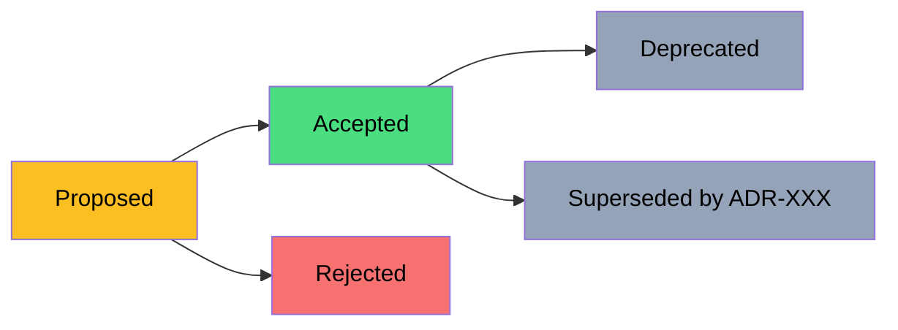

# Architecture Decision Records (ADR)

> Полный гайд по ADR: что это, зачем, когда писать, как структурировать, как поддерживать. Закрывает: lifecycle, anti-patterns, tools, разница ADR/RFC, реальные примеры с rationale.

---

## Что это, зачем и когда

### Что такое ADR?

**Architecture Decision Record** — короткий документ, фиксирующий **значимое архитектурное решение** в проекте: контекст, что решено, рассмотренные альтернативы и последствия.

**Аналогия:** Судебное дело. Есть факты (Context), решение судьи (Decision), рассмотренные доводы сторон (Alternatives), и последствия (Consequences). Через год можно прочитать и понять "почему сделали именно так, а не иначе".

### Зачем?

| Без ADR | С ADR |
|---------|-------|
| "Почему мы используем PostgreSQL, а не Mongo?" — никто не помнит | ADR-0003 объясняет с context/alternatives |
| Новичок предлагает переход на microservices, не зная что это уже обсуждалось | ADR-0001 показывает почему выбрали modular monolith |
| Через год — переписывание модулей "потому что не нравится" | ADR говорит когда и зачем выбрали этот паттерн |
| "Bus factor" — знание уходит с человеком | Решения зафиксированы, доступны всем |
| Бесконечные перепалки "DI это хорошо или плохо?" в Slack | ADR закрывает дискуссию, ссылка вместо повторения |

### Когда писать ADR?

| Писать ADR | Не писать ADR |
|------------|---------------|
| Выбор СУБД (PG vs Mongo) | Какую версию EF Core использовать |
| Modular monolith vs microservices | Как назвать переменную |
| Authentication strategy (JWT vs session) | Code style (это в .editorconfig) |
| Result\<T\> vs exceptions | Какой logger выбрать (если консенсус очевиден) |
| Cloud provider (AWS vs Azure vs GCP) | Как разбить функцию на методы |
| ORM choice (EF vs Dapper) | Какой HTTP-client использовать |
| Structuring tests (per-feature vs per-class) | Какой mocking framework |

**Правило большого пальца:** если решение дорого изменить через 6 месяцев — пиши ADR. Если переделка занимает час — не пиши.

### ADR vs RFC vs Design Doc

| | ADR | RFC | Design Doc |
|--|-----|-----|------------|
| Цель | Зафиксировать **принятое** решение | Обсудить **предлагаемое** решение | Спроектировать систему |
| Когда | После решения | До решения | Перед/во время разработки |
| Длина | 1-2 страницы | 5-15 страниц | 10-30 страниц |
| Лайфтайм | Иммутабельный (или Superseded) | Закрывается после accept/reject | Обновляется во время разработки |
| Примеры | "Выбрали PG" | "Предлагаем перейти на Kafka" | "Архитектура нового платежного модуля" |

---

## Структура ADR

### Минималистичный шаблон (Michael Nygard)

```markdown
# ADR-{NNN}: {Название}

## Status
[Proposed | Accepted | Rejected | Deprecated | Superseded by ADR-XXX]

## Context
Какую проблему решаем? Какие силы давят? Какие ограничения?

## Decision
Что решили.

## Consequences
Что становится проще / сложнее в результате этого решения.
```

### Расширенный шаблон (рекомендуется)

```markdown
# ADR-{NNN}: {Название}

**Status:** Proposed | Accepted | Deprecated | Superseded by ADR-XXX
**Date:** YYYY-MM-DD
**Deciders:** {кто принял — имена/команда}
**Tags:** #infrastructure #data #async (для навигации)

## Context

Какую проблему решаем? Какие ограничения?
- Бизнес-контекст (кто страдает без решения, что хочет product)
- Технический контекст (что есть сейчас, что не работает)
- Constraints (бюджет, дедлайны, существующая команда)
- Forces (требования к performance, scale, security)

## Decision

Что решили и почему. Кратко, но конкретно.

## Alternatives Considered

| Option | Pros | Cons | Why not chosen |
|--------|------|------|----------------|
| A      | ...  | ...  | ...            |
| B      | ...  | ...  | ...            |

## Consequences

### Positive
- Что улучшится

### Negative / Trade-offs
- Какие компромиссы принимаем
- Что станет сложнее

### Risks
- Что может пойти не так
- Mitigation strategy

## References
- Ссылки на benchmarks, статьи, RFC которые использовались
- Связанные ADR (зависимости, последующие решения)

## Notes
- Что специфично для нашего контекста
- Что было обсуждено но не вошло в основной текст
```

### MADR (Markdown Any Decision Records)

Современный стандарт от MADR community — расширение Nygard'а с дополнительными секциями:

```markdown
# {Название}

* Status: {accepted | proposed | deprecated | superseded by [ADR-0005](0005-...)}
* Deciders: {имена}
* Date: {YYYY-MM-DD}

## Context and Problem Statement

{Описание контекста и проблемы — 2-3 параграфа}

## Decision Drivers

* {Driver 1, e.g., a force, facing concern, ...}
* {Driver 2}
* ...

## Considered Options

* {Option 1}
* {Option 2}
* {Option 3}

## Decision Outcome

Chosen option: "{Option N}", because {обоснование}.

### Positive Consequences
* {улучшение 1}
* ...

### Negative Consequences
* {trade-off 1}
* ...

## Pros and Cons of the Options

### {Option 1}

* Good, because {аргумент}
* Bad, because {аргумент}

### {Option 2}
...

## Links

* {Тип ссылки: ссылка}
* {Refines [ADR-0001](0001-...)}
* {Superseded by [ADR-0010](0010-...)}
```

---

## Lifecycle ADR



| Статус | Что значит | Когда использовать |
|--------|-----------|-------------------|
| **Proposed** | Решение предложено, обсуждается | Pull request с ADR, draft |
| **Accepted** | Решение принято и применяется | После approve команды |
| **Rejected** | Решение рассмотрено, не принято | Сохраняем как decision history |
| **Deprecated** | Больше не применяется, но не заменено | "Используем но не для нового кода" |
| **Superseded by ADR-XXX** | Заменено более новым решением | Новое ADR явно отменяет старое |

### Иммутабельность принятых ADR

> [!warning] Критическое правило
> **Принятые ADR не редактируются.** Если решение изменилось — создаётся новый ADR со статусом `Supersedes ADR-XXX`, а старый помечается `Superseded by ADR-XXX`.

Зачем: история решений сохраняется. Через год можно увидеть что в 2024 решили использовать MongoDB, а в 2026 пересмотрели и переехали на Postgres — оба контекста сохранены.

Пример:

```markdown
# ADR-0003: Use MongoDB for product catalog
**Status:** Superseded by [ADR-0015](0015-postgres-with-jsonb.md)

## Context (от 2024-03)
...

# ADR-0015: Migrate from MongoDB to Postgres with JSONB
**Status:** Accepted
**Supersedes:** [ADR-0003](0003-mongodb.md)

## Context (от 2026-04)
В ADR-0003 выбрали Mongo из-за гибкости схемы. За 2 года выяснилось:
- Часто нужны транзакции через несколько коллекций (Mongo не подходит)
- 80% запросов — реляционные с JOIN'ами
...
```

---

## Где хранить ADR

### Вариант 1: В монорепо

```
my-project/
├── docs/
│   └── adr/
│       ├── 0001-modular-monolith.md
│       ├── 0002-result-pattern-over-exceptions.md
│       ├── 0003-postgres-as-primary-db.md
│       ├── 0004-vertical-slices-architecture.md
│       └── README.md
├── src/
└── tests/
```

**Плюсы:** ADR живёт с кодом, ревью в PR, версионирование.
**Минусы:** не видно для не-разработчиков.

### Вариант 2: Отдельный repo

```
company-architecture/
├── adr/
│   ├── platform/        # Cross-project decisions
│   ├── nexusai/         # Project-specific
│   └── trading-bot/
└── rfc/
```

**Плюсы:** общий контекст для нескольких проектов, доступ для архитекторов / PM.
**Минусы:** разрыв с кодом.

### Вариант 3: Wiki / Confluence

ADR в Confluence или Notion.
**Плюсы:** удобно для бизнес-аудитории, поиск.
**Минусы:** не в репо, нет PR ревью, легко забыть обновить.

### Что выбрать

- **Стартап / маленькая команда (1-5 человек):** docs/adr в монорепо
- **Средняя компания, несколько команд:** отдельный architecture repo + per-project adr/
- **Корпорация:** Confluence + ссылки из репо

---

## Naming convention

```
0001-{kebab-case-title}.md
0002-use-postgres-for-relational-data.md
0003-result-pattern-over-exceptions.md
0004-modular-monolith-over-microservices.md
```

**Почему так:**
- `0001` (4 цифры) — лексикографическая сортировка работает до 9999 ADR
- kebab-case — читаемо, работает в URL
- начинается с глагола в decision: "use", "migrate", "deprecate", "adopt"

---

## Tools

### adr-tools (CLI)

Bash-инструмент от Nat Pryce.

```bash
# Установка
brew install adr-tools  # macOS
# или скачать с github.com/npryce/adr-tools

# Init в проекте
adr init docs/adr

# Создать новый ADR
adr new "Use PostgreSQL for primary database"
# → docs/adr/0001-use-postgresql-for-primary-database.md

# Список ADR
adr list

# Связи и ссылки
adr link 5 supersedes 3   # ADR-5 supersedes ADR-3
```

### Log4brains

Web UI для ADR.

```bash
npx log4brains init
npx log4brains preview   # локальный preview
npx log4brains build     # static site
```

Генерирует красивый сайт с навигацией, поиском, графом связей. Можно публиковать на GitHub Pages.

### dotnet-adr (для .NET)

```bash
dotnet tool install --global dotnet-adr

dotnet adr init -p docs/adr
dotnet adr new "Use Result pattern" -t nygard
```

### IDE plugins

- VS Code — "ADR Manager" extension
- IntelliJ — "ADR" plugin

---

## Process: как принимать ADR в команде

### Этап 1: Trigger

Кто-то заметил что нужно архитектурное решение:
- "Нужно выбрать MQ" 
- "Как делаем authentication?"
- "Как храним user files?"

### Этап 2: Author создаёт draft

```bash
adr new "Choose message broker"
```

Заполняет sections Context, Considered Options. Decision и Consequences оставляет пустыми (это для обсуждения).

Открывает PR со статусом `Proposed`.

### Этап 3: Discussion

В PR обсуждают альтернативы. Через комменты + sync meeting.

Important: **не превращать в чат-бутерброд** — все важные argument'ы в самом ADR (в Considered Options таблице).

### Этап 4: Decision

Тимлид / архитектор / команда (зависит от культуры) принимают решение. Author обновляет ADR:
- Заполняет Decision section с обоснованием
- Заполняет Consequences
- Меняет status на `Accepted`
- Указывает Date и Deciders

### Этап 5: Merge

PR мержится в main. Все могут ссылаться на ADR.

### Этап 6: Implementation

Делается работа. Если в процессе обнаруживается что ADR не работает — open new ADR который supersedes.

### Roles в процессе

| Роль | Ответственность |
|------|----------------|
| **Author** | Пишет ADR, отвечает на вопросы, обновляет на основе фидбека |
| **Reviewers** | Команда / senior engineers — ревью PR |
| **Decider** | Кто финально решает (tech lead, architect, principal) |
| **Owner** | Кто отвечает за исполнение и обновление статуса |

---

## Anti-patterns

### 1. ADR-фабрика

Команда создаёт ADR на каждое мелкое решение ("ADR-0234: use camelCase for properties"). 

**Лечение:** ADR только для **значимых** решений (high cost to change, cross-cutting). Code style — в .editorconfig.

### 2. ADR без alternatives

```markdown
## Decision
Используем PostgreSQL.

## Alternatives Considered
- Mongo — не подходит
- MySQL — не подходит
```

**Проблема:** через год не понятно почему "не подходит".

**Лечение:** конкретные минусы каждой альтернативы с примерами:

```markdown
| Option | Pros | Cons | Why not chosen |
|--------|------|------|----------------|
| MongoDB | Гибкая схема | Нет multi-collection транзакций; eventual consistency | 30% наших операций требуют транзакций между Order/Payment/Inventory |
| MySQL | Знакомо команде | Слабее JSON-операции | Нам нужен JSONB для product attributes (см. ADR-0007) |
```

### 3. ADR превращается в RFC

ADR на 30 страниц с детальным design'ом, code samples, всеми углами.

**Лечение:** ADR — это **что и почему**, не **как**. Дизайн системы — отдельный design doc или code.

### 4. ADR-кладбище

В репо лежат 50 ADR со статусом Accepted, никто их не читает, реальные решения принимаются в Slack.

**Лечение:** 
- Onboarding новых — обязательное чтение всех `Accepted` ADR
- ADR упоминается в стикерах PR ("This implements ADR-0007")
- Регулярный review раз в квартал — что устарело, что Deprecated

### 5. Stealth deprecation

Решение давно не работает, но ADR всё ещё `Accepted`.

**Лечение:** добавить статус `Deprecated` или новый ADR со `Supersedes`.

### 6. ADR пишется после факта

Команда уже год использует подход, спустя время кто-то пишет ADR. Часто в этом случае ADR превращается в "документацию текущего состояния", а не зафиксированное решение.

**Лечение:** OK, иногда нужно. Но прямо в ADR указать "Date discovered: 2026-04-30, Backfilled documentation".

### 7. Один Decider

Архитектор пишет 50 ADR, никто не читает, никто не оспаривает. ADR превращается в декреты.

**Лечение:** обязательное ревью двух+ engineers. Open PR, не direct push.

### 8. Слишком абстрактный ADR

```markdown
## Decision
Используем best practices for clean code.
```

**Лечение:** конкретно. "Используем Clean Architecture с layers Domain/Application/Infrastructure/Presentation, references только сверху вниз, проверяется через NetArchTest."

---

## Реальные примеры (cross-project)

### ADR-0001: Modular Monolith over Microservices

**Status:** Accepted
**Date:** 2024-01-01
**Deciders:** Vitaly

#### Context

Большинство проектов — single-developer или 2-3 человека, 1-3 bounded contexts. Microservices добавляют значительный operational overhead:
- Distributed tracing complexity
- Kubernetes / orchestration learning curve
- Network reliability как часть бизнес-логики (saga, retry, idempotency)
- Schema evolution через несколько services

При маленькой команде эта инвестиция не окупается до достижения определённого scale.

#### Decision

**Modular Monolith** как дефолт для новых проектов. Внутри — Clean Architecture или Vertical Slices с чётко определёнными bounded contexts.

Microservices — **только** при **явной** необходимости:
- Независимый деплой компонентов (разные релизные циклы)
- Разные SLA / scaling profile (одна часть нагружена в 100x больше)
- Разные команды с независимым ownership
- Разные технологические стеки (.NET + Python ML model)

#### Alternatives Considered

| Option | Pros | Cons | Why not |
|--------|------|------|---------|
| Microservices from day 1 | Готовность к scale, independent deployment | Operational complexity при 1-2 dev | YAGNI |
| Layered Monolith | Просто на старте | Big ball of mud к 50K LOC | Лучше структурировать сразу |
| Modular Monolith | Чёткие границы, простой деплой, одна БД и транзакции | Дисциплина по boundaries (NetArchTest помогает) | Выбрано |

#### Consequences

**Positive:**
- Простой деплой (один artefact)
- Транзакции внутри одной БД, нет distributed saga
- Меньше moving parts → меньше bugs
- Легче рефакторить (всё в одном репо)
- Можно "распилить" в микросервисы позже, когда выявятся реальные boundaries

**Negative:**
- Нужна дисциплина по boundaries (компилятор не помешает coupling между модулями) — митигируется NetArchTest
- Один deploy → одна точка отказа

**Risks:**
- Превращение в Big Ball of Mud если границы не соблюдаются → mitigation: arch tests в CI

#### References
- Sam Newman — "Building Microservices" (chapter on monolith vs services)
- Simon Brown — Modular Monolith concept
- Связанные: ADR-0004 (Vertical Slices)

---

### ADR-0002: Result\<T\> over Exceptions for flow control

**Status:** Accepted
**Date:** 2024-01-01

#### Context

Ожидаемые ошибки в бизнес-логике (NotFound, Validation, Conflict, BusinessRuleViolation):
- Через exceptions: дорого (StackTrace allocation), неявно (нет в сигнатуре), ломают railway-oriented pipeline в MediatR/CQRS
- Через bool returns: теряем error information
- Через nullable: только Yes/No, нет error details

#### Decision

Все **ожидаемые** ошибки — через `Result<T>` (или `OneOf<T, Error1, Error2>` для discriminated unions).

Exceptions — только для **инфраструктурных сбоев**:
- DB connection lost
- Redis timeout
- File system errors
- Programming bugs (NullReferenceException, ArgumentException)

#### Alternatives Considered

| Option | Pros | Cons | Why not |
|--------|------|------|---------|
| Exceptions для всего | Знакомо | Дорого, неявно, антипаттерн в DDD | Trade-off не оправдан |
| Bool returns + out params | Дёшево | Теряем error details | Недостаточно info |
| Result\<T\> (FluentResults / LanguageExt / custom) | Явный контракт, pattern matching | Чуть больше boilerplate | Выбрано |
| OneOf\<T, Err1, Err2\> | Полный type safety | Сложнее для команды | Подходит для критичных мест, не везде |

#### Consequences

**Positive:**
- Контракт виден: метод возвращает `Result<Order>`, caller обязан обработать
- Pattern matching по типу ошибки: `IsSuccess`, `Error.Code`, `Error.Type == ErrorType.NotFound`
- Composable через `.Bind()`, `.Map()`, `.OnSuccess()` (railway-oriented)
- Тестирование проще — нет `Assert.Throws<>`
- Performance — нет StackTrace allocation на нормальных flow

**Negative:**
- Boilerplate (но IDE autocomplete помогает)
- Команда должна освоить pattern matching
- Сложнее в местах где много вложенных вызовов (но `.Bind()` спасает)

**Risks:**
- Кто-то начнёт использовать exceptions внутри Result-кода → mixing styles
  - Mitigation: Roslynator analyzer, code review

#### References
- Scott Wlaschin — Railway Oriented Programming
- FluentResults библиотека: github.com/altmann/FluentResults
- Связанные: ADR-0001 (применяется внутри modular monolith)

---

### ADR-0003: EF Core + Dapper Hybrid

**Status:** Accepted
**Date:** 2024-06-01

#### Context

EF Core отлично подходит для CRUD и миграций, но для сложных read-side запросов (отчёты, агрегаты с window functions, recursive CTE) генерирует sub-optimal SQL.

#### Decision

- **EF Core** — для write-side (Commands), простых Queries, миграций, change tracking
- **Dapper** — для сложных read-side запросов, raw SQL, отчётов
- Оба используют **один connection / DbContext** (через `context.Database.GetDbConnection()`)

#### Alternatives Considered

| Option | Pros | Cons | Why not |
|--------|------|------|---------|
| Чистый EF Core | Один tool, есть change tracking | Sub-optimal SQL для отчётов | Performance критичен |
| Чистый Dapper | Простой, fast | Нет change tracking, миграций — пишем всё SQL'ом | Слишком много boilerplate |
| EF + raw SQL через `FromSqlRaw` | Не нужна вторая библиотека | Менее удобно чем Dapper, нет async-friendly mapping | Не такой удобный |
| EF + Dapper hybrid | Best of both worlds | Две парадигмы в коде (но разделены по CQRS) | Выбрано |

#### Consequences

**Positive:**
- Лучший SQL для сложных запросов
- EF для миграций и change tracking
- Чёткое разделение: writes через EF (Commands), reads через Dapper (Queries) → CQRS-friendly

**Negative:**
- Два подхода — нужно знать оба
- Dapper не имеет миграций — изменения схемы координируются через EF migrations

**Risks:**
- Ad-hoc SQL legacy — нужны review и naming conventions

---

### ADR-0004: Vertical Slices over Layer-per-folder

**Status:** Accepted
**Date:** 2024-06-01

#### Context

Layer-per-folder структура (Controllers/, Services/, Repositories/, Models/) приводит к **shotgun surgery** — одна фича размазана по 5 папкам. Изменение требует трогать 6 файлов в разных местах.

#### Decision

**Feature folders** структура: `Features/Orders/CreateOrder/` содержит Command, Handler, Validator, Endpoint.

```
src/MyApp.Api/
├── Features/
│   ├── Orders/
│   │   ├── CreateOrder/
│   │   │   ├── CreateOrderCommand.cs
│   │   │   ├── CreateOrderHandler.cs
│   │   │   ├── CreateOrderValidator.cs
│   │   │   └── CreateOrderEndpoint.cs
│   │   ├── GetOrder/
│   │   └── CancelOrder/
│   └── Customers/
│       ├── RegisterCustomer/
│       └── GetCustomer/
└── Shared/  # cross-cutting
```

#### Alternatives Considered

| Option | Pros | Cons | Why not |
|--------|------|------|---------|
| Layer-per-folder | Знакомо | Shotgun surgery, фича размазана | Замедляет feature development |
| Feature-per-folder (VSA) | Вся фича в одном месте | Shared logic нужно выносить осознанно | Выбрано |
| DDD bounded contexts | Самое строгое | Overkill для маленьких проектов | Применяем на сложных частях |

#### Consequences

**Positive:**
- Вся фича в одном месте — легко найти, понять, изменить
- Легко удалить/переместить фичу целиком
- Меньше merge conflicts (разные команды → разные папки)
- Onboarding быстрее: "хочешь добавить фичу X — создай папку"

**Negative:**
- Shared logic нужно выносить в Shared/ осознанно, чтобы не дублировать
- Может быть культурный шок для команд с layer-per-folder опытом

#### References
- Jimmy Bogard — Vertical Slice Architecture
- jimmybogard.com/vertical-slice-architecture
- Связанные: ADR-0001 (внутри modular monolith)

---

### ADR-0005: PostgreSQL as Primary Database

**Status:** Accepted
**Date:** 2024-09-01

#### Context

Нужна основная БД для CRUD приложений. Команда .NET-ориентирована, исторически работала с SQL Server.

#### Decision

**PostgreSQL 16+** для всех новых проектов.

#### Alternatives Considered

| Option | Pros | Cons | Why not |
|--------|------|------|---------|
| SQL Server | Знакомо, отличная EF integration | Платная лицензия для production scale, плохо в Docker/K8s | Стоимость и Linux-friendly важны |
| MySQL | Популярная | JSON слабее чем JSONB, нет advanced features | PG лучше во всех ways |
| Postgres | Open-source, JSONB, full-text search, RLS, advanced types, отличный Npgsql provider | Чуть больше учить (lock modes, MVCC) | Выбрано |
| MongoDB | Гибкая схема | 80% наших данных реляционные, multi-doc транзакции с Postgres лучше | Не подходит для основной БД |

#### Consequences

**Positive:**
- Бесплатно (в т.ч. production)
- JSONB для гибких атрибутов где нужно
- Full-text search встроен (без ElasticSearch)
- Row-Level Security для multi-tenant
- pgvector для AI/RAG кейсов
- Отличная EF integration через Npgsql

**Negative:**
- Команда учит specific lock modes, VACUUM, autovacuum tuning
- Меньше DBA на рынке знающих PG чем SQL Server

#### References
- ADR-0007 — Multi-tenant via RLS in PG
- ADR-0010 — pgvector for embeddings

---

## Best Practices

- **Пиши проще** — 1-2 страницы, не 10
- **Конкретно** — "use Postgres 16 with JSONB" вместо "use modern database"
- **С датой** — контекст изменяется, дата важна
- **Иммутабельные** — accepted ADR не редактируем, создаём новый
- **Кросс-ссылки** — `Supersedes`, `Refines`, `Related to` другие ADR
- **Ставь tags** — для навигации (#data, #security, #async)
- **Включи в onboarding** — новый разработчик читает все Accepted ADR в первую неделю
- **Регулярный review** — раз в квартал смотрите старые ADR, помечайте Deprecated
- **Не создавай ADR-фабрику** — только значимые решения
- **Считай альтернативы honestly** — не "X плохо потому что я так сказал", а конкретные cons

---

## Чеклист хорошего ADR

- [ ] Заголовок начинается с глагола ("Use", "Adopt", "Migrate to")
- [ ] Status указан и актуален
- [ ] Date проставлена
- [ ] Deciders перечислены
- [ ] Context объясняет **почему** мы стоим перед этим решением
- [ ] Не менее 2 alternatives рассмотрены с pros/cons
- [ ] Decision конкретный, не abstract
- [ ] Consequences включают и negative trade-offs
- [ ] Risks обозначены с mitigation
- [ ] Ссылки на источники / связанные ADR
- [ ] Не более 2 страниц (если больше — это design doc, не ADR)

---

## Case Studies

### Case Study #1 — Greenfield project — что выбрать

**Сценарий:** Новый SaaS, 2-3 разработчика. Нужно решить архитектуру за 1 день.

**Decision:**
1. **Modular monolith** (не microservices) — single deploy
2. **Clean Architecture** — Domain / App / Infrastructure / Web
3. **CQRS через свой dispatcher** (или Mediator source-gen; MediatR 13+ коммерческий — [[choosing-dependencies|Choosing Dependencies]]) — command/query separation, но одна DB
4. **PostgreSQL + EF Core** — proven, no premature NoSQL
5. **Vertical Slice внутри Application** — feature folders
6. **Docker compose для dev** — Postgres + Redis локально

**Why:** простота важнее модности. Refactor → microservices когда есть **specific** pain.

См. [[microservices-vs-monolith|Microservices vs Monolith]] и [[patterns-decision-guide|Patterns Decision Guide]].

---

### Case Study #2 — Strangler fig migration

**Сценарий:** Legacy ASP.NET 4.8 monolith, 5 лет, 200K LOC. Нужно migrate на .NET 10.

**Strategy:**
1. **API Gateway** перед монолитом (YARP)
2. Identify **bounded contexts** в monolith
3. Extract **первый context** → new microservice
4. Gateway routes specific paths к new service
5. Repeat — context за context
6. Monolith постепенно "сжимается"

**Timeline:** 12-18 months для full migration.

См. [[api-gateway|API Gateway]].

---

### Case Study #3 — Multi-tenant SaaS architecture

**Сценарий:** B2B SaaS — 100 tenants, нужна **isolation**.

**Three options:**
1. **Shared schema + TenantId column** — самое дешёвое, less isolation
2. **Schema-per-tenant** — middle ground
3. **Database-per-tenant** — full isolation, expensive

**Decision:**
- < 50 tenants → shared schema (TenantId везде)
- 50-500 → schema-per-tenant
- > 500 или enterprise (regulations) → DB-per-tenant

**Common pattern:** start с shared, migrate critical tenants to dedicated DBs.

См. [[real-world-scenarios|Real-World Scenarios]] (Scenario 15).


---

## Cheat sheet

| Concern | Pattern |
|---------|---------|
| Separation business logic | Clean Architecture (Domain center) |
| Read vs write models | CQRS |
| Asynchronous operations | Event-driven, message queues |
| Cross-cutting | Middleware, filters, decorators |
| Domain modeling | DDD (entities, aggregates, value objects) |
| Testability | DI + interfaces |
| Deployment isolation | Microservices (с правильной мотивацией) |
| Scaling parts independently | Microservices |
| Independence per team | Microservices |
| Avoid distributed transactions | Saga / Outbox |
| Decouple услуги | Message broker |
| API versioning | URL path (/v1/) или header |
| Multi-tenant | Schema/DB per tenant |
| Long-running ops | Background workers + queue |

| Style | When |
|-------|------|
| **Monolith** | < 5 dev, MVP, simple domain |
| **Modular monolith** | 5-20 dev, mid complexity |
| **Microservices** | 20+ dev, mature ops, independent scaling |
| **Serverless** | Event-driven, sporadic load |
| **CQRS** | Different read/write requirements |
| **Event Sourcing** | Audit trail critical, temporal queries |
| **Hexagonal** | Multiple input/output adapters |


---

## Decision tree

```
Architecture решение?
│
├── Размер команды и проекта?
│   ├── Solo / pair → Simplest possible (single project, layers)
│   ├── 2-5 dev → Clean Architecture monolith
│   ├── 5-20 dev → Modular monolith (DDD bounded contexts)
│   └── 20+ dev → Microservices (с DevOps support)
│
├── Domain complexity?
│   ├── CRUD-heavy → Layered, simple
│   ├── Business logic complex → DDD + CQRS
│   ├── Audit / temporal → Event Sourcing
│   └── Multiple I/O adapters → Hexagonal
│
├── Scaling needs?
│   ├── Single instance OK → Monolith
│   ├── Different parts разные scale → Microservices
│   ├── Serverless friendly (event-driven) → Functions
│   └── Real-time → SignalR + Redis backplane
│
├── Data consistency?
│   ├── Strong needed → Single DB, transactions
│   ├── Eventual OK → Event-driven, message queue
│   └── Mix → Saga pattern для cross-service
│
├── Existing system?
│   ├── New (greenfield) → Start simple, evolve
│   ├── Migration → Strangler fig
│   └── Extending → Don't break existing patterns
│
└── Team experience?
    ├── Junior team → Familiar simple patterns
    ├── Senior team → Match patterns к problem
    └── Mixed → Conservative choices
```

См. [[patterns-decision-guide|Patterns Decision Guide]] для конкретных pattern selections.


---

## См. также

- [[architecture-patterns|Architecture Patterns]] — Clean Architecture, VSA, Modular Monolith
- [[distributed-systems|Distributed Systems]] — saga, CQRS как ADR-able решения
- [[system-design|System Design]] — design docs vs ADR
- [[ddd|DDD на практике]] — bounded contexts как ADR
- [[solid|SOLID + DRY/KISS/YAGNI]] — принципы которые часто закрепляются в ADR

## Reading list

- **Michael Nygard — Documenting Architecture Decisions** — cognitect.com/blog/2011/11/15/documenting-architecture-decisions (оригинальная статья)
- **MADR project** — adr.github.io
- **adr-tools** — github.com/npryce/adr-tools
- **Log4brains** — github.com/thomvaill/log4brains
- **ThoughtWorks Tech Radar — ADR** — thoughtworks.com/radar/techniques/lightweight-architecture-decision-records
- **Building Evolutionary Architectures** — Neal Ford, Rebecca Parsons (книга)
- **ADR examples — open-source projects:**
  - Spotify Backstage: github.com/backstage/backstage/tree/master/docs/architecture-decisions
  - Arc42 examples: arc42.org
  - GitHub Engineering: github.blog/category/engineering/
