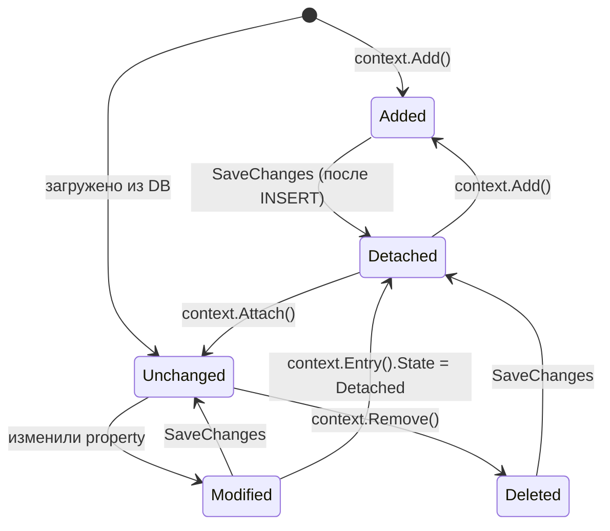

# DbContext, Tracking и Loading

> Глубокий гайд по фундаментальным механизмам EF Core. Закрывает: DbContext lifecycle, Change Tracker внутреннее устройство, Identity Resolution, все типы Loading (Eager/Explicit/Lazy/Projection), AsNoTracking nuances, Cartesian explosion, AsSplitQuery, Filtered Include, Compiled Models (.NET 8+), DbContextPool ловушки.

---

## Что это, зачем и когда

### Что такое EF Core?
ORM (Object-Relational Mapper) — **мост** между C#-объектами и таблицами в БД. Ты работаешь с `Order`, `User`, а EF превращает это в SQL: `SELECT`, `INSERT`, `UPDATE`.

**Аналогия — переводчик:** Ты говоришь «дай все заказы дороже 1000». EF переводит в `SELECT * FROM Orders WHERE Total > 1000`.

### Что такое DbContext?
«Сессия работы с БД». Открывает соединение, отслеживает изменения, генерирует SQL при `SaveChangesAsync()`.

**Важно:** DbContext = **Scoped** lifetime в DI (один на HTTP-запрос). НЕ Singleton (утечка памяти + thread-safety).

### Что такое Tracking?
EF «следит» за объектами, которые ты прочитал из БД. Если изменишь свойство — при `SaveChangesAsync()` EF сам сгенерирует `UPDATE`.

| Режим | Зачем | Когда |
|-------|-------|-------|
| **Tracking** (default) | EF следит за изменениями | Читаешь чтобы **изменить** и сохранить |
| **AsNoTracking** | EF НЕ следит, быстрее на 30-50% | Read-only (GET endpoints) |
| **AsNoTrackingWithIdentityResolution** | NoTracking + dedup объектов | Read-only с Include |

### Что такое Loading связанных данных?

| Тип | Как | Когда |
|-----|-----|-------|
| **Eager** (`Include`) | Один SQL с JOIN | Знаешь заранее что нужны связи |
| **Explicit** (`Entry().Collection().LoadAsync()`) | Отдельный SQL по требованию | Условная загрузка |
| **Lazy** (прокси) | SQL при обращении к свойству | **Антипаттерн** — N+1 ловушка |
| **Projection** (`Select`) | Только нужные колонки | **Лучший** для read-only |

---

> [!question]- **Интервью: Change Tracker — назначение и влияние на perf?**
> Change Tracker отслеживает состояние сущностей (Added, Modified, Deleted, Unchanged, Detached) и оригинальные/текущие значения. При `SaveChanges` — DetectChanges вызывает snapshot comparison → SQL для изменённых. Накладные: snapshot каждой tracked сущности, O(N) проход при DetectChanges. Для read-only `AsNoTracking()` убирает overhead.

> [!question]- **Интервью: Cartesian explosion и решение?**
> Множественные `Include` с коллекциями → декартово произведение в SQL (N×M строк, дубликаты parent'а). Решения: `AsSplitQuery()` (несколько SQL вместо JOIN), `AsSingleQuery()` (default JOIN, осознанно для одной коллекции), или `Select` projection (лучший для read-only).

---

## DbContext Lifecycle

### Lifetime в DI

```csharp
// ✅ Правильно — Scoped (default)
builder.Services.AddDbContext<AppDbContext>(options =>
    options.UseNpgsql(connectionString));

// Каждый HTTP request → новый scope → новый DbContext → новое connection
// При завершении request → Dispose context → connection → пул
```

### Manual creation через DbContextFactory

Иногда нужен short-lived context вне scope (BackgroundService, Console app, parallel ops):

```csharp
builder.Services.AddDbContextFactory<AppDbContext>(options =>
    options.UseNpgsql(connectionString));

// Использование
public class OrderProcessor(IDbContextFactory<AppDbContext> factory)
{
    public async Task ProcessAsync()
    {
        using var context = await factory.CreateDbContextAsync();
        // ... работа ...
    }  // Dispose
}
```

### Pooling — переиспользование DbContext

```csharp
builder.Services.AddDbContextPool<AppDbContext>(
    options => options.UseNpgsql(connStr),
    poolSize: 1024);  // default 1024
```

Pool возвращает context после reset (Change Tracker очищается). Создание DbContext дешевле → меньше GC, быстрее throughput на 5-15%.

> [!warning] DbContextPool ограничения
>
> 1. **Конструктор** должен принимать **только** `DbContextOptions<T>`. Никаких других параметров.
>
> ```csharp
> // ❌ Не работает с pooling
> public AppDbContext(DbContextOptions options, ICurrentUserService user) { }
>
> // ✅ Работает
> public AppDbContext(DbContextOptions options) { }
> ```
>
> 2. **OnConfiguring** не вызывается на reuse — только при первом создании. Не используй для dynamic config.
>
> 3. **Scoped зависимости** — нельзя инжектить через конструктор. Если нужен `ITenantProvider` (для multi-tenant) — передавать через ContextScope:
>
> ```csharp
> services.AddDbContextPool<AppDbContext>((sp, options) =>
> {
>     var tenant = sp.GetRequiredService<ITenantProvider>();
>     options.UseNpgsql(GetTenantConnString(tenant));
> });
> ```
>
> 4. **Pool size warning** — если все contexts заняты, новые создаются вне pool (с allocations). Мониторь `PooledContextCount` метрику.

### Сравнение опций

| | AddDbContext | AddDbContextFactory | AddDbContextPool |
|--|--------------|---------------------|------------------|
| Lifetime | Scoped | Singleton factory | Pooled |
| HTTP request | 1 context | Создаёшь вручную | 1 из пула |
| Background service | Через scope.CreateScope | Прямо | Через scope |
| Performance | Baseline | Так же | +5-15% |
| Constraints | Нет | Нет | Только DbContextOptions в ctor |
| Когда | Default | Console, BackgroundService, parallel | High-throughput API |

---

## Change Tracker — внутреннее устройство

### Что хранит

Для каждой tracked сущности:
- **EntityState** — Added / Modified / Deleted / Unchanged / Detached
- **Original Values** — что было прочитано из БД
- **Current Values** — что сейчас в объекте
- **Modified Properties** — какие именно поля изменились

```csharp
var order = await context.Orders.FindAsync(id);
order.Total = 999;

var entry = context.Entry(order);
Console.WriteLine(entry.State);                          // Modified
Console.WriteLine(entry.Property(o => o.Total).IsModified);  // true
Console.WriteLine(entry.OriginalValues[nameof(Order.Total)]); // 100 (orig)
Console.WriteLine(entry.CurrentValues[nameof(Order.Total)]);  // 999 (current)
```

### DetectChanges

При `SaveChanges` EF вызывает `ChangeTracker.DetectChanges()`:

1. Проходит **все tracked сущности** (O(N))
2. Сравнивает текущие значения с original (snapshot)
3. Помечает изменённые → Modified state
4. Генерирует SQL только для Modified/Added/Deleted

> [!warning] DetectChanges — O(N) от количества tracked entities
> Если в context загружено 50,000 сущностей и ты сделал одно изменение — DetectChanges пройдёт по всем 50K. Решения:
> - Используй short-lived context (один use case = один context)
> - `AsNoTracking` для read-only данных
> - `ChangeTracker.AutoDetectChangesEnabled = false` + ручной `DetectChanges` (только для bulk insert сценариев)

### EntityState переходы



### Manual state manipulation

```csharp
// Attach — добавить как Unchanged (не INSERT'нет, но будет tracked)
context.Attach(order);

// Update — добавить как Modified (UPDATE всех колонок)
context.Update(order);

// Detach — перестать отслеживать
context.Entry(order).State = EntityState.Detached;

// Помечать конкретные поля как Modified
context.Entry(order).Property(o => o.Total).IsModified = true;
// Только Total попадёт в UPDATE
```

### Disconnected scenario

```csharp
// API endpoint получает DTO от клиента
[HttpPut("{id}")]
public async Task<IActionResult> Update(Guid id, OrderDto dto)
{
    var order = new Order { Id = id, Total = dto.Total };
    context.Update(order);  // помечает все колонки как Modified
    await context.SaveChangesAsync();
    return Ok();
}
```

> [!warning] Update перезаписывает все колонки
> Если DTO не содержит какое-то поле — оно перезапишется default value (например, `null` или `0`). Опасно. Лучше:
> 1. Загрузить из БД, применить изменения, SaveChanges
> 2. Или явно указать modified properties

```csharp
// ✅ Загрузить и обновить нужные поля
var order = await context.Orders.FindAsync(id);
if (order is null) return NotFound();

order.Total = dto.Total;
order.Status = dto.Status;
// Customer не трогается

await context.SaveChangesAsync();
```

---

## Tracking режимы

### Tracking (default)

```csharp
// Обычный read с tracking
var order = await context.Orders.FindAsync(id);

// Изменения отслеживаются
order.Status = OrderStatus.Completed;
await context.SaveChangesAsync();  // EF знает что изменилось
```

### AsNoTracking — для read-only

```csharp
var orders = await context.Orders
    .AsNoTracking()
    .Where(o => o.Total > 100)
    .ToListAsync();

// Read-only:
// - 30-50% быстрее
// - Меньше памяти (нет snapshot)
// - SaveChanges не будет видеть изменений
```

### AsNoTrackingWithIdentityResolution

Identity Resolution = одинаковые объекты → одна и та же ссылка в результате.

```csharp
// ❌ Без identity resolution (default AsNoTracking)
var orders = await context.Orders
    .AsNoTracking()
    .Include(o => o.Customer)
    .ToListAsync();

// 5 заказов от одного клиента → 5 объектов Customer (даже если одинаковый)
orders[0].Customer == orders[1].Customer;  // false!

// ✅ С identity resolution
var orders = await context.Orders
    .AsNoTrackingWithIdentityResolution()
    .Include(o => o.Customer)
    .ToListAsync();

orders[0].Customer == orders[1].Customer;  // true (тот же объект)
```

> [!info] Когда identity resolution важна
> - Когда дубликаты объектов в результате → лишняя память
> - Когда хочется сравнивать по reference (== вместо .Equals)
> - Цена: чуть медленнее на больших коллекциях (build identity map)

### Глобально отключить tracking

```csharp
public class AppDbContext(DbContextOptions options) : DbContext(options)
{
    protected override void OnConfiguring(DbContextOptionsBuilder options)
    {
        options.UseQueryTrackingBehavior(QueryTrackingBehavior.NoTracking);
    }
}

// Теперь все queries — NoTracking
// Для writes использовать AsTracking() или Add/Update/Remove
var order = await context.Orders.AsTracking().FindAsync(id);
```

Хорошо для CQRS Read-side context.

### Identity Map (для tracking)

Tracking автоматически делает identity resolution:

```csharp
var order1 = await context.Orders.FindAsync(id);
var order2 = await context.Orders.FindAsync(id);

order1 == order2;  // true — один tracked объект

var order3 = await context.Orders.AsNoTracking().FirstAsync(o => o.Id == id);
order1 == order3;  // false — отдельный объект
```

`Find` использует identity map: если уже tracked — возвращает кэш без SQL запроса.

### Reload из БД

```csharp
var order = await context.Orders.FindAsync(id);
// ... другая транзакция изменила в БД ...

await context.Entry(order).ReloadAsync();
// order сейчас содержит свежие данные
```

---

## Loading стратегии

### Eager Loading

```csharp
var orders = await context.Orders
    .Include(o => o.Customer)
    .Include(o => o.Items)
        .ThenInclude(i => i.Product)
    .Where(o => o.Status == OrderStatus.Active)
    .ToListAsync(ct);
```

#### AutoInclude — глобальный Include

```csharp
modelBuilder.Entity<Order>()
    .Navigation(o => o.Customer)
    .AutoInclude();

// Теперь Customer всегда загружается
var orders = await context.Orders.ToListAsync();
// SELECT o.*, c.* FROM Orders o JOIN Customers c ...
```

> [!warning] AutoInclude не работает в проекциях
> ```csharp
> var dtos = await context.Orders
>     .Select(o => new { o.Id })  // Customer НЕ загрузится
>     .ToListAsync();
> ```
> AutoInclude применяется только когда возвращается Entity, не projection.

#### Disable AutoInclude для конкретного запроса

```csharp
var orders = await context.Orders
    .IgnoreAutoIncludes()
    .ToListAsync();
```

### Explicit Loading

```csharp
var order = await context.Orders.FindAsync(orderId);

// Загрузить коллекцию
await context.Entry(order)
    .Collection(o => o.Items)
    .LoadAsync(ct);

// Reference
await context.Entry(order)
    .Reference(o => o.Customer)
    .LoadAsync(ct);

// С фильтром
await context.Entry(order)
    .Collection(o => o.Items)
    .Query()
    .Where(i => i.Quantity > 1)
    .LoadAsync(ct);

// Проверить загружено ли
bool isLoaded = context.Entry(order).Collection(o => o.Items).IsLoaded;
```

### Lazy Loading — антипаттерн

```csharp
// Требует пакета: Microsoft.EntityFrameworkCore.Proxies
options.UseLazyLoadingProxies();

// Свойства должны быть virtual
public class Order
{
    public virtual Customer Customer { get; set; } = null!;  // virtual!
    public virtual ICollection<OrderItem> Items { get; set; } = [];
}

// Использование — выглядит безобидно, но...
foreach (var order in context.Orders)
{
    Console.WriteLine(order.Customer.Name);  // ← каждый раз отдельный SQL!
}
// 1000 заказов → 1001 запрос к БД (N+1)
```

#### Альтернатива: ILazyLoader (без proxies)

```csharp
public class Order
{
    private readonly ILazyLoader _lazyLoader;
    
    public Order() { }
    public Order(ILazyLoader lazyLoader) => _lazyLoader = lazyLoader;
    
    private ICollection<OrderItem>? _items;
    public ICollection<OrderItem> Items
    {
        get => _lazyLoader?.Load(this, ref _items) ?? _items ?? [];
        set => _items = value;
    }
}
```

> [!warning] Lazy loading отключён по умолчанию — и это правильно
> N+1 в цикле незаметно даст 100-1000 SQL запросов. На production это убьёт perf. Используй eager + projection.

### Projection — лучший подход

```csharp
// ✅ Идеально для read-only — только нужные поля
var result = await context.Orders
    .Where(o => o.Status == OrderStatus.Active)
    .Select(o => new OrderDto
    {
        Id = o.Id,
        CustomerName = o.Customer.Name,        // JOIN автоматически
        ItemCount = o.Items.Count,             // подзапрос COUNT
        Total = o.Items.Sum(i => i.Price * i.Quantity),  // агрегация в SQL
        TopItems = o.Items
            .OrderByDescending(i => i.Price)
            .Take(3)
            .Select(i => new ItemDto(i.ProductName, i.Price))
            .ToList()
    })
    .ToListAsync(ct);

// Преимущества:
// - Нет tracking overhead
// - Только нужные колонки → меньше I/O, меньше памяти
// - Один оптимальный SQL
// - Нет cartesian explosion (LEFT JOIN с агрегацией)
```

### Сравнение стратегий

| | Eager | Explicit | Lazy | Projection |
|--|-------|----------|------|------------|
| Round trips | 1 (JOIN) или N (Split) | 2 (parent + child) | 1 + N | 1 |
| Загрузка | Всё что в Include | По требованию | Когда обращаешься | Только нужное |
| Tracking | Да | Да | Да | Нет (anonymous/DTO) |
| Cartesian explosion | Возможен | Нет | Нет | Нет |
| Сложность кода | Низкая | Средняя | Низкая (выглядит) | Средняя |
| **Когда** | CRUD, нужно изменить | Условная загрузка | Никогда (deprecated) | Read-only, API |

---

## Cartesian Explosion и AsSplitQuery

### Проблема

```csharp
// 100 заказов, у каждого 10 items и 5 payments
var orders = await context.Orders
    .Include(o => o.Items)
    .Include(o => o.Payments)
    .ToListAsync();

// SQL: SELECT * FROM Orders LEFT JOIN Items LEFT JOIN Payments
// Возвращает: 100 × 10 × 5 = 5000 строк!
// EF потом дедуплицирует на client → 100 orders
// Но передача 5000 строк по сети — катастрофа
```

### AsSplitQuery — отдельные запросы

```csharp
var orders = await context.Orders
    .Include(o => o.Items)
    .Include(o => o.Payments)
    .AsSplitQuery()
    .ToListAsync();

// 3 запроса вместо 1:
// SELECT * FROM Orders WHERE ...
// SELECT * FROM Items WHERE OrderId IN (...)
// SELECT * FROM Payments WHERE OrderId IN (...)

// Передаётся 100 + 1000 + 500 = 1600 строк (в 3 раза меньше)
```

### Глобальная настройка

```csharp
options.UseNpgsql(connStr, b =>
    b.UseQuerySplittingBehavior(QuerySplittingBehavior.SplitQuery));

// Override per-query
.AsSingleQuery()  // back to JOIN
```

### Когда что

| Single Query (JOIN) | Split Query |
|---------------------|-------------|
| Одна коллекция | Несколько коллекций |
| Маленький объём данных | Большой объём |
| Нужна consistency snapshot | OK с возможной несогласованностью |
| Меньше round-trips | Меньше передача |

> [!warning] Split Query — потенциальная inconsistency
> При AsSplitQuery каждый запрос — отдельная транзакция (если нет explicit TX). Между ними кто-то может INSERT/UPDATE → результаты могут быть из разных моментов времени.
>
> Решение: явный transaction с REPEATABLE READ или SNAPSHOT isolation.

### Когда EF предупреждает

EF Core 5+ выводит warning в логи при detecting cartesian explosion:

```
warn: Microsoft.EntityFrameworkCore.Query[20504]
      Compiling a query which loads related collections for more than one collection navigation
      either via 'Include' or through projection but no 'QuerySplittingBehavior' has been
      configured. Use 'AsSplitQuery' or 'AsSingleQuery' to suppress this warning.
```

Хорошо в development, можно настроить ConfigureWarnings для production:

```csharp
options.ConfigureWarnings(w => 
    w.Throw(RelationalEventId.MultipleCollectionIncludeWarning));
// Кидать exception если кто-то забыл AsSplitQuery
```

---

## Filtered Include (.NET 5+)

```csharp
var customers = await context.Customers
    .Include(c => c.Orders.Where(o => o.Status == OrderStatus.Active))
    .ToListAsync();

// SQL: LEFT JOIN с фильтром на Orders
```

### Sort, Take, Skip в Filtered Include

```csharp
var customers = await context.Customers
    .Include(c => c.Orders
        .Where(o => o.CreatedAt > DateTime.UtcNow.AddDays(-30))
        .OrderByDescending(o => o.CreatedAt)
        .Take(5))
    .ToListAsync();
// Каждый клиент → последние 5 заказов за месяц
```

> [!warning] Customer без orders загружается всё равно
> Filtered Include — фильтр на навигации, не на основной сущности. Customer без активных Orders → загрузится с пустым `Orders = []`.

### Several Filters

```csharp
// Несколько Filtered Include на одну navigation НЕЛЬЗЯ
.Include(c => c.Orders.Where(o => o.IsActive))    // ❌
.Include(c => c.Orders.Where(o => o.Status == ...)) // EF: error

// Решение — одно Where с AND
.Include(c => c.Orders.Where(o => o.IsActive && o.Status == ...))
```

---

## Complex projections — N+1 в Select

### Subquery в Select — может быть N+1

```csharp
var orders = await context.Orders
    .Select(o => new
    {
        o.Id,
        Top3Items = o.Items.OrderBy(i => i.Price).Take(3).ToList()  // OK — translates to SQL
    })
    .ToListAsync();

// ✅ EF Core 5+ — translates to one SQL with subquery
```

### Methods which break SQL translation

```csharp
var orders = await context.Orders
    .Select(o => new
    {
        o.Id,
        Currency = MyHelper.GetCurrency(o.CurrencyCode)  // ❌ client evaluation
    })
    .ToListAsync();
// EF Core 3+ — kicks ⚠️ exception "could not translate"
// Решение: загрузить → enumerate в памяти → MyHelper.GetCurrency
```

### EF.Functions

```csharp
var orders = await context.Orders
    .Where(o => EF.Functions.Like(o.OrderNumber, "ORD-%"))  // SQL LIKE
    .ToListAsync();

// PG-specific
.Where(o => EF.Functions.ILike(o.Name, "%john%"))  // case-insensitive
.Where(o => EF.Functions.JsonContains(o.Metadata, """{"verified": true}"""))

// Date functions
.Where(o => EF.Functions.DateDiffDay(o.CreatedAt, DateTime.UtcNow) < 7)
```

---

## Find vs FirstOrDefault

```csharp
// Find — использует identity map (если уже tracked → без SQL)
var order1 = await context.Orders.FindAsync(id);

// FirstOrDefault — всегда SQL
var order2 = await context.Orders.FirstOrDefaultAsync(o => o.Id == id);
```

### Когда что

- **Find** — для получения by primary key, использует identity map
- **FirstOrDefault** — для произвольных условий, или когда явно нужен SQL

> [!info] Find не работает с Include
> `Find` нельзя комбинировать с Include. Если нужна навигация — `FirstOrDefault` или `Single`.

---

## Compiled Models (.NET 6+)

Для приложений с большой моделью (50+ entities) — startup time замедляется. EF Core compiles model в build-time:

```bash
dotnet ef dbcontext optimize -o Models -n MyApp.Models
```

Генерирует pre-compiled model:

```csharp
public partial class AppDbContext
{
    protected override void OnConfiguring(DbContextOptionsBuilder options)
    {
        options.UseNpgsql(connStr).UseModel(MyApp.Models.AppDbContextModel.Instance);
    }
}
```

**Эффект:** startup на 5-10x быстрее (200ms → 30ms на больших моделях).

> [!warning] Compiled Models нужно регенерировать после каждого изменения модели
> Добавь в build pipeline: `dotnet ef dbcontext optimize` перед публикацией. Иначе compiled model будет stale.

---

## Common Pitfalls

### 1. DbContext sharing между потоками

DbContext **не thread-safe**:

```csharp
// ❌ Падает или corruption
await Task.WhenAll(
    Task.Run(async () => await context.Orders.AddAsync(order1)),
    Task.Run(async () => await context.Orders.AddAsync(order2))
);

// ✅ Каждый task — свой context
var factory = serviceProvider.GetRequiredService<IDbContextFactory<AppDbContext>>();
await Task.WhenAll(
    Task.Run(async () =>
    {
        using var ctx = await factory.CreateDbContextAsync();
        await ctx.Orders.AddAsync(order1);
        await ctx.SaveChangesAsync();
    }),
    Task.Run(async () =>
    {
        using var ctx = await factory.CreateDbContextAsync();
        await ctx.Orders.AddAsync(order2);
        await ctx.SaveChangesAsync();
    })
);
```

### 2. DbContext в Singleton

```csharp
// ❌ Утечка памяти + thread issues
public class CacheService(AppDbContext context)  // context — Singleton!
{
    private List<Order>? _cache;
    public async Task RefreshAsync() => _cache = await context.Orders.ToListAsync();
}

// ✅ Использовать factory или service scope
public class CacheService(IServiceScopeFactory scopeFactory)
{
    public async Task RefreshAsync()
    {
        using var scope = scopeFactory.CreateScope();
        var context = scope.ServiceProvider.GetRequiredService<AppDbContext>();
        _cache = await context.Orders.ToListAsync();
    }
}
```

### 3. Long-living context

```csharp
// ❌ В Console app — один context на всё время
var context = new AppDbContext(options);
while (true)
{
    var orders = await context.Orders.ToListAsync();  // tracked forever
    // ChangeTracker растёт → DetectChanges медленнеет
    // Identity map хранит все объекты → memory leak
}

// ✅ Short-lived contexts
while (true)
{
    using var ctx = factory.CreateDbContext();
    var orders = await ctx.Orders.AsNoTracking().ToListAsync();
}
```

### 4. Загрузка миллиона записей в память

```csharp
// ❌ OOM
var allOrders = await context.Orders.ToListAsync();  // 10M записей

// ✅ Streaming
await foreach (var order in context.Orders.AsAsyncEnumerable())
{
    await ProcessAsync(order);
    // обрабатывается по одной, не загружается всё в память
}

// Или batched
const int batchSize = 1000;
int offset = 0;
while (true)
{
    var batch = await context.Orders
        .AsNoTracking()
        .OrderBy(o => o.Id)
        .Skip(offset)
        .Take(batchSize)
        .ToListAsync();
    
    if (batch.Count == 0) break;
    
    await ProcessBatchAsync(batch);
    offset += batchSize;
}
```

### 5. Забывать AsNoTracking для read-only

API endpoint возвращает 1000 заказов — без AsNoTracking:
- 1000 snapshots в Change Tracker
- ~200KB лишней памяти
- DetectChanges на следующем SaveChanges (если он вообще будет) — O(1000)

```csharp
// ✅ Всегда AsNoTracking для read endpoints
var orders = await context.Orders.AsNoTracking().ToListAsync();
```

### 6. Update без Find — переписываем все колонки

```csharp
// ❌ Переписывает все колонки даже если изменилась одна
[HttpPut("{id}")]
public async Task<IActionResult> Update(Guid id, OrderDto dto)
{
    var order = new Order { Id = id, Status = dto.Status };
    context.Update(order);  // ВСЕ колонки → 0/null!
    await context.SaveChangesAsync();
}

// ✅ Загружать сначала
var order = await context.Orders.FindAsync(id);
order.Status = dto.Status;
await context.SaveChangesAsync();
```

### 7. ToList в проекции для использования в Where

```csharp
// ❌ Загружает ВСЁ из БД, потом фильтрует в памяти
var orders = (await context.Orders.ToListAsync())
    .Where(o => o.Total > 100)
    .ToList();

// ✅ Where до ToListAsync — фильтр в SQL
var orders = await context.Orders
    .Where(o => o.Total > 100)
    .ToListAsync();
```

### 8. Включение navigation properties в DTO

```csharp
// ❌ Циклы и over-fetch
return Ok(await context.Orders.Include(o => o.Customer).ToListAsync());
// Order → Customer → Orders → Customer ... cycle in JSON

// ✅ Projection в DTO
return Ok(await context.Orders
    .Select(o => new OrderDto(o.Id, o.Customer.Name, o.Total))
    .ToListAsync());
```

### 9. SaveChanges без CancellationToken

```csharp
// ❌ Не cancellable
await context.SaveChangesAsync();

// ✅
await context.SaveChangesAsync(cancellationToken);
```

В endpoint cancellation token = HttpContext.RequestAborted — пользователь отменил запрос → не сохранять.

---

## Best Practices

- **DbContext Scoped** в DI (default), Pool для high-throughput
- **AsNoTracking** для всех read-only queries
- **Projection (Select)** вместо Include для read endpoints
- **AsSplitQuery** при двух+ Include с коллекциями
- **CancellationToken** в каждый async метод
- **Short-lived contexts** в background services и parallel ops
- **Identity Resolution** для AsNoTracking + Include
- **Не использовать Lazy Loading** — N+1 ловушка
- **DbContextFactory** для console / parallel / background
- **Filtered Include** для условной загрузки навигаций
- **Find** для PK lookup (использует identity map), FirstOrDefault для остального
- **Compiled Models** для больших моделей (50+ entities)

---

## Case Studies

### Case Study #1 — N+1 query disaster

**Сценарий:** Endpoint `/orders` показывает 100 orders с customer name. p99 latency: 5 sec.

**❌ N+1:**
```csharp
var orders = await _db.Orders.ToListAsync();  // 1 query
foreach (var o in orders)
{
    Console.WriteLine($"{o.Customer.Name}");  // ⚠️ 100 separate queries для customers!
}
```

**✅ Eager loading:**
```csharp
var orders = await _db.Orders
    .Include(o => o.Customer)
    .ToListAsync();  // 1 query с JOIN
```

**Result:** 5 sec → 50 ms.

---

### Case Study #2 — Tracking overhead для read-only

**Сценарий:** Read API endpoint. Возвращает 1000 entities. EF tracker создаёт snapshots.

**❌ Tracking enabled (default):**
```csharp
var users = await _db.Users.ToListAsync();
return users;  // tracker tracks 1000 entities — overhead 30%+
```

**✅ AsNoTracking:**
```csharp
var users = await _db.Users.AsNoTracking().ToListAsync();
```

**Result:** Memory -40%, query time -25%.

---

### Case Study #3 — Bulk update без EF 7+

**Сценарий:** Деактивировать 1M users.

**❌ Old way — load в memory:**
```csharp
var users = await _db.Users.Where(u => u.LastLogin < cutoff).ToListAsync();
foreach (var u in users) u.IsActive = false;
await _db.SaveChangesAsync();  // 1M UPDATE statements!
```

**✅ EF 7+ ExecuteUpdate:**
```csharp
await _db.Users
    .Where(u => u.LastLogin < cutoff)
    .ExecuteUpdateAsync(s => s.SetProperty(u => u.IsActive, false));
// One SQL UPDATE, zero memory
```

См. [[queries-performance|Queries Performance]] и [[dapper-comparison|Dapper vs EF]].


---

## Cheat sheet

| Need | EF Core API |
|------|-------------|
| Read-only query | `.AsNoTracking()` |
| Read with relations | `.Include(o => o.Items)` |
| Read только некоторые fields | `.Select(o => new OrderDto { ... })` (projection) |
| Filter | `.Where(predicate)` |
| Pagination | `.OrderBy().Skip(n).Take(n)` |
| Conditional include | `.Include(o => o.Items.Where(i => i.IsActive))` |
| Bulk update (EF 7+) | `.ExecuteUpdateAsync(s => s.SetProperty(...))` |
| Bulk delete (EF 7+) | `.ExecuteDeleteAsync()` |
| Raw SQL | `.FromSqlRaw("...", params)` |
| Track changes | default (Add, Update modify entities) |
| Detach | `_db.Entry(entity).State = EntityState.Detached` |
| Stop tracking всё | `_db.ChangeTracker.Clear()` |
| Optimistic concurrency | `[Timestamp]` или `IsConcurrencyToken()` |
| Soft delete | Global query filter |
| Audit columns | `SaveChanges` override |
| Compiled query | `EF.CompileAsyncQuery(...)` |

| Loading strategy | When |
|------------------|------|
| Eager (`Include`) | Знаешь что нужны related entities |
| Explicit (`.Reference().Load()`) | Иногда нужны (lazy без proxies) |
| Lazy (proxies) | API endpoints с unpredictable access — но careful с N+1 |
| Projection (`Select`) | API DTO — самое efficient |
| Split query | Multiple Includes на разные collections |


---

## Decision tree

```
EF Core решение?
│
├── Read-only query?
│   ├── Single entity → Find / FirstOrDefault
│   ├── List → AsNoTracking + ToListAsync
│   ├── Aggregation → DB-level (Sum, Count, GroupBy)
│   └── Big result set → IAsyncEnumerable + streaming
│
├── Need related data?
│   ├── 1 collection → Include
│   ├── Multiple collections → AsSplitQuery (.NET 5+)
│   ├── Только некоторые fields → Projection (Select)
│   └── Filtered → Include + Where (filtered include)
│
├── Bulk operation?
│   ├── EF 7+ → ExecuteUpdate / ExecuteDelete
│   ├── EF 6 — → Dapper или raw SQL
│   └── Очень большой volume → SqlBulkCopy
│
├── Performance critical?
│   ├── Hot path → Compiled query (EF.CompileAsyncQuery)
│   ├── Read-heavy → Dapper (часто 2-3x faster)
│   └── Complex logic → Stored procedures
│
├── Concurrency?
│   ├── Last-write-wins → no concurrency token
│   ├── Optimistic → [Timestamp] / RowVersion
│   ├── Pessimistic → SELECT FOR UPDATE (raw SQL)
│   └── Compensating → SAGA pattern
│
└── Migration approach?
    ├── Code-first → Add-Migration → Update-Database
    ├── DB-first → Scaffold-DbContext (reverse engineering)
    └── Hybrid → manual migrations + handcraft schema
```


---

## См. также

- [[migrations|EF Core Migrations]]
- [[relationships|EF Core Relationships]]
- [[concurrency|EF Core Concurrency]]
- [[ef-patterns|EF Core Patterns]]
- [[queries-performance|EF Core Queries Performance]]
- [[optimization|SQL Optimization]]

## Reading list

- **Microsoft Docs — Change Tracking** — learn.microsoft.com/ef/core/change-tracking
- **Microsoft Docs — Loading Related Data** — learn.microsoft.com/ef/core/querying/related-data
- **Andrew Lock — DbContext lifetime gotchas** — andrewlock.net
- **Jon P Smith — Entity Framework Core in Action** (книга — лучший deep-dive)
- **Stephen Toub — Performance improvements in .NET 8/9** (секции про EF Core)
- **Microsoft Docs — Compiled Models** — learn.microsoft.com/ef/core/performance/advanced-performance-topics
