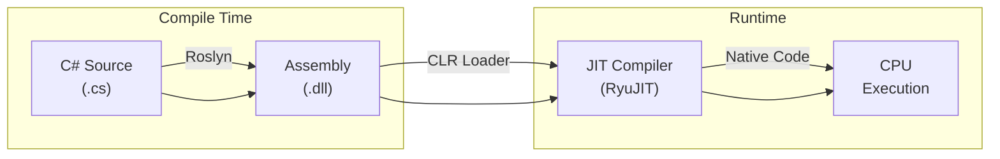
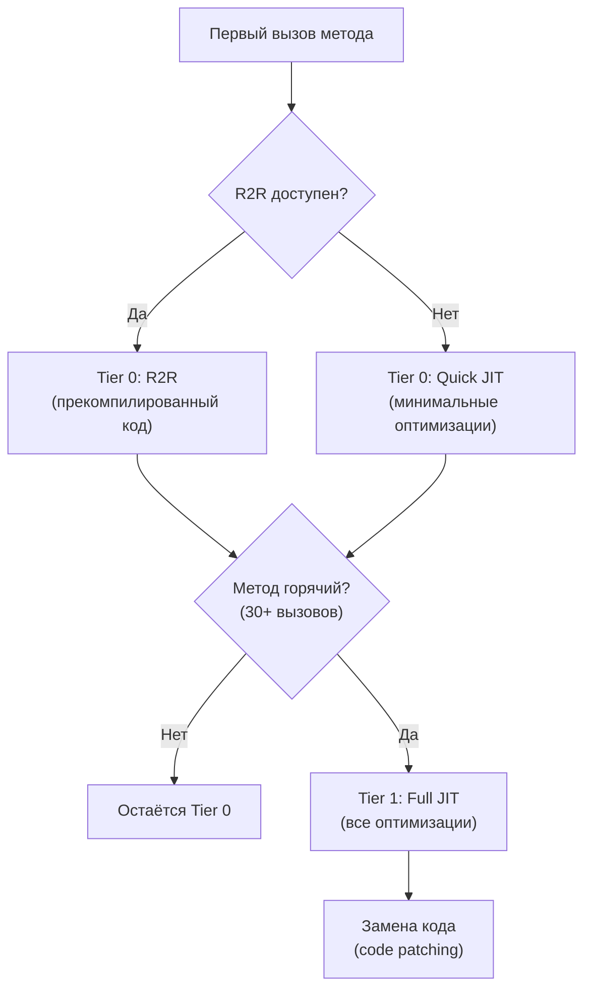

---
tags:
  - runtime
  - clr
  - jit
  - roslyn
  - deepdive
complexity: Senior
date: 2026-08-02
level: Senior
---

# .NET Runtime: от исходного кода до машинных инструкций

> Полный pipeline исполнения: Roslyn компилирует C# в IL, CLR грузит assembly и MethodTable, RyuJIT через Tiered Compilation, OSR, Dynamic PGO и R2R/NativeAOT превращает IL в native code. Зачем — чтобы диагностировать startup, JIT-аллокации и понимать lowering.

## Что это, зачем и когда

### Что такое .NET Runtime (CLR)?
**Виртуальная машина**, которая запускает твой C#-код. Компилирует, управляет памятью (GC), проверяет типы, ловит ошибки.

**Аналогия:** Операционная система внутри операционной системы. Ты пишешь код на C# → Roslyn компилирует в IL (промежуточный язык) → CLR компилирует IL в машинный код прямо во время работы (JIT).

### Зачем это знать?

| Без понимания | С пониманием |
|--------------|-------------|
| «Почему первый вызов медленный?» | JIT компилирует метод при первом вызове |
| «Зачем AOT?» | Компиляция заранее → мгновенный старт (Lambda, контейнеры) |
| «Что делает Roslyn?» | Компилятор C# → IL. Source generators работают на этом этапе |
| «Зачем Tiered Compilation?» | Tier 0 — быстрая компиляция, Tier 1 — оптимизированная. Баланс старта и скорости |

### Этапы выполнения

| Этап | Что происходит | Инструмент |
|------|---------------|-----------|
| Компиляция | C# → IL (.dll) | Roslyn |
| Загрузка | Assembly загружается в AppDomain | CLR Loader |
| JIT | IL → машинный код (при первом вызове) | RyuJIT |
| Выполнение | Машинный код на CPU | Процессор |

---

## Общая картина

Путь C#-кода до процессора — это конвейер из трёх стадий: **компиляция → загрузка → исполнение**. На каждом этапе код трансформируется в более низкоуровневое представление.



---

## 1. Roslyn: компиляция в IL

### Что происходит

Roslyn — компилятор C# (и VB.NET), реализованный как набор API. Он превращает исходный код в **MSIL** (Microsoft Intermediate Language, он же CIL / IL) и упаковывает в **assembly** (.dll / .exe).

### Под капотом

```
Source Code (.cs)
    │
    ├── 1. Lexical Analysis    → токены (keywords, identifiers, literals)
    ├── 2. Syntax Tree (AST)   → дерево синтаксиса
    ├── 3. Semantic Analysis   → типы, символы, binding
    ├── 4. Lowering            → упрощение конструкций языка
    └── 5. IL Emission         → байт-код + метаданные → .dll
```

### Что внутри Assembly

| Компонент | Содержимое |
|-----------|------------|
| **PE Header** | Формат Portable Executable, точка входа |
| **CLR Header** | Версия runtime, флаги (AnyCPU, x64) |
| **Metadata** | Типы, методы, поля, ссылки — полное описание модели |
| **IL Code** | Стековый байт-код — инструкции для виртуальной машины |
| **Resources** | Строки, файлы, embedded ресурсы |

```csharp
// Этот C# код:
public static int Add(int a, int b) => a + b;

// Превращается в IL:
// .method public static int32 Add(int32 a, int32 b) cil managed
// {
//     .maxstack 2
//     ldarg.0        // загрузить a на стек
//     ldarg.1        // загрузить b на стек
//     add            // сложить два верхних элемента стека
//     ret            // вернуть результат
// }
```

> [!info] IL — стековая машина
> IL не работает с регистрами процессора напрямую. Все операции идут через evaluation stack: загрузить значения → выполнить операцию → результат на вершине стека. JIT потом транслирует это в регистровый машинный код.

### Lowering — скрытые трансформации

Roslyn **до** генерации IL упрощает высокоуровневые конструкции:

| Конструкция C# | Во что lowering |
|-----------------|-----------------|
| `foreach` | `GetEnumerator()` + `while(MoveNext())` |
| `async/await` | State machine struct (`IAsyncStateMachine`) |
| `yield return` | State machine class (`IEnumerator<T>`) |
| `using` | `try { } finally { Dispose(); }` |
| `?.` (null-conditional) | `if (x != null) x.Method()` |
| `switch` expression | Серия `if/else` или jump table |
| `string interpolation` | `DefaultInterpolatedStringHandler` (C# 10+) |
| `record` | `Equals`, `GetHashCode`, `ToString`, `Deconstruct` |

> [!warning] Ключевой инсайт
> Многие «фичи языка» не существуют на уровне IL. `async/await` — это синтаксический сахар над state machine. `record` — это обычный класс с автогенерированными методами. Понимание lowering критично для диагностики производительности.

### Incremental parsing в IDE — переиспользование старого syntax tree

Всё выше описывает **single-pass** компиляцию: `csc` парсит файл один раз и уходит. Но в IDE Roslyn парсит **на каждое нажатие клавиши** — и парсить весь файл с нуля на каждый символ непозволительно дорого. Здесь работает отдельный механизм — **incremental parsing**, который переиспользует узлы предыдущего syntax tree.

> [!info] Это НЕ то же самое, что incremental generators
> `IIncrementalGenerator` кэширует результаты pipeline между прогонами source generator (см. [[source-generators|Source Generators]]). Incremental **parsing** работает на уровень ниже — внутри самого парсера, переиспользуя `SyntaxNode` старого дерева при построении нового. Один — про кэш генерации кода, другой — про переиспользование AST. Не путать.

**Why before how.** Редактор держит старое дерево от предыдущего keystroke и `TextChangeRange` — описание того, какой диапазон текста изменился. Большая часть файла не тронута, значит её узлы валидны как есть. Задача парсера — переиспользовать максимум старых узлов и пере-лексировать только то, что реально задето правкой.

#### Blender: смешивание старого дерева и свежих токенов

Сердце механизма — **`Blender`**. Он «подмешивает» (blend) узлы и токены старого дерева в поток свежего лексера. Для каждой позиции принимается решение **reuse-vs-relex**: взять готовый токен/узел из старого дерева или попросить лексер выдать свежий.

```
Старое дерево ─┐
               ├──► Blender ──► поток узлов: [reused | relexed | reused | ...]
Свежий лексер ─┘        │
                        └─ per-token решение: reuse или relex?
```

Позиции в старом и новом тексте не совпадают — правка сдвигает всё, что идёт после неё. Blender держит **`_changeDelta`**: для узла за пределами всех правок `newPosition = oldPosition + changeDelta`. Так старая позиция узла отображается в его место в новом тексте без полного пересчёта.

#### Cursor: O(1) навигация по старому дереву

Чтобы быстро ходить по старому дереву (в т.ч. **назад**, когда lookahead откатывается), Blender использует **`Cursor`** — `readonly struct`, который хранит явный путь до текущего узла:

| Поле | Назначение |
|------|------------|
| `PathNode` parent stack | стек родителей — явный путь от корня, без рекурсии |
| `indexInParent` | индекс узла в его родителе |

Явный путь вместо рекурсивного обхода даёт **O(1) на ход назад**: вместо повторного спуска от корня Cursor просто декрементирует `indexInParent` или поднимается по стеку `PathNode`. Рекурсивный обход здесь дал бы O(depth) на каждое движение и риск переполнения стека на больших файлах.

#### ReadToken: атомарный lookahead с откатом

Парсеру нужен **lookahead** — заглянуть вперёд и при неудаче откатиться. `Blender.ReadToken` возвращает пару:

- immutable **`BlendedNode`** — переиспользованный узел/токен;
- **новое состояние `Blender`** (тоже значение, не мутация).

Поскольку старое состояние не мутируется, откат lookahead — это просто «выбросить новый `Blender` и продолжить со старого». Атомарность бесплатна за счёт immutability — никакого ручного undo.

```csharp
// Концептуально (упрощённо): lookahead с откатом без мутации
var (node, advanced) = blender.ReadToken();   // advanced — НОВЫЙ Blender
if (LooksWrong(node))
    return ParseFreshFrom(blender);            // откат: старый blender как был
return ParseWith(node, advanced);              // принять: идём с advanced
```

#### Условия переиспользования — «when in doubt, don't reuse»

Узел старого дерева можно переиспользовать **только если выполнены ВСЕ** условия:

| Условие | Почему |
|---------|--------|
| Нет diagnostics / skipped text | узел с ошибкой мог бы по-другому распарситься в новом контексте |
| Позиции совпадают после `_changeDelta` | сдвинутый узел должен сесть ровно на своё место в новом тексте |
| Нет пересечения с изменённым `TextSpan` | задетый правкой текст обязан быть пере-лексирован |
| Lexer mode консистентен | напр. внутри/вне interpolated string, `#if` региона, директивы — режим лексера должен совпадать |

Принцип отрасли — **«when in doubt, don't reuse»**: при любой неоднозначности парсер пере-лексирует. Ложный relex стоит немного CPU; ложный reuse даёт **некорректное дерево** — куда хуже.

> [!warning] Инвариант валидации каждого парса
> После каждого incremental-парса Roslyn проверяет `code.Length == syntax.FullWidth`. `FullWidth` узла — это суммарная ширина всего его текста включая trivia (whitespace, комментарии). Если ширина итогового дерева не равна длине исходного текста — где-то reuse «съел» или «добавил» символы, дерево рассинхронизировано с буфером. Это дешёвый, но мощный контроль целостности всего слияния.

#### Выигрыш и когда он не нужен

На реальных деревьях incremental parsing даёт огромную экономию именно на **широких и неглубоких** деревьях (длинный файл из множества top-level членов): большинство соседних узлов не задеты правкой и переиспользуются как есть.

| Метрика | Эффект |
|---------|--------|
| Скорость | ~30x быстрее (один бенч: 26ms → 0.3ms) |
| Аллокации | ~98% меньше — переиспользованные узлы не создаются заново |
| Профиль дерева | максимум выигрыша на wide-shallow; на узких глубоких — скромнее |

> [!warning] Только для per-keystroke сценария
> Incremental parsing оправдан, когда один и тот же файл переписывается много раз подряд (IDE, language server). Для **single-pass** компилятора (`csc`, CI-сборка) старого дерева нет — переиспользовать нечего, а накладные расходы на ведение `Blender`/`Cursor` лишь замедлят. Не тащите этот механизм в одноразовый парсинг.

---

## 2. CLR: Execution Engine

### Что такое CLR

**Common Language Runtime** — среда исполнения .NET. Это не интерпретатор — это движок, который управляет:

```
CLR
├── Type System        → загрузка типов, метаданных, generics
├── JIT Compiler       → компиляция IL → native code
├── Garbage Collector  → управление памятью
├── Thread Pool        → управление потоками
├── Exception Engine   → SEH, managed exceptions
├── Security           → CAS, transparency (legacy), code access
└── Interop            → P/Invoke, COM Interop
```

### Загрузка типов

При первом обращении к типу CLR выполняет:

1. **Загрузка Assembly** — находит .dll, проверяет identity
2. **Загрузка Type** — парсит метаданные, создаёт `MethodTable`
3. **Валидация IL** — верификация type safety
4. **JIT-компиляция** — при первом вызове метода

```
Первый вызов MyClass.Process():
                                    MethodTable
┌──────────────┐     ┌───────────────────────────┐
│  MyClass     │     │ Process() → [JIT Stub]    │  ← указатель на stub
│  instance    │────►│ GetData() → [JIT Stub]    │
│              │     │ ToString() → [native ptr] │  ← уже скомпилирован
└──────────────┘     └───────────────────────────┘
                                    │
                          первый вызов Process()
                                    │
                                    ▼
                     ┌──────────────────────────┐
                     │   RyuJIT: IL → x64/ARM   │
                     │   Оптимизации, inlining   │
                     └──────────────────────────┘
                                    │
                                    ▼
                     MethodTable.Process() → [native code ptr]
```

> [!info] JIT Stub
> Изначально каждый метод в MethodTable указывает на **JIT stub** — маленький код, который вызывает JIT-компилятор. После компиляции stub заменяется на указатель на native code. Последующие вызовы идут напрямую в скомпилированный код.

---

## 3. JIT и Tiered Compilation

### RyuJIT

Текущий JIT-компилятор .NET (с .NET Core 1.0). Однопроходный, генерирует native code для x64, x86, ARM, ARM64.

### Tiered Compilation

С .NET Core 3.0 включена **многоуровневая компиляция** — компромисс между скоростью старта и качеством оптимизаций:



| Уровень | Когда | Оптимизации | Скорость компиляции |
|---------|-------|-------------|---------------------|
| **Tier 0 (Quick JIT)** | Первый вызов | Минимальные: без inlining, без loop optimization | Очень быстро |
| **Tier 0 (R2R)** | Первый вызов (если AOT) | Средние: прекомпилированы, но generic-независимые | Мгновенно (уже скомпилирован) |
| **Tier 1 (Full JIT)** | После ~30 вызовов | Полные: inlining, CSE, dead code elimination, loop unrolling | Медленнее |

> [!question]- **Интервью: Что такое IL? Как JIT компилирует?**
> IL (Intermediate Language) — платформо-независимый байткод, в который Roslyn компилирует C#. JIT (Just-In-Time) компилятор (RyuJIT) транслирует IL в нативный код при первом вызове метода. Tiered Compilation: Tier 0 — быстрая компиляция, минимальные оптимизации; Tier 1 — после ~30 вызовов, полные оптимизации (inlining, loop unrolling).

> [!question]- **Интервью: NativeAOT vs ReadyToRun?**
> **R2R** — прекомпиляция в нативный код + IL. JIT может перекомпилировать с полными оптимизациями. Быстрый старт, полная совместимость.
>
> **NativeAOT** — полная AOT компиляция, без JIT. Минимальный размер, мгновенный старт. Ограничения: нет dynamic, нет unreferenced reflection.

### Оптимизации Tier 1

```csharp
// Исходный код:
public int Sum(int[] arr)
{
    int sum = 0;
    for (int i = 0; i < arr.Length; i++)
        sum += arr[i];
    return sum;
}

// Tier 0: дословная трансляция IL → native
// Tier 1 применяет:
// 1. Bounds check elimination — arr[i] без проверки границ (i < arr.Length гарантирует)
// 2. Loop strength reduction — упрощение индексной арифметики
// 3. Register allocation — переменные в регистрах, не в памяти
// 4. Inlining — мелкие методы встраиваются в вызывающий код
```

> [!warning] On-Stack Replacement (OSR) — .NET 7+
> Если метод содержит долгий цикл и Tier 0 код слишком медленный, CLR может **заменить код прямо во время выполнения цикла** — перейти с Tier 0 на Tier 1 без ожидания завершения метода. Это OSR — критичная оптимизация для первого запуска.

### Profile-Guided Optimization (PGO)

**.NET 8+** — Dynamic PGO включён по умолчанию:

```csharp
// JIT собирает профиль: какие ветки чаще выполняются
public void Process(IShape shape)
{
    // Dynamic PGO видит, что 95% вызовов — Circle
    // Генерирует:
    if (shape is Circle c)       // fast path (devirtualization)
        c.Draw();                // прямой вызов, возможен inlining
    else
        shape.Draw();            // виртуальный вызов (fallback)
}
```

Dynamic PGO превращает виртуальные вызовы в прямые (Guarded Devirtualization) на основе реальной статистики.

---

## 4. ReadyToRun (R2R)

### Проблема

JIT при первом запуске тратит время на компиляцию. Для микросервисов с быстрым scale-out или serverless — это критично.

### Решение

R2R — **ahead-of-time** (AOT) компиляция в native code при публикации. Assembly содержит и IL, и прекомпилированный native code.

```bash
# Публикация с R2R
dotnet publish -c Release -r linux-x64 --self-contained \
    /p:PublishReadyToRun=true
```

### Как R2R работает с Tiered Compilation

```
Startup:
  R2R native code (Tier 0) → быстрый старт, код уже есть

Runtime (горячие методы):
  Tier 1 Full JIT → заменяет R2R на оптимизированный код
```

R2R не заменяет JIT — он даёт быстрый старт, а Tier 1 потом дооптимизирует горячие пути.

### NativeAOT (.NET 7+)

Полная AOT-компиляция — **без JIT, без IL**, один native binary:

```bash
dotnet publish -c Release -r linux-x64 \
    /p:PublishAot=true
```

| Характеристика | JIT | R2R | NativeAOT |
|----------------|-----|-----|-----------|
| Startup time | Медленный | Быстрый | Мгновенный |
| Peak performance | Максимум (Tier 1 + PGO) | Хороший | Хороший (нет dynamic PGO) |
| Binary size | Маленький (.dll) | Средний | Большой (всё в binary) |
| Reflection | Полная | Полная | Ограниченная (trimming) |
| Generics | Полные | Полные | Ограниченные (no shared generics) |

> [!warning] NativeAOT trade-offs
> NativeAOT не поддерживает: `Assembly.LoadFrom`, runtime code generation (`Reflection.Emit`), неограниченный reflection. Для CLI-утилит и microservices — отлично. Для plugin-систем — не подходит.

### NativeAOT — что нужно для подготовки

Чтобы приложение работало с NativeAOT, нужно **избавиться от рефлексии** или объяснить компилятору, что сохранить.

#### Source Generators — замена рефлексии

```csharp
// ✗ Без source generator — System.Text.Json использует рефлексию
var json = JsonSerializer.Serialize(order); // NativeAOT: ОШИБКА или пустой JSON

// ✓ С source generator — без рефлексии, AOT-ready
[JsonSerializable(typeof(Order))]
[JsonSerializable(typeof(List<OrderDto>))]
[JsonSerializable(typeof(ProblemDetails))]
public partial class AppJsonContext : JsonSerializerContext;

// Регистрация в Minimal API
builder.Services.ConfigureHttpJsonOptions(options =>
{
    options.SerializerOptions.TypeInfoResolverChain.Insert(0, AppJsonContext.Default);
});

// Ручная сериализация
var json = JsonSerializer.Serialize(order, AppJsonContext.Default.Order);
```

#### Logging source generator

```csharp
// ✗ Рефлексия + boxing + аллокации
logger.LogInformation("Order {OrderId} created for {Total}", order.Id, order.Total);

// ✓ Source generator — zero-alloc, compile-time проверка, AOT-ready
public static partial class LogMessages
{
    [LoggerMessage(Level = LogLevel.Information,
        Message = "Order {OrderId} created for {Total}")]
    public static partial void OrderCreated(ILogger logger, Guid orderId, decimal total);
}

// Использование
LogMessages.OrderCreated(logger, order.Id, order.Total);
```

#### Trimming — удаление неиспользуемого кода

```xml
<!-- .csproj -->
<PropertyGroup>
    <PublishAot>true</PublishAot>
    <!-- Или только trimming без AOT: -->
    <PublishTrimmed>true</PublishTrimmed>
    <TrimMode>link</TrimMode>
</PropertyGroup>
```

```csharp
// Если библиотека использует рефлексию — пометить что сохранить
[DynamicallyAccessedMembers(DynamicallyAccessedMemberTypes.PublicProperties)]
public Type GetEntityType() => typeof(Order);

// Или в rd.xml — список типов для сохранения
```

#### Когда использовать NativeAOT?

| Сценарий | NativeAOT? | Почему |
|----------|-----------|--------|
| **CLI утилита** | Да | Мгновенный старт, один файл |
| **AWS Lambda / Azure Functions** | Да | Cold start критичен |
| **Микросервис (Minimal API)** | Да | Быстрый старт, маленький Docker image |
| **Полное ASP.NET Core приложение** | Осторожно | Многие библиотеки не AOT-ready |
| **EF Core** | Нет (пока) | Активно использует рефлексию |
| **Plugin-система** | Нет | Нужен runtime loading |

#### Чеклист AOT-готовности

| Проверка | Как |
|---------|-----|
| JSON сериализация | `[JsonSerializable]` source generator |
| Logging | `[LoggerMessage]` source generator |
| DI | Конструкторная инжекция (не `Activator.CreateInstance`) |
| Конфигурация | `IOptions<T>` с source generator или ручной binding |
| Trimming warnings | `dotnet publish` с `<PublishTrimmed>true</PublishTrimmed>` и проверить warnings |
| Тесты | Запустить приложение после publish и проверить все endpoints |

---

## 5. Практический кейс: диагностика startup

```bash
# Измерить время JIT при запуске
dotnet trace collect --process-id <PID> --providers Microsoft-Windows-DotNETRuntimePrivate

# Посмотреть, какие методы JIT-ятся
DOTNET_JitDisasm="MyNamespace.MyClass:HotMethod" dotnet run

# Включить событие JIT для анализа
DOTNET_EnableEventPipe=1 DOTNET_EventPipeOutputPath=trace.nettrace dotnet run

# Анализ R2R покрытия
crossgen2 --print-repro-instructions MyApp.dll
```

---

## 6. JIT уже убрал boxing, который вы помните

Многие «правила производительности» из эпохи .NET Framework устарели: современный JIT lowering снимает аллокации, ради которых раньше писали ручные обходы. Два хрестоматийных случая — `Enum.HasFlag` и string interpolation. **Why before how:** прежде чем переписывать читаемый код на bitwise-арифметику или `string.Concat`, надо знать, что именно JIT и Roslyn делают с исходником на вашем target runtime — иначе вы усложняете код ради аллокации, которой уже нет.

### 6.1. `HasFlag` больше не боксит (.NET Core 2.1+)

Историческая проблема: `Enum.HasFlag` в .NET Framework принимал параметр как `Enum` (reference type), поэтому каждый вызов **боксил** и сам enum, и флаг — две аллокации на проверку бита. Отсюда совет «в hot path замени `HasFlag` на `(state & flag) == flag`».

С **.NET Core 2.1** JIT распознаёт паттерн `someEnum.HasFlag(someFlag)` как intrinsic и lowering превращает его ровно в ту самую bitwise-проверку — никакого boxing, никакого reflection-вызова `Enum.HasFlag`:

```csharp
[Flags]
public enum Permission { None = 0, Read = 1, Write = 2, Delete = 4 }

// Исходный, читаемый код:
bool canWrite = perm.HasFlag(Permission.Write);

// JIT на .NET Core 2.1+ lowering превращает в:
// movzx eax, ...        // загрузить perm
// and   eax, 2          // & Permission.Write
// cmp   eax, 2          // == Permission.Write
// sete  al
// — ноль аллокаций, идентично ручному (perm & flag) == flag
```

> [!info] Условие intrinsic
> JIT де-боксит `HasFlag`, когда **оба** аргумента — один и тот же enum-тип, известный на момент компиляции метода. Вызов через `Enum`-переменную или generic `where T : Enum` без конкретизации может не попасть под intrinsic — проверяйте disasm для своего случая. Подробности по самим флагам — [[enums-flags]].

Вывод: для конкретного enum-типа `HasFlag` сегодня настолько же дёшев, как ручная битовая логика, но читается лучше. Ручной де-боксинг оправдан только если disasm на вашем runtime показал, что intrinsic не сработал.

### 6.2. String interpolation больше не боксит value types (C# 10)

До C# 10 интерполяция компилировалась в `string.Format(format, args)`, а `args` — это `params object[]`. Каждый `int`, `double`, `DateTime`, `Guid` в `$"...{value}..."` **боксился** при упаковке в `object[]`, плюс аллокация самого массива.

С **C# 10** Roslyn делает lowering в `DefaultInterpolatedStringHandler`. У него generic-метод `AppendFormatted<T>(T value)` — value type передаётся по своему типу, форматируется через `ISpanFormattable.TryFormat` прямо в внутренний буфер. Boxing исчезает:

```csharp
int orderId = 42;
decimal total = 19.99m;

// C# 10+ lowering (упрощённо):
// var handler = new DefaultInterpolatedStringHandler(literalLength, formattedCount);
// handler.AppendLiteral("Order ");
// handler.AppendFormatted<int>(orderId);       // generic — без boxing int
// handler.AppendLiteral(" total ");
// handler.AppendFormatted<decimal>(total);     // generic — без boxing decimal
// string s = handler.ToStringAndClear();
string s = $"Order {orderId} total {total}";
```

> [!warning] Boxing возвращается через `params object[]`
> Аллокация снова появляется, когда **интерполированная строка попадает в перегрузку, принимающей `params object[]` или `object`** — там handler не используется, value type упаковывается в `object`. Классический капкан — логирование:

```csharp
// ✗ Boxing: interpolation вычисляется ВСЕГДА, аргументы боксятся в object[],
//   плюс строка строится, даже если этот log level выключен.
logger.LogInformation($"Order {orderId} created for {total}");

// ✓ Message template: параметры по object?[], но deferred — строка не строится,
//   если уровень выключен. А source-generated [LoggerMessage] вообще без boxing.
logger.LogInformation("Order {OrderId} created for {Total}", orderId, total);
```

То есть «интерполяция бесплатна» верно для прямого присваивания в `string` и для целевых типов с interpolated-string-handler, но **не** когда строка передаётся как обычный `object`-аргумент. Подробнее про сами строки и `DefaultInterpolatedStringHandler` — [[strings-regex]].

### 6.3. Дисциплина: measure-on-your-runtime

Главный принцип — **не доверяй памяти о boxing из старых версий, измеряй на конкретном target runtime**. Фикс мог уже стать бесплатным, и ручная «оптимизация» только ухудшит читаемость.

Рецепт верификации:

1. **BenchmarkDotNet с `[MemoryDiagnoser]`.** Смотри колонку `Allocated`. Если для подозрительного кода `Allocated == 0` (за вычетом неизбежного результата) — boxing нет, переписывать нечего.

```csharp
[MemoryDiagnoser]
public class FlagBench
{
    private readonly Permission _perm = Permission.Read | Permission.Write;

    [Benchmark]
    public bool HasFlag() => _perm.HasFlag(Permission.Write);

    [Benchmark]
    public bool Bitwise() => (_perm & Permission.Write) == Permission.Write;
    // Ожидаемо: обе строки Allocated = 0 B, Mean в пределах шума.
}
```

2. **Подтверди на уровне native code через `DOTNET_JitDisasm`** — на том самом runtime, где код поедет в прод (TFM, x64/ARM64, Debug/Release одинаково важны). Затем grep по дизасму на helper boxing’а:

```bash
# Сдампить native code метода на целевом runtime
DOTNET_JitDisasm="MyNamespace.FlagBench:HasFlag" \
DOTNET_TieredCompilation=0 \
dotnet run -c Release | grep -i CORINFO_HELP_BOX
```

3. **Решение по результату grep:** если `CORINFO_HELP_BOX` в дизасме **нет** — JIT уже убрал boxing, оставляй читаемый код. Если helper **есть** — только тогда дебоксируй вручную (bitwise для флагов, явный `.ToString()`/template для строк) и повтори замер.

> [!info] Почему именно дизасм, а не «здравый смысл»
> intrinsic и interpolation-handler — оптимизации конкретного JIT/компилятора конкретной версии. `[MemoryDiagnoser]` отвечает «есть ли аллокация», а `DOTNET_JitDisasm` + поиск `CORINFO_HELP_BOX` отвечает «почему и где именно». Вместе они закрывают вопрос объективно, а не по воспоминаниям о .NET Framework.

---

## Итог: полный pipeline

```
┌─────────────────────────────────────────────────────────────────┐
│                        COMPILE TIME                             │
│                                                                 │
│  .cs → Roslyn → [Syntax Tree → Semantic Model → Lowering → IL] │
│                           ↓                                     │
│                     Assembly (.dll)                              │
│              [PE Header + Metadata + IL + Resources]            │
│                                                                 │
│  Опционально: R2R / NativeAOT → native code в assembly         │
└─────────────────────────────────────────────────────────────────┘
                            ↓
┌─────────────────────────────────────────────────────────────────┐
│                         RUNTIME                                 │
│                                                                 │
│  CLR загружает Assembly → Type Loader → MethodTable             │
│       ↓                                                         │
│  Первый вызов метода → JIT Stub → RyuJIT (Tier 0)              │
│       ↓                                                         │
│  Горячий метод (30+ вызовов) → Tier 1 (Full Optimizations)     │
│       ↓                                                         │
│  Dynamic PGO → Guarded Devirtualization, Branch Prediction      │
│       ↓                                                         │
│  Native code → CPU Execution (registers, cache, pipelines)      │
└─────────────────────────────────────────────────────────────────┘
```

---

## См. также

- [[gc-memory|GC, LOH и POH]]
- [[span-layout|Span и Memory Layout]]
- [[concurrency-atomics|Concurrency и атомарность]]
- [[types-and-memory|Типы и память]]
