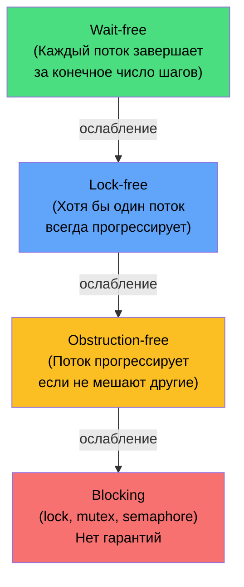

---
tags:
  - concurrency
  - lock-free
  - cas
  - volatile
  - memory-model
  - cache-coherency
  - false-sharing
  - delegates
  - deepdive
complexity: Senior
date: 2026-08-02
level: Senior
---

# Concurrency: гарантии прогресса, атомарность, memory model

> Самая глубокая заметка по lock-free и low-level concurrency. Цель — закрыть всё, что нужно знать Senior'у про работу с памятью на нескольких потоках: от CAS до cache coherency и memory model .NET / ECMA-335.

---

## Что это, зачем и когда

### Что такое низкоуровневая concurrency?
**Управление доступом к общим данным из нескольких потоков** без блокировок (lock-free) или с минимальными блокировками. Использует атомарные операции CPU (CAS, Interlocked) и memory barriers.

**Аналогия:** Обычный `lock` — это очередь в один турникет (один проходит, остальные ждут). Lock-free — каждый пытается пройти одновременно, и если столкнулись — повторяют попытку, но никто не стоит в очереди.

### Зачем это знать?

| Без понимания | С пониманием |
|--------------|-------------|
| «Зачем `volatile`?» | Без volatile компилятор/CPU могут переупорядочить чтение/запись → гонка |
| «Что такое CAS?» | Compare-And-Swap — атомарная операция: «если значение X, замени на Y» |
| «Когда lock-free?» | Когда lock — bottleneck (миллионы операций/сек), иначе обычный lock проще |
| «Race condition в продакшене» | Interlocked.Increment вместо `counter++` (не атомарная операция!) |
| «Почему ARM ведёт себя иначе?» | Weak memory model — нужны explicit barriers, x86 более forgiving |
| «Что такое false sharing?» | Два потока пишут в разные поля → cache line bouncing → 50x slowdown |

### Когда какой подход?

| Подход | Когда | Сложность |
|--------|-------|-----------|
| **lock / Monitor / Lock (.NET 9)** | 99% случаев, умеренная нагрузка | Просто |
| **SemaphoreSlim** | Ограничение одновременных операций (пул), async-friendly | Просто |
| **ReaderWriterLockSlim** | Много читателей, мало писателей | Средне |
| **Interlocked** | Атомарные счётчики, флаги | Средне |
| **Lock-free (CAS)** | Экстремальная производительность, миллионы ops/sec | Сложно |
| **`volatile`** | Флаг остановки потока, простейшая публикация | Средне |
| **Channel\<T\>** | Producer-consumer pattern, async-friendly | Просто |
| **ConcurrentDictionary, ConcurrentQueue** | Готовая lock-free / fine-grained коллекция | Просто |

**Правило:** Начинай с `lock`. Переходи на lock-free только если профайлер показал, что lock — bottleneck.

---

## 1. Гарантии прогресса



### Wait-free
**Каждый** поток завершает операцию за ограниченное число шагов, независимо от других.

```csharp
Interlocked.Increment(ref counter);              // wait-free
var value = Volatile.Read(ref _sharedValue);     // wait-free read
```

### Lock-free
**Хотя бы один** поток всегда завершает операцию. Остальные могут retry, но **система в целом** прогрессирует. Нет дедлоков.

```csharp
public bool TryUpdate(ref int location, Func<int, int> transform)
{
    while (true)
    {
        int current = Volatile.Read(ref location);
        int desired = transform(current);
        if (Interlocked.CompareExchange(ref location, desired, current) == current)
            return true;
    }
}
```

### Obstruction-free
Поток прогрессирует, если другие не мешают. При contention возможен livelock.

### Blocking
`lock`, `Mutex`, `SemaphoreSlim` — поток может ждать бесконечно. Возможны дедлоки. Но **проще** и часто **достаточно**.

> [!info] Практическое правило
> 95% задач решаются через `lock` или `SemaphoreSlim`. Lock-free нужен для **hot path** (миллионы ops/sec). Wait-free — экзотика.

---

## 2. Memory Model — фундамент

### Зачем

Современный CPU и компилятор **переупорядочивают** операции для производительности.

```csharp
// Что ты пишешь:
_data = 42;       // (1)
_ready = true;    // (2)

// Что может выполниться:
_ready = true;    // (2) ← может пойти первой!
_data = 42;       // (1)

// Другой поток:
if (_ready)
    Console.WriteLine(_data);  // может увидеть 0!
```

### Источники reordering

| Источник | Что делает |
|----------|-----------|
| **Компилятор** | Переставляет операции, кэширует значения в регистрах |
| **JIT** | Те же оптимизации |
| **CPU** | Out-of-order execution, store buffers |
| **Кэш** | Разные ядра видят разные значения временно |

### Memory Model .NET (ECMA-335)

.NET спецификация **слабее** чем у Java. Гарантии:

1. **Reads и writes к ссылкам и aligned values размером ≤ word** — атомарны
2. **Volatile read** — Acquire: всё что **после** этого чтения, не может переехать **до** него
3. **Volatile write** — Release: всё что **до** этой записи, не может переехать **после**
4. **Lock release** — все записи внутри lock'а видны всем, кто потом возьмёт lock
5. **Lock acquire** — все чтения после lock'а видят запись, сделанные в предыдущем lock'е

### Acquire / Release / SeqCst

```
Sequential Consistency (SeqCst) — самая сильная:
  Все потоки видят все операции в одном порядке.
  Дорого. MFENCE везде.

Acquire-Release — стандартная для lock-free:
  Acquire: чтение → barrier → последующие операции
  Release: предыдущие операции → barrier → запись

Relaxed — самая слабая:
  Только атомарность, никаких guarantees о видимости.
```

### x86 vs ARM

| | x86 / x64 | ARM / ARM64 / Apple Silicon |
|--|-----------|-----------------------------|
| Strong/weak | TSO (Total Store Ordering) — strong | Weak memory model |
| Loads | Не reordered с loads | Могут reordered |
| Stores | Не reordered с stores | Могут reordered |
| Default semantics | Близко к acquire-release | Relaxed |
| MFENCE | ~30 cycles | DMB ~50+ cycles |

**Практическое следствие:** код, работающий на Intel x86, **может ломаться на Apple Silicon / Graviton / Snapdragon**. Тестируй на ARM.

```csharp
// Этот код "случайно" работает на x86 (TSO):
private int _data;
private bool _ready;

// Producer:
_data = 42;
_ready = true;       // ← на x86 ordering сохраняется
                     // ← на ARM может leak past _data write

// ✅ Правильно — volatile или Volatile.Write
private volatile bool _ready;
// или
Volatile.Write(ref _ready, true);
```

---

## 3. Memory Barriers подробно

### Типы barriers

| Тип | Что блокирует | Когда |
|-----|---------------|-------|
| **LoadLoad** | Reordering read→read | Acquire |
| **LoadStore** | Reordering read→write | Acquire |
| **StoreStore** | Reordering write→write | Release |
| **StoreLoad** | Reordering write→read | Самый дорогой, SeqCst |
| **Full Fence** | Все 4 | `Thread.MemoryBarrier()` |

### Volatile.Read и Volatile.Write

```csharp
int value = Volatile.Read(ref _shared);   // Acquire
Volatile.Write(ref _shared, value);       // Release
Thread.MemoryBarrier();                   // Full fence
```

### `volatile` keyword vs Volatile.Read/Write

```csharp
private volatile int _v1;
_v1 = 42;
int x = _v1;

// vs:
private int _v2;
Volatile.Write(ref _v2, 42);
int y = Volatile.Read(ref _v2);
```

`Volatile.Read/Write` лучше:
- Явно видно где barrier
- Можно применить к local variables
- Не зависит от declared type

### Thread.MemoryBarrierProcessWide (.NET 5+)

```csharp
Thread.MemoryBarrierProcessWide();
```

Дорого (IPI на Linux через `sys_membarrier`), но иногда необходимо.

---

## 4. CAS (Compare-And-Swap)

### Атомарная инструкция

```
CAS(address, expected, desired):
    ATOMICALLY:
        if *address == expected:
            *address = desired
            return expected    // успех
        else:
            return *address    // неудача
```

x86: `LOCK CMPXCHG`. ARM: `LDREX/STREX` или `CAS` (ARMv8.1+).

### Interlocked

```csharp
int original = Interlocked.CompareExchange(
    ref location,
    desired,
    expected);

Interlocked.Increment(ref counter);
Interlocked.Decrement(ref counter);
Interlocked.Add(ref counter, 10);
Interlocked.Exchange(ref value, newValue);
Interlocked.Or(ref flags, MyFlag);    // .NET 7+
Interlocked.And(ref flags, ~MyFlag);  // .NET 7+
```

### Поддерживаемые типы

- `int`, `long`, `uint`, `ulong`
- `float`, `double` (.NET 5+)
- `IntPtr`, `UIntPtr`
- Любой reference type через `Interlocked.CompareExchange<T>`

```csharp
private MyConfig? _config;

void UpdateConfig(MyConfig newConfig)
{
    var old = Interlocked.Exchange(ref _config, newConfig);
    old?.Dispose();
}
```

### ABA Problem

```
Thread 1: читает A, готовится записать B
Thread 2: меняет A → C → A
Thread 1: CAS видит A → "не изменилось" → записывает B
          НО состояние системы изменилось!
```

**Решения:**
1. **Version counter (tagged pointer)** — CAS по `(value, version)`. На x86 — `CMPXCHG16B`.
2. **Immutable objects** — каждое изменение создаёт новый объект.
3. **Hazard pointers** — для unmanaged.
4. **Epoch-based reclamation**.

В managed коде ABA редко проявляется — GC сам управляет. Опасно для unmanaged interop.

---

## 5. Lock-free Stack (Treiber Stack)

```csharp
public class LockFreeStack<T>
{
    private volatile Node? _head;

    private class Node(T value, Node? next)
    {
        public readonly T Value = value;
        public Node? Next = next;
    }

    public void Push(T value)
    {
        var newNode = new Node(value, null);
        while (true)
        {
            newNode.Next = _head;
            if (Interlocked.CompareExchange(ref _head, newNode, newNode.Next) == newNode.Next)
                return;
        }
    }

    public bool TryPop(out T? value)
    {
        while (true)
        {
            var head = _head;
            if (head is null) { value = default; return false; }
            if (Interlocked.CompareExchange(ref _head, head.Next, head) == head)
            {
                value = head.Value;
                return true;
            }
        }
    }
}
```

> [!warning] В production — ConcurrentStack&lt;T&gt;
> Пример — для понимания. `System.Collections.Concurrent.ConcurrentStack<T>` оптимизирован и протестирован.

---

## 6. Lock-free Queue (Michael-Scott)

```csharp
public class MichaelScottQueue<T>
{
    private class Node(T? value)
    {
        public T? Value = value;
        public Node? Next;
    }

    private Node _head;
    private Node _tail;

    public MichaelScottQueue()
    {
        var dummy = new Node(default);
        _head = dummy;
        _tail = dummy;
    }

    public void Enqueue(T value)
    {
        var node = new Node(value);
        while (true)
        {
            var tail = _tail;
            var next = tail.Next;

            if (tail != _tail) continue;

            if (next is null)
            {
                if (Interlocked.CompareExchange(ref tail.Next, node, null) is null)
                {
                    Interlocked.CompareExchange(ref _tail, node, tail);
                    return;
                }
            }
            else
            {
                Interlocked.CompareExchange(ref _tail, next, tail);
            }
        }
    }

    public bool TryDequeue(out T? value)
    {
        while (true)
        {
            var head = _head;
            var tail = _tail;
            var next = head.Next;

            if (head != _head) continue;

            if (head == tail)
            {
                if (next is null) { value = default; return false; }
                Interlocked.CompareExchange(ref _tail, next, tail);
            }
            else
            {
                if (next is null) continue;
                value = next.Value;
                if (Interlocked.CompareExchange(ref _head, next, head) == head)
                    return true;
            }
        }
    }
}
```

`ConcurrentQueue<T>` использует похожий подход + segment-based структуру для уменьшения allocation.

---

## 7. False Sharing — невидимый killer производительности

### Проблема

CPU кэширует данные **cache line'ами** — обычно 64 байта (на ARM Apple Silicon — 128). Если два потока пишут в **разные поля одного объекта**, попавшие в одну cache line — каждая запись инвалидирует cache line у другого потока (MESI coherency).

```csharp
// ❌ BAD — false sharing
public class Counter
{
    public long Value1;  // в cache line 0
    public long Value2;  // в cache line 0 (рядом!)
}
// Thread 1 пишет Value1, Thread 2 пишет Value2
// → cache line bouncing → ~50x медленнее
```

### Решение: padding

```csharp
// ✅ GOOD — padding до 64 байт
[StructLayout(LayoutKind.Explicit, Size = 128)]
public struct PaddedLong
{
    [FieldOffset(64)]
    public long Value;
}

// Или per-core counter
[StructLayout(LayoutKind.Explicit, Size = 128)]
public struct Cell
{
    [FieldOffset(0)] public long Value;
}

private Cell[] _cells = new Cell[Environment.ProcessorCount];

public void Increment()
{
    int idx = Thread.GetCurrentProcessorId() % _cells.Length;
    Interlocked.Increment(ref _cells[idx].Value);
}

public long GetTotal()
{
    long sum = 0;
    foreach (var c in _cells) sum += Volatile.Read(ref c.Value);
    return sum;
}
```

Это паттерн **Striped Counter** — известный из JVM, .NET использует похожее в внутренних структурах.

### Detection

```bash
# Linux — найти hot cache lines
perf c2c record -p $(pidof dotnet)
perf c2c report
```

Также Intel VTune, AMD μProf.

---

## 8. Cache coherency — MESI / MOESI

### Состояния cache line

| State | Значение |
|-------|----------|
| **M (Modified)** | Этот core изменил, ещё не записал в RAM |
| **E (Exclusive)** | Только этот core имеет cache line, не модифицирован |
| **S (Shared)** | Несколько cores имеют read-only копию |
| **I (Invalid)** | Cache line невалидна |

### Что происходит при write

```
Core 0: Read X → load X (S)         Core 1: Read X → load X (S)

Core 0 writes X:
  Send Invalidate to Core 1 → Core 1's X (I)
  Core 0's X (M)
  
Core 1 reads X:
  Cache miss → fetch from Core 0 (или RAM) → (S)
```

Каждое изменение shared cache line → broadcast invalidate → bus traffic. **На 64-core машинах — bottleneck.**

### Влияние на .NET

- `Interlocked.Increment` на shared переменной с 64 потоков — **последовательная** работа
- Решение: per-thread / per-core counter
- `ConcurrentDictionary` использует **lock striping** — разные ключи не конфликтуют

---

## 9. Volatile vs Interlocked vs lock — полная картина

| Механизм | Атомарность | Visibility | Ordering | Cost (на x86) | Для чего |
|----------|-------------|------------|----------|---------------|----------|
| Plain field | aligned r/w ≤ word | Нет (compiler may cache) | Reordered | 0 | Не shared |
| `volatile` | aligned r/w | Да | Acquire/Release | 1-3 cycles | Флаги |
| `Volatile.Read/Write` | aligned r/w | Да | Acquire/Release | 1-3 cycles | Explicit |
| `Interlocked.*` | Да (CAS) | Да | Full fence (LOCK) | ~25 cycles | Счётчики, CAS |
| `Thread.MemoryBarrier` | — | Полная | Full fence (MFENCE) | ~30 cycles | Manual ordering |
| `lock {}` / `Monitor` | Critical section | Да | Full fence on enter/exit | 20-50ns uncontended | Составные операции |
| `Lock` (.NET 9) | Critical section | Да | Full fence | Чуть быстрее `lock` | Same |

### `volatile` ловушки

```csharp
private volatile bool _cancelled;  // ✅ для флага OK

// ❌ НЕПРАВИЛЬНО — i++ не атомарен даже с volatile
private volatile int _counter;
_counter++;  // Read + Increment + Write — 3 операции

// ✅ ПРАВИЛЬНО
Interlocked.Increment(ref _counter);

// ❌ volatile с long на 32-битных — С# не позволяет
private volatile long _bigValue;  // compile error

// ✅ Используй Interlocked для long
Interlocked.Read(ref _bigValue);
Interlocked.Exchange(ref _bigValue, newValue);
```

> [!warning] volatile не делает операции атомарными
> `volatile` гарантирует только **видимость** и **порядок**. Для атомарных read-modify-write — только `Interlocked`.

---

## 10. Lock — .NET 9 новый тип

С .NET 9 — `System.Threading.Lock`:

```csharp
// .NET до 9
private readonly object _lock = new();
lock (_lock) { /* critical section */ }

// .NET 9+
private readonly Lock _lock = new();
lock (_lock) { /* critical section */ }

// Или явно
using (_lock.EnterScope()) { /* ... */ }
```

Преимущества:
- Чуть быстрее — JIT эмитит специализированный код
- Type safety — нельзя случайно lock на string
- Фундамент для будущих async-friendly операций

---

## 11. Monitor под капотом

`lock(x) { ... }` — синтаксический сахар над:

```csharp
Monitor.Enter(x);
try { /* ... */ }
finally { Monitor.Exit(x); }
```

### Sync Block

Lock использует **sync block** в object header (см. [[gc-memory|GC]]). При первом lock — выделяется entry в sync block table.

### Thin Lock vs Inflated Lock

| Lock state | Где |
|------------|-----|
| **Unlocked** | Sync block index = 0 |
| **Thin lock** | Lock owner ID + nesting count — прямо в object header |
| **Inflated** | Полноценный sync block с queue ожидающих |

Thin lock — fast path: `LOCK CMPXCHG` для acquire, без kernel transition. Inflate происходит при contention или `Wait/Pulse`.

### Pulse / Wait / PulseAll

```csharp
private readonly object _lock = new();
private bool _ready;

// Producer
lock (_lock)
{
    _ready = true;
    Monitor.PulseAll(_lock);
}

// Consumer
lock (_lock)
{
    while (!_ready)
        Monitor.Wait(_lock);  // отпустить lock, ждать pulse
}
```

> [!info] 99% случаев — лучше SemaphoreSlim, ManualResetEventSlim, или Channel.

---

## 12. ReaderWriterLockSlim

```csharp
private readonly ReaderWriterLockSlim _rwLock = new(LockRecursionPolicy.NoRecursion);
private Dictionary<string, string> _cache = new();

public string? Read(string key)
{
    _rwLock.EnterReadLock();
    try
    {
        return _cache.TryGetValue(key, out var v) ? v : null;
    }
    finally { _rwLock.ExitReadLock(); }
}

public void Write(string key, string value)
{
    _rwLock.EnterWriteLock();
    try { _cache[key] = value; }
    finally { _rwLock.ExitWriteLock(); }
}

// Upgradeable — read с возможностью upgrade в write
public void ReadAndMaybeWrite(string key)
{
    _rwLock.EnterUpgradeableReadLock();
    try
    {
        if (!_cache.ContainsKey(key))
        {
            _rwLock.EnterWriteLock();
            try { _cache[key] = "default"; }
            finally { _rwLock.ExitWriteLock(); }
        }
    }
    finally { _rwLock.ExitUpgradeableReadLock(); }
}
```

| Когда | RWLockSlim лучше |
|-------|------------------|
| Read 95% / Write 5% | ✅ Concurrent reads |
| Read 50% / Write 50% | ❌ Overhead больше lock |
| Read дорогой (DB) | ✅ |
| Async-friendly | ❌ — синхронный |

> [!warning] ReaderWriterLockSlim не async-friendly
> Если нужна read/write блокировка в async — пиши свой через `SemaphoreSlim` или `AsyncReaderWriterLock` из Nito.AsyncEx.

---

## 13. SemaphoreSlim — async-friendly

Универсальный примитив для async:

```csharp
// Mutual exclusion (1, 1) — async-аналог lock
private readonly SemaphoreSlim _mutex = new(1, 1);

public async Task DoSomethingAsync()
{
    await _mutex.WaitAsync();
    try
    {
        // critical section
    }
    finally
    {
        _mutex.Release();
    }
}

// Throttling — максимум 5 одновременно
private readonly SemaphoreSlim _throttle = new(5, 5);

public async Task<HttpResponseMessage> CallApiAsync(string url)
{
    await _throttle.WaitAsync();
    try
    {
        return await _httpClient.GetAsync(url);
    }
    finally { _throttle.Release(); }
}
```

### С CancellationToken

```csharp
await _mutex.WaitAsync(TimeSpan.FromSeconds(5), cancellationToken);
```

Если timeout или cancellation — `OperationCanceledException`.

### AsyncLock pattern (custom)

`SemaphoreSlim(1,1)` — это и есть async lock. Но если хочется идиомы `using`:

```csharp
public sealed class AsyncLock
{
    private readonly SemaphoreSlim _semaphore = new(1, 1);

    public async ValueTask<IDisposable> LockAsync(CancellationToken ct = default)
    {
        await _semaphore.WaitAsync(ct);
        return new Releaser(_semaphore);
    }

    private sealed class Releaser(SemaphoreSlim s) : IDisposable
    {
        public void Dispose() => s.Release();
    }
}

// Использование
private readonly AsyncLock _lock = new();

public async Task DoAsync()
{
    using (await _lock.LockAsync())
    {
        // critical section
    }
}
```

> [!warning] SemaphoreSlim — не reentrant
> Один и тот же поток не может взять lock дважды. В отличие от `lock {}`, который reentrant.

---

## 14. Channel\<T\> — producer-consumer для async

`System.Threading.Channels` — современный async-friendly producer-consumer:

```csharp
// Bounded — backpressure
var channel = Channel.CreateBounded<Order>(new BoundedChannelOptions(100)
{
    FullMode = BoundedChannelFullMode.Wait,  // ждать если полный
    SingleReader = true,
    SingleWriter = false,
});

// Producer
async Task ProduceAsync(CancellationToken ct)
{
    foreach (var order in GetOrders())
    {
        await channel.Writer.WriteAsync(order, ct);
    }
    channel.Writer.Complete();
}

// Consumer
async Task ConsumeAsync(CancellationToken ct)
{
    await foreach (var order in channel.Reader.ReadAllAsync(ct))
    {
        await ProcessAsync(order, ct);
    }
}
```

### Bounded vs Unbounded

| | Bounded | Unbounded |
|--|---------|-----------|
| Capacity | Limit | Unlimited |
| Memory safe | ✅ | ❌ Может OOM |
| Backpressure | ✅ Producer ждёт | ❌ |
| Speed | Чуть медленнее | Самый быстрый |

### FullMode

| Mode | Поведение при full |
|------|-------------------|
| `Wait` (default) | Producer ждёт place |
| `DropNewest` | Сбросить новейший item |
| `DropOldest` | Сбросить старейший item |
| `DropWrite` | Сбросить пишущий item |

### SingleReader / SingleWriter

Если ты гарантируешь что reader один (или writer один) — оптимизация. Channel не использует CAS на этих путях.

См. [[async-threading|Async и Threading]] — глубже про channels.

---

## 15. ConcurrentDictionary — внутреннее устройство

`ConcurrentDictionary<TKey, TValue>` использует **lock striping**:

```
Buckets:        [B0][B1][B2][B3]...[Bn]
Locks:          [L0][L1][L2][L3]...[Lk]
                  ↑    ↑   ↑   ↑     ↑
              key0  key1 key2 key3 keyN

bucket = hash(key) % buckets.Length
lock = bucket % locks.Length  (~ Environment.ProcessorCount * 4)
```

**Reads** — lock-free, через volatile read.
**Writes** — берут только свой stripe lock. Разные ключи → разные locks → параллельно.

### TryGetValue — lock-free

```csharp
// Read pattern (упрощённо):
public bool TryGetValue(TKey key, out TValue value)
{
    int hash = comparer.GetHashCode(key);
    var node = Volatile.Read(ref buckets[hash % buckets.Length]);
    while (node != null)
    {
        if (comparer.Equals(node.Key, key))
        {
            value = node.Value;
            return true;
        }
        node = node.Next;
    }
    value = default;
    return false;
}
```

### AddOrUpdate / GetOrAdd ловушка

```csharp
// ❌ valueFactory может вызваться несколько раз!
var result = dict.GetOrAdd(key, k => new ExpensiveObject(k));

// При concurrent доступе с одинаковым key — несколько threads могут
// одновременно вызвать factory, но в dict попадёт только один.
// Остальные ExpensiveObject'ы будут выброшены.

// ✅ Lazy<T>
var result = dict.GetOrAdd(key, k =>
    new Lazy<ExpensiveObject>(() => new ExpensiveObject(k))
).Value;

// Или AsyncLazy для async factory
```

### EstimatedCount vs Count

```csharp
// Точный count — ЛОКИРУЕТ ВСЕ buckets
int count = dict.Count;  // ❌ блокирует все writers

// Approximate — без lock
int approx = dict.GetType().GetField("_tables")
    .GetValue(dict);  // hack, или через reflection
```

В .NET 8+ есть `ConcurrentDictionary.IsEmpty` без full lock. Но `Count` всё ещё блокирующий.

---

## 16. ImmutableArray + atomic update — простой lock-free паттерн

Когда у тебя коллекция, которая редко меняется, но часто читается — паттерн **copy-on-write**:

```csharp
private ImmutableList<Subscriber> _subscribers = ImmutableList<Subscriber>.Empty;

public void Subscribe(Subscriber s)
{
    while (true)
    {
        var current = _subscribers;
        var updated = current.Add(s);
        if (Interlocked.CompareExchange(ref _subscribers, updated, current) == current)
            return;
    }
}

public void Notify()
{
    // Read — lock-free, без CAS
    var snapshot = _subscribers;  // atomic ref read
    foreach (var s in snapshot)
        s.OnEvent();
}
```

Преимущества:
- Reads — wait-free
- Writes — lock-free
- Snapshot consistency (не "половина старого, половина нового")

Недостатки:
- Каждое изменение создаёт новый array → GC pressure
- Не подходит для частых writes

---

## 17. ThreadLocal vs AsyncLocal

### ThreadLocal\<T\>

Значение **per thread**.

```csharp
private static readonly ThreadLocal<Random> _rng = new(() => new Random());

// Безопасно из любого потока
int x = _rng.Value.Next();
```

**Проблема в async:** thread меняется между await'ами → значение может потеряться.

### AsyncLocal\<T\>

Значение **per logical execution context** — переживает `await`.

```csharp
private static readonly AsyncLocal<string?> _correlationId = new();

public async Task ProcessAsync()
{
    _correlationId.Value = Guid.NewGuid().ToString();
    
    await Task.Delay(100);
    
    Console.WriteLine(_correlationId.Value);  // тот же ID, даже после await
}
```

Используется для:
- Distributed tracing (correlation IDs)
- AspNetCore HttpContext (внутри `IHttpContextAccessor`)
- Logging scopes

### Внимание: AsyncLocal копируется при fork

```csharp
_correlationId.Value = "A";
var t = Task.Run(() =>
{
    Console.WriteLine(_correlationId.Value);  // "A"
    _correlationId.Value = "B";  // изменение в child НЕ виду parent'у
});
await t;
Console.WriteLine(_correlationId.Value);  // "A", не "B"
```

ExecutionContext копируется при создании Task → child не может изменить родительский context.

---

## 18. SpinWait и SpinLock

```csharp
// SpinWait — адаптивное ожидание (spin → yield → sleep)
var spinner = new SpinWait();
while (!_condition)
{
    spinner.SpinOnce();  // CPU spin → Thread.Yield → Thread.Sleep(0) → Thread.Sleep(1)
}

// SpinLock — lock без kernel transition
private SpinLock _lock = new(enableThreadOwnerTracking: false);

bool taken = false;
try
{
    _lock.Enter(ref taken);
    // критическая секция — должна быть ОЧЕНЬ короткой (наносекунды)
}
finally
{
    if (taken) _lock.Exit();
}
```

> [!warning] SpinLock только для нс-операций
> Если критическая секция > 1 мкс — обычный `lock`. SpinLock тратит CPU. На single-CPU машинах бесполезен.

### Adaptive backoff

`SpinWait.SpinOnce()` стратегия:
1. Первые ~10 — pure spin (`PAUSE` instruction на x86)
2. Затем — `Thread.Yield()` (отдать timeslice другим потокам)
3. Затем — `Thread.Sleep(0)` (отдать другим потокам того же приоритета)
4. Финал — `Thread.Sleep(1)` (1 мс)

---

## 19. ManualResetEventSlim, CountdownEvent, Barrier

### ManualResetEventSlim

```csharp
private readonly ManualResetEventSlim _ready = new(initialState: false);

// Producer
async Task PrepareAsync()
{
    await Task.Delay(1000);
    _ready.Set();  // signal
}

// Consumer
void Use()
{
    _ready.Wait();  // блокирует пока Set
    // ... работа
}

// Async-friendly waiting (через Task.Run + ManualResetEventSlim или ContinueWith)
```

Slim — оптимизация: spin перед kernel wait.

### CountdownEvent — ждём N сигналов

```csharp
var countdown = new CountdownEvent(initialCount: 10);

// 10 worker'ов
for (int i = 0; i < 10; i++)
{
    Task.Run(() =>
    {
        DoWork();
        countdown.Signal();  // -1
    });
}

countdown.Wait();  // ждём пока count == 0
```

### Barrier — N потоков синхронизируются на phases

```csharp
var barrier = new Barrier(participantCount: 3, postPhaseAction: b =>
{
    Console.WriteLine($"Phase {b.CurrentPhaseNumber} complete");
});

// 3 потока, каждый делает несколько фаз работы
async Task WorkerAsync()
{
    for (int phase = 0; phase < 5; phase++)
    {
        DoPhaseWork(phase);
        barrier.SignalAndWait();  // ждём пока все 3 закончат phase
    }
}
```

Используется в parallel computing, ML training (gradient sync between epochs).

---

## 20. Multicast Delegates — внутренняя механика

### Как устроены делегаты

```csharp
public abstract class Delegate
{
    internal object? _target;       // this или null
    internal IntPtr _methodPtr;     // указатель на метод
}

public abstract class MulticastDelegate : Delegate
{
    private object? _invocationList;   // Delegate[]?
    private IntPtr _invocationCount;
}
```

### InvocationList — неизменяемый массив

```csharp
Action<string> handler = Console.WriteLine;
handler += msg => File.AppendAllText("log.txt", msg);
handler += msg => Debug.WriteLine(msg);

// handler._invocationList = Delegate[3]
```

### Combine и Remove — создают новый массив

```csharp
handler += newHandler;  // создаёт НОВЫЙ делегат с НОВЫМ массивом
handler -= oldHandler;  // создаёт НОВЫЙ делегат БЕЗ удалённого
```

> [!info] Thread safety делегатов
> `Delegate.Combine` и `Delegate.Remove` создают **новые** объекты. Старый делегат неизменяем. Поэтому паттерн `handler?.Invoke(args)` потокобезопасен — `handler` копируется на стек, и даже если другой поток изменит поле, вызов пойдёт по старой копии.

### Invoke — последовательный вызов

```csharp
handler("message");

// CLR делает:
// for (int i = 0; i < _invocationList.Length; i++)
//     _invocationList[i].Invoke("message");

// Если подписчик бросает исключение — остальные НЕ вызываются!
```

### Ручной обход

```csharp
foreach (var d in handler.GetInvocationList())
{
    try { ((Action<string>)d)("message"); }
    catch (Exception ex) { logger.LogError(ex, "Handler failed"); }
}
```

### Thread-safe event invocation

```csharp
public event EventHandler? Updated;

protected virtual void OnUpdated(EventArgs e)
{
    // Snapshot — атомарное чтение _Updated field
    var handler = Updated;
    handler?.Invoke(this, e);
}
```

В C# `event Updated` под капотом — приватное поле `Updated` + публичные `add/remove` через `Delegate.Combine/Remove` (с `Interlocked.CompareExchange` начиная с C# 4).

---

## 21. Lock convoys и Priority inversion

### Lock convoy

Если все threads пытаются взять один lock и часто его берут — даже если каждая критическая секция короткая, они выстраиваются в очередь и thread scheduler kicks in. Throughput падает.

**Симптом:** CPU не загружен, но performance плохой. Все потоки в "Waiting" состоянии в profiler'е.

**Решения:**
- Lock striping (как в ConcurrentDictionary)
- Per-thread queues + steal-work
- Lock-free структуры
- Reduce critical section size

### Priority inversion

Высокоприоритетный поток ждёт lock от низкоприоритетного, который вытеснён средним приоритетом. Высокий ждёт неопределённо.

В .NET / OS Windows — использует **priority inheritance**: владелец lock'а временно получает приоритет ожидающего.

**Real-time системы** требуют priority inheritance protocols явно.

---

## 22. Hardware Intrinsics для concurrency

### x86: PAUSE инструкция

В spin loop желательно вставлять `PAUSE` — намекает CPU что мы в spin loop, экономит power и предсказывает branch.

```csharp
using System.Runtime.Intrinsics.X86;

while (!Volatile.Read(ref _ready))
{
    if (X86Base.IsSupported)
        X86Base.Pause();  // CPU optimization hint
}
```

`SpinWait.SpinOnce()` использует это автоматически.

### ARM: YIELD

```csharp
using System.Runtime.Intrinsics.Arm;

if (ArmBase.IsSupported)
    ArmBase.Yield();  // ARM аналог PAUSE
```

### Memory barriers через intrinsics

```csharp
// Полные barriers
X86Base.MemoryFence();    // x86 MFENCE
ArmBase.MemoryBarrier();  // ARM DMB
```

---

## Cheat Sheet: выбор примитива синхронизации

```
Нужна синхронизация?
  │
  ├── Простой флаг (bool/int) → volatile
  │
  ├── Счётчик (increment/add) → Interlocked
  │
  ├── CAS-обновление → Interlocked.CompareExchange + loop
  │
  ├── Read-mostly коллекция → ImmutableList + Interlocked.CompareExchange
  │
  ├── Per-thread / per-core counter → Striped (Cell[]) с padding
  │
  ├── Короткая sync операция → lock / Lock (.NET 9)
  │   └── Наносекунды → SpinLock
  │
  ├── Async-совместимая блокировка → SemaphoreSlim(1,1)
  │
  ├── Read-many / write-rare → ReaderWriterLockSlim (sync только)
  │
  ├── Producer-consumer → Channel<T>
  │
  ├── Multi-key concurrent → ConcurrentDictionary
  │
  ├── Wait для signal → ManualResetEventSlim или TaskCompletionSource
  │
  ├── N tasks завершить → CountdownEvent или Task.WhenAll
  │
  └── Phase-based sync → Barrier
```

---

## Best Practices

- **Проверь архитектуру таргет** — x86 forgiving, ARM (Apple Silicon, Graviton) requires explicit barriers
- **Профилируй прежде чем lock-free** — `lock` достаточен в 95% случаев
- **Cache line padding** для shared счётчиков (false sharing убивает)
- **Не делай свой ConcurrentDictionary** — используй встроенный
- **`volatile` только для флагов** — не для счётчиков
- **AsyncLocal для context** в async-коде, ThreadLocal для thread-bound
- **Channel\<T\> для producer-consumer** — не свои queues
- **`SpinWait` уменьшает контеншн** — но не панацея
- **Тестируй на multi-core под нагрузкой** — single-threaded race condition ≠ multi-core
- **Используй Roslyn analyzer ConcurrentExclusiveSchedulerPair** для контроля

---

## См. также

- [[compilation-jit|.NET Runtime: компиляция]]
- [[gc-memory|GC и память]]
- [[span-layout|Span и Memory Layout]]
- [[async-threading|Async и потоки]]
- [[hft-low-latency|HFT/Low-Latency]] — channels, lock-free для trading

## Reading list

- **Joe Duffy — Concurrent Programming on Windows** (книга, классика для CLR)
- **Maurice Herlihy & Nir Shavit — The Art of Multiprocessor Programming**
- **Sergey Tepliakov — внутреннее устройство .NET concurrency** (RU)
- **Stephen Toub — Channels блог-серия** — devblogs.microsoft.com
- **ECMA-335 Memory Model** — раздел "Memory model and optimizations"
- **Vance Morrison — CLR memory model** — статья MSDN
- **Hans Boehm — Threads cannot be implemented as a library** (статья)
- **JEP-188 — Java Memory Model для сравнения** — openjdk.org
- **Preshing on Programming** — preshing.com — лучший блог про lock-free на любом языке
