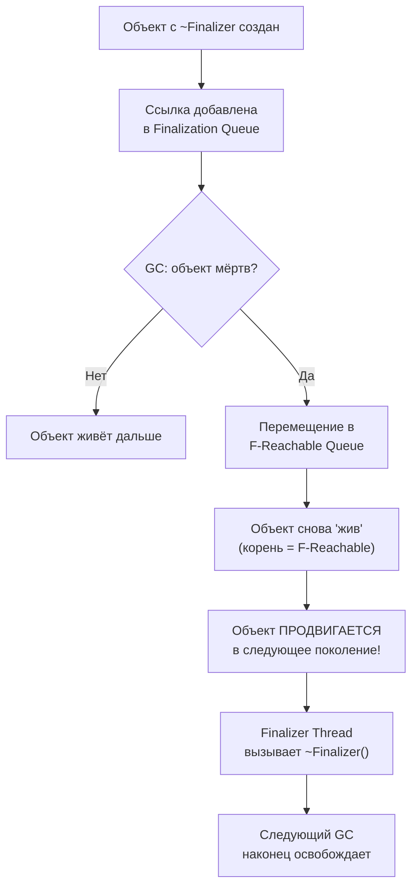

---
tags:
  - gc
  - memory
  - loh
  - poh
  - finalization
  - regions
  - datas
  - card-tables
  - write-barriers
  - leaks
  - deepdive
complexity: Senior
date: 2026-04-30
level: Senior
---

# Управление памятью: GC, LOH, POH и всё, что нужно знать Senior

> Это самая глубокая заметка по runtime в этом vault. Цель — закрыть **все** вопросы по памяти, которые задают на Senior/Tech Lead интервью, плюс всё, что реально нужно для troubleshooting в production. Если что-то не помещается в голову — читай разделами, начиная с «Что это, зачем и когда».

---

## Что это, зачем и когда

### Что такое Garbage Collector (GC)?

**Автоматический уборщик памяти.** Находит объекты, которые больше никому не нужны, и освобождает память. Ты не вызываешь `free()` как в C — GC делает это за тебя.

**Аналогия:** Уборщик в офисе. Ты бросаешь бумажки (объекты), уборщик периодически проходит и собирает мусор. Молодые бумажки (Gen 0) убирает часто, старые архивы (Gen 2) — редко.

### Зачем это знать?

| Без понимания | С пониманием |
|--------------|-------------|
| «Приложение подвисает на 200мс» | GC Gen 2 пауза — слишком много долгоживущих объектов |
| «Память растёт и не падает» | Утечка: event подписка, static field, closure, cache без TTL |
| «Allocations — это плохо?» | Gen 0 сборка дешёвая. Проблема — объекты, доживающие до Gen 2 |
| «Зачем LOH/POH?» | LOH: > 85KB объекты (не компактируется). POH: pinned объекты (нет фрагментации) |
| «Почему Server GC ест 4 GB при 200 MB working set?» | Server GC аллоцирует heap-per-core, виртуально — резерв не = commit |
| «Что такое DATAS?» | .NET 8+: GC адаптирует heap count под реальную нагрузку — экономит память в k8s |

### Поколения — когда что собирается?

| Поколение | Что там | Когда собирается | Стоимость |
|-----------|---------|-----------------|-----------|
| **Gen 0** | Новые объекты | Часто (мс) | Дёшево |
| **Gen 1** | Пережили 1 сборку | Средне | Средне |
| **Gen 2** | Долгоживущие (кеши, singletons) | Редко | Дорого (full GC) |
| **LOH** | Объекты > 85 KB | С Gen 2 | Дорого, без компактификации |
| **POH** | Pinned объекты (.NET 5+) | С Gen 2 | Дорого, без компактификации |

---

## Архитектура managed heap (классическая модель — segments)

### Layout (.NET Framework и .NET до 6)

```
Managed Heap (Workstation GC, single core)
┌──────────────────────────────────────────────────────┐
│  Gen 0          │  Gen 1        │  Gen 2             │
│  (Nursery)      │  (Survivor)   │  (Long-lived)      │
│  Быстро, часто  │  Промежуточ.  │  Редко, дорого     │
│  ~256 KB        │  ~2 MB        │  Неограничен       │
├──────────────────────────────────────────────────────┤
│  LOH (Large Object Heap) — объекты > 85 000 bytes   │
├──────────────────────────────────────────────────────┤
│  POH (Pinned Object Heap) — pinned объекты (.NET 5+)│
└──────────────────────────────────────────────────────┘
```

В этой модели Gen 0/1 живут вместе в **ephemeral segment** (молодые объекты в одной области памяти). Gen 2 — в отдельных segments. LOH и POH — каждый в своих segments.

### Ephemeral Segment

Сегмент = непрерывный кусок виртуальной памяти (обычно 16 MB или 256 MB на Server GC). **Ephemeral segment** — тот, в котором живёт Gen 0 + Gen 1 + начало Gen 2. У каждого heap (а на Server GC heap'ов несколько) — один ephemeral segment.

Когда ephemeral segment заполняется — триггерится Gen 0/1 collection. Если после collection всё равно не хватает — full GC + аллокация нового сегмента.

### Сравнение поколений

| Характеристика | Gen 0 | Gen 1 | Gen 2 | LOH | POH |
|----------------|-------|-------|-------|-----|-----|
| **Размер budget** | ~256 KB | ~2 MB | Неограничен | Неограничен | Неограничен |
| **Порог объекта** | < 85 KB | < 85 KB | < 85 KB | ≥ 85 KB | Любой (pinned) |
| **Частота сборки** | Очень часто | Часто | Редко | С Gen 2 | С Gen 2 |
| **Compaction** | Да | Да | Да (дорого) | Нет* | Нет |
| **Стоимость сборки** | Микросекунды | Миллисекунды | Десятки мс | С Gen 2 | С Gen 2 |
| **Типичное содержимое** | Temp DTO, строки | Пережившие Gen 0 | Singletons, кэши | byte[], string | Буферы для I/O |

*LOH compaction возможен вручную: `GCSettings.LargeObjectHeapCompactionMode`

---

## Regions vs Segments — революция .NET 7+

С **.NET 7** GC поэтапно переходит от **segments** к **regions**. В .NET 8 regions — default на 64-bit. Это самая значительная архитектурная перестройка GC за 15 лет.

### Проблема старой модели

В segments-based GC ephemeral segment большой (256 MB на Server GC). Если у тебя 32 ядра — это 32 × 256 MB = **8 GB виртуально зарезервировано** только под молодые объекты, даже если приложение реально использует 200 MB. В контейнере с лимитом 512 MB это ломает .NET'у поведение (Server GC не подходит, переключается на Workstation, теряем throughput).

### Решение: regions

Регион — маленький блок (4 MB по умолчанию). Heap состоит из множества регионов, каждый принадлежит **какому-то поколению**. Регионы могут быть переаллоцированы между поколениями динамически.

```
Heap с regions (упрощённо):
┌─────┬─────┬─────┬─────┬─────┬─────┬─────┬─────┐
│Gen0 │Gen1 │Gen2 │Gen2 │Gen0 │ LOH │ POH │ Gen2│
│ 4MB │ 4MB │ 4MB │ 4MB │ 4MB │ 4MB │ 4MB │ 4MB │
└─────┴─────┴─────┴─────┴─────┴─────┴─────┴─────┘
```

### Что это даёт

| Преимущество | Как |
|--------------|-----|
| **Меньше виртуальной памяти** | Не резервируем 256 MB заранее, аллоцируем по 4 MB |
| **Container-friendly** | Server GC работает в маленьких контейнерах |
| **Лучше fragmentation** | Можно освобождать регионы целиком |
| **Параллелизм Gen 2** | Регионы Gen 2 можно собирать партиями параллельно |
| **DATAS возможен** | См. ниже — динамическая адаптация heap count |

### Включение/выключение

```xml
<!-- .csproj — выключить regions (отладка проблемы): -->
<PropertyGroup>
  <ServerGarbageCollection>true</ServerGarbageCollection>
  <RetainVMGarbageCollection>true</RetainVMGarbageCollection>
</PropertyGroup>
```

```bash
# Через env vars
DOTNET_GCRegions=0  # выключить (default 1 в .NET 8+)
```

> [!warning] Production-вопрос
> Если приложение мигрировало с .NET 6 на .NET 8 и неожиданно стали другие GC pause patterns — проверь, что не отключены regions, и что нет hardcoded GC tuning на старую segments-модель.

---

## DATAS — Dynamically Adapting To Application Sizes (.NET 8+)

### Зачем

Server GC всегда создавал **heap-per-core** (на 32-ядерной машине — 32 heap'а). На контейнере с лимитом 1 CPU и 512 MB это абсурд: куча heap'ов, каждый со своим budget'ом, GC прыгает между ними. Memory footprint раздут.

### Что делает DATAS

GC мониторит реальную нагрузку и **динамически уменьшает/увеличивает heap count**. Если приложение под нагрузкой — heaps больше, throughput выше. Если idle — heap count падает до 1-2, экономя память.

### Включение

```xml
<PropertyGroup>
  <ServerGarbageCollection>true</ServerGarbageCollection>
  <GarbageCollectionAdaptationMode>1</GarbageCollectionAdaptationMode>
</PropertyGroup>
```

```bash
DOTNET_GCDynamicAdaptationMode=1  # default 1 в .NET 9+
```

| .NET версия | DATAS статус |
|-------------|--------------|
| .NET 8 | Opt-in (по умолчанию выключен) |
| .NET 9 | Default ON |
| .NET 10+ | Default ON, дополнительные эвристики |

> [!info] Кейс
> Workload: ASP.NET Core API в k8s, 0.5 CPU / 512 MB лимит. До DATAS: Server GC делал 8 heap'ов (по числу ядер ноды), working set 400 MB при минимальной нагрузке. После DATAS: 2 heap'а, working set 180 MB, и при пиках масштабируется автоматически.

---

## Workstation vs Server GC

```xml
<!-- .csproj -->
<PropertyGroup>
  <ServerGarbageCollection>true</ServerGarbageCollection>
  <ConcurrentGarbageCollection>true</ConcurrentGarbageCollection>
</PropertyGroup>
```

```json
// runtimeconfig.json
{
  "configProperties": {
    "System.GC.Server": true,
    "System.GC.Concurrent": true
  }
}
```

### Сравнение режимов

| Режим | Потоков GC | Heaps | Пауза | Throughput | Для чего |
|-------|-----------|-------|-------|-----------|----------|
| **Workstation, non-concurrent** | 1 | 1 | Полная STW | Низкий | Минимальная аллокация |
| **Workstation, concurrent (default desktop)** | 1 + 1 background | 1 | Малая STW | Средний | UI, desktop, WPF |
| **Server, non-concurrent** | N | N | Полная STW (но быстрее) | Высокий | Batch jobs |
| **Server, concurrent (default ASP.NET)** | N + N background | N | Малая STW | Самый высокий | Web серверы |

### Что значит "concurrent"

**Concurrent / Background GC** — большая часть Gen 2 collection происходит **параллельно с работой приложения**. Только короткие фазы (Initial Mark, Final Mark) требуют STW. Это снижает максимальную паузу с десятков-сотен мс до единиц мс.

```
Non-concurrent Gen 2 collection:
[STW pause: 200ms, app frozen] → resume

Background Gen 2 collection:
[Initial Mark: 2ms STW] → [Mark concurrent: 150ms, app runs] → [Final Mark: 5ms STW] → [Sweep concurrent: 50ms]
```

### Server GC — heap-per-core

```
4-ядерная машина, Server GC:
Core 0 → Heap 0 (Gen 0/1/2/LOH/POH)
Core 1 → Heap 1 (Gen 0/1/2/LOH/POH)
Core 2 → Heap 2 (Gen 0/1/2/LOH/POH)
Core 3 → Heap 3 (Gen 0/1/2/LOH/POH)
```

Каждый поток аллоцирует **в свой heap** без блокировок (через allocation context — см. ниже). При сборке — параллельно по всем heaps, плюс синхронизация на пересечениях.

> [!question]- **Интервью: Workstation vs Server GC — когда что?**
> **Workstation** — минимальные паузы (UI, desktop). Один поток GC. **Server** — макс. пропускная способность (ASP.NET). Один поток GC на ядро (или меньше с DATAS), параллельная сборка. Default для ASP.NET Core. Настройка: `<ServerGarbageCollection>true</ServerGarbageCollection>`. **Concurrent/Background** включён по умолчанию в обоих режимах — снижает паузы Gen 2 за счёт фонового потока.

> [!question]- **Интервью: Что такое DATAS и зачем?**
> .NET 8+ feature: GC динамически адаптирует количество heap'ов под реальную нагрузку, не плодит heap-per-core если контейнер ограничен. По умолчанию включено в .NET 9. Решает проблему "Server GC раздувает working set в маленьких контейнерах".

---

## Allocation Context — как поток аллоцирует без блокировок

### Проблема

На Server GC у каждого heap несколько потоков аллоцируют одновременно. Если каждая аллокация — `lock(heap) { allocate; }` — это смерть производительности.

### Решение: thread-local allocation context

У каждого потока (по сути у каждого ядра) есть **allocation context** — маленький буфер (~8 KB) внутри ephemeral segment. Аллокация = просто **bump pointer** (увеличить указатель). Без блокировок.

```csharp
// псевдокод bump allocation
ptr = thread.AllocContext.Current;
if (ptr + size <= thread.AllocContext.Limit)
{
    thread.AllocContext.Current = ptr + size;
    return ptr;  // O(1), без lock
}
else
{
    // Refill context — берём новый кусок ephemeral segment под lock
    RefillAllocContext();
}
```

### Почему это важно знать

- Аллокация в .NET — **очень быстрая** (несколько наносекунд), быстрее чем malloc в C
- "Allocations are bad" — миф. Плохо, когда они **доживают до Gen 2**, не сама аллокация.
- На hot path лучше избегать аллокаций — но через `Span`/`stackalloc`/`ArrayPool`, а не через "не создавай объекты".

---

## Фазы сборки мусора

### Mark — Plan — Relocate — Compact


### 1. Mark (Маркировка)

GC начинает с **корней** (GC Roots) и обходит граф объектов.

#### GC Roots

```
GC Roots:
├── Stack variables (локальные на стеке каждого потока)
├── Static fields (статические поля)
├── GC Handles (GCHandle.Alloc — Normal, Pinned, Weak, WeakTrackResurrection)
├── Finalization Queue (объекты с финализатором, ещё не финализированные)
├── Thread-local storage
├── CPU Registers (регистры с ссылками)
└── F-Reachable Queue (объекты ждущие финализации)
```

#### Tri-Color Marking

GC использует **tri-color algorithm**:

| Цвет | Означает |
|------|----------|
| **White (белый)** | Не посещён, потенциально мусор |
| **Gray (серый)** | Посещён, но дети ещё не обойдены |
| **Black (чёрный)** | Посещён, дети тоже посещены |

Алгоритм: начинаем с roots (gray), обходим в ширину, white → gray → black. По завершении — все black = живые, white = мусор.

#### Stack Walking — как GC находит ссылки на стеке

JIT генерирует **GC info tables** для каждого метода: на каком offset какой регистр содержит managed reference. При GC рантайм проходит call stack каждого потока и читает эти таблицы.

```
JIT info table (упрощённо):
Method Foo, IL offset 0x1A:
  - rax: managed pointer to obj1
  - [rsp+0x10]: managed pointer to obj2
```

Без этих таблиц GC не знал бы что в регистрах — managed-ссылка или просто число. Это называется **precise GC** (.NET использует precise, не conservative как в JVM Boehm).

### 2. Plan (Планирование)

Для каждого живого объекта определяется его **новое место** после compact. Создаётся **plan** — таблица "obj X переезжает на адрес Y, его size = Z".

### 3. Relocate (Перемещение)

Объекты копируются на новые места согласно plan. Старые места становятся свободными.

### 4. Compact + Update References

Все ссылки в живых объектах обновляются на новые адреса. После этого — heap consistent.

```
До Compact:
[obj1][    ][obj2][         ][obj3][    ]
       ↑ gap        ↑ gap           ↑ gap

После Compact:
[obj1][obj2][obj3][          свободно          ]
                   ↑ allocation pointer
```

> [!warning] Stop-The-World
> Mark+Plan+Compact для Gen 0/1 быстрые (микросекунды на современном железе). Gen 2 — могут быть десятки мс. **Background GC** для Gen 2 минимизирует STW: только короткие фазы Initial/Final Mark — STW, остальное параллельно с приложением.

---

## Card Tables и Write Barriers — как GC отслеживает межпоколенные ссылки

### Проблема

Если ссылка из Gen 2 указывает на объект Gen 0, и Gen 0 collection не сканирует Gen 2 (это дорого) — как узнать, что Gen 0 объект жив?

### Решение: Card Table

**Card Table** — массив битов/байтов, по одному на каждые 4 KB heap (карта). Когда **запись** в managed-объект указывает на ссылку — взводится бит соответствующей карты.

```
Heap (4 KB cards):
[card 0: clean][card 1: DIRTY][card 2: clean][card 3: DIRTY]
                ↑ где-то была запись             ↑ где-то была запись

Gen 0 collection: сканировать только dirty cards в Gen 2 + LOH + POH
```

### Write Barrier

**Каждое присваивание ссылки** в managed-объект проходит через **write barrier** — маленький код, вставленный JIT'ом:

```csharp
// Ты пишешь:
obj.Field = anotherObj;

// JIT генерирует (псевдокод):
*(slot) = anotherObj;
if (objLivesIn(Gen2or higher) && anotherObjLivesIn(Gen0or1))
{
    setCardDirty(slot);
}
```

Write barrier — это **накладные расходы на каждую запись ссылки**. Поэтому struct без ссылок (например, `int[]`) быстрее, чем `object[]`: нет write barrier'ов.

> [!info] Практический совет
> На hot path избегай записи ссылок в долгоживущие объекты. Не "обновлять полем кеш" в цикле миллион раз — каждое присваивание = write barrier + потенциальный card mark + дополнительная работа GC.

---

## Pinned Plugs — почему pinned объекты ломают compact

В сегментной модели pinned объект застревает посреди ephemeral segment. GC не может его сдвинуть. Объекты **между** pinned объектами тоже не могут быть сдвинуты эффективно — это **pinned plug**.

```
До pinning:
[obj1][obj2][obj3 PINNED][obj4][obj5]

После compact:
[obj1][obj2][obj3 PINNED][obj4][obj5]   ← ничего не сдвинулось!
                          ↑ "plug" вокруг pinned
```

Со временем heap превращается в швейцарский сыр — много pinned plugs, фрагментация, частые расширения heap'а. **Решение** — POH (.NET 5+).

---

## LOH (Large Object Heap)

### Что попадает в LOH

Объекты ≥ **85 000 bytes** попадают в LOH. **LOH собирается только с Gen 2** — каждая аллокация большого массива увеличивает Gen 2 budget.

```csharp
// byte[] > 85000 → LOH
var buffer = new byte[85001];        // LOH!

// string > ~42500 chars → LOH (char = 2 bytes + overhead)
var bigString = new string('x', 50000); // LOH!

// Массив ссылочных типов > ~10625 элементов (8 bytes × 10625 = 85000)
var refs = new object[10626];        // LOH!

// Boxing большого struct → object на heap, может попасть в LOH
struct Big { fixed byte data[100_000]; }
object boxed = new Big();  // LOH!
```

### Проблема: LOH не уплотняется по умолчанию → фрагментация

```
LOH после работы:
[100KB][freed][200KB][freed][freed][50KB][freed][300KB]
         ↑              ↑      ↑            ↑
    фрагментация — свободные блоки разного размера

Запрос на 250KB → OutOfMemoryException!
(хотя суммарно свободно 500KB, нет непрерывного блока 250KB)
```

### Минимизация LOH-фрагментации

```csharp
// 1. ArrayPool — переиспользование буферов
var pool = ArrayPool<byte>.Shared;
byte[] buffer = pool.Rent(100_000);
try
{
    // работаем с buffer
}
finally
{
    pool.Return(buffer, clearArray: true);
}

// 2. Принудительный LOH Compact (крайний случай)
GCSettings.LargeObjectHeapCompactionMode = GCLargeObjectHeapCompactionMode.CompactOnce;
GC.Collect();  // compact произойдёт один раз

// 3. RecyclableMemoryStream от Microsoft — pool of MemoryStream
var streamManager = new RecyclableMemoryStreamManager();
using var stream = streamManager.GetStream();  // не создаёт новый byte[]
```

### MemoryStream и LOH — частый pitfall

```csharp
// ❌ BAD — каждый Read создаёт новый byte[] в LOH
var ms = new MemoryStream();
// ms.ToArray() — копия в LOH

// ✅ GOOD — RecyclableMemoryStream
private static readonly RecyclableMemoryStreamManager Manager = new();
using var ms = Manager.GetStream();  // буфер из пула
```

---

## POH (Pinned Object Heap) — .NET 5+

### Зачем POH

Pinning нужен для interop: P/Invoke, Socket buffers — native code должен читать/писать по фиксированному адресу. Раньше это делалось через `GCHandle.Alloc(obj, GCHandleType.Pinned)` или `fixed`. И эти pinned объекты застревали посреди обычного heap → pinned plugs → фрагментация Gen 2.

### POH — выделенная куча для pinned

```csharp
// .NET 5+ — аллокация в POH
byte[] pinnedBuffer = GC.AllocateArray<byte>(4096, pinned: true);

// Буфер ГАРАНТИРОВАННО не двигается — можно безопасно
// передавать указатель в native code без GCHandle
unsafe
{
    fixed (byte* ptr = pinnedBuffer)
    {
        // ptr стабилен на всё время жизни буфера
        NativeInterop.ReadSocket(ptr, pinnedBuffer.Length);
    }
}

// Также можно AllocateUninitializedArray — без zero-initialization (быстрее на больших буферах)
byte[] fastBuffer = GC.AllocateUninitializedArray<byte>(4096, pinned: true);
```

### Когда использовать POH

| Сценарий | Используй POH |
|----------|---------------|
| Socket I/O буферы | ✅ Да — ядро ОС держит указатель |
| Native interop (P/Invoke) | ✅ Да — native код ожидает стабильный адрес |
| GPU/CUDA буферы | ✅ Да |
| Memory-mapped files | ✅ Да |
| Временный fixed в цикле | ❌ Нет — обычный `fixed` достаточно |
| Обычные массивы | ❌ Нет — overhead не оправдан |

> [!info] Кейс: Kestrel
> Kestrel использует POH для буферов чтения/записи сокетов. Без POH тысячи pinned буферов фрагментировали бы Gen 2, вызывая длинные GC-паузы. С POH — Gen 2 чистый, паузы предсказуемы.

---

## Object Header — что находится перед каждым объектом

В .NET каждый объект имеет **header** в 16 байтах (на x64):

```
Object layout (x64):
├─ -8: Sync Block Index (для lock(), GetHashCode, etc.)
├─  0: Method Table Pointer (указатель на тип — virtual dispatch, RTTI)
├─  8: Field 1
├─ 16: Field 2
└─ ...
```

### Sync Block

Используется для:
- `lock(obj)` — Monitor
- `GetHashCode()` (если не переопределён)
- `Thread.Wait/Pulse`

При первом использовании создаётся отдельная sync block table entry, в header сохраняется индекс.

### Method Table (MT) Pointer

Указатель на структуру с метаданными типа: vtable, EEClass, статические поля, имя типа. По нему JIT находит виртуальные методы.

### Влияние на размер объекта

```csharp
class Empty { }  // sizeof = 24 bytes (header 16 + alignment to 8)

class OneInt { int X; }  // sizeof = 24 (header 16 + int 4 + padding 4)

class TwoInt { int X; int Y; }  // sizeof = 24 (header 16 + 4 + 4)

class IntAndLong { int X; long Y; }  // sizeof = 32 (header 16 + 4 + padding 4 + 8)

struct EmptyStruct { }  // sizeof = 1 byte (минимум)
```

> [!question]- **Интервью: Сколько весит пустой объект?**
> Минимум 24 байта на x64: 16 byte header (sync block + MT pointer) + 8 byte alignment. Поэтому много мелких объектов = много overhead. Иногда выгоднее `struct` (без header) или объединение в один объект.

---

## Финализация — Finalization Queue и F-Reachable Queue

### Как работает финализация

Объекты с деструктором (`~ClassName()`) или `Finalize()` проходят **двухэтапную** очистку:



### Проблемы финализации

```csharp
public class BadResource
{
    private IntPtr _handle;

    ~BadResource()  // Finalizer
    {
        CloseHandle(_handle);  // вызовется когда-нибудь...
    }
}

// Проблемы:
// 1. Объект переживает МИНИМУМ одну лишнюю сборку GC
// 2. Продвигается в Gen 1 или Gen 2 → дорогая сборка
// 3. Finalizer Thread — один на процесс, не параллелится
// 4. Порядок вызова финализаторов НЕ гарантирован
// 5. Если финализатор бросает исключение → процесс падает (.NET 4+)
// 6. Финализатор может вызваться с **partially-constructed** объектом
//    (исключение в конструкторе)
```

### Правильный паттерн: IDisposable + Finalizer

```csharp
public class ManagedResource : IDisposable
{
    private IntPtr _handle;
    private bool _disposed;

    public void Dispose()
    {
        Dispose(disposing: true);
        GC.SuppressFinalize(this);  // ← КРИТИЧНО: убираем из Finalization Queue
    }

    protected virtual void Dispose(bool disposing)
    {
        if (_disposed) return;

        if (disposing)
        {
            // Освобождаем managed ресурсы
        }

        // Освобождаем unmanaged ресурсы
        if (_handle != IntPtr.Zero)
        {
            CloseHandle(_handle);
            _handle = IntPtr.Zero;
        }

        _disposed = true;
    }

    ~ManagedResource() => Dispose(disposing: false);
}
```

> [!warning] GC.SuppressFinalize — must-have
> Без `SuppressFinalize` объект проходит через Finalization Queue **даже после Dispose**. Это значит: лишняя сборка GC, промоция в следующее поколение, задержка освобождения. Всегда вызывать в `Dispose()`.

### SafeHandle — современная замена ручной финализации

```csharp
using Microsoft.Win32.SafeHandles;

public class FileResource
{
    private readonly SafeFileHandle _handle;

    public FileResource(string path)
    {
        _handle = File.OpenHandle(path);
    }

    public void Use()
    {
        // Работа через _handle
    }

    public void Dispose() => _handle.Dispose();
    // Финализатор не нужен — SafeFileHandle сам имеет Critical Finalizer
}
```

**SafeHandle** — потомок `CriticalFinalizerObject`, его финализатор вызывается **гарантированно** (даже при `AppDomain.Unload`), плюс SafeHandle инкрементирует ref count перед использованием — защита от race conditions.

### CriticalFinalizerObject vs обычный финализатор

| Свойство | Обычный финализатор | CriticalFinalizerObject |
|----------|---------------------|------------------------|
| Гарантия вызова | Best-effort | Гарантирован, последний |
| Aborted thread | Может не вызваться | Всегда вызывается |
| Race конструктора | Может вызваться частично | Защищён |
| Применение | Любые ресурсы | Unmanaged handles only |

---

## GCHandle — низкоуровневое управление

`GCHandle` — указатель на managed-объект, который GC учитывает специальным образом. 4 типа:

```csharp
using System.Runtime.InteropServices;

object obj = new MyObject();

// Normal — keeps alive, обычная сильная ссылка
var hNormal = GCHandle.Alloc(obj, GCHandleType.Normal);
// объект жив пока handle не освобождён
hNormal.Free();

// Pinned — keeps alive + не двигает (legacy способ pinning)
var hPinned = GCHandle.Alloc(buffer, GCHandleType.Pinned);
IntPtr ptr = hPinned.AddrOfPinnedObject();
// ... передаём ptr в native code
hPinned.Free();  // ОБЯЗАТЕЛЬНО, иначе утечка + permanent pin

// Weak — слабая ссылка, не keeps alive
var hWeak = GCHandle.Alloc(obj, GCHandleType.Weak);
if (hWeak.Target is MyObject still)
{
    // объект ещё жив
}
hWeak.Free();

// WeakTrackResurrection — слабая, но видит resurrected объекты
var hWtr = GCHandle.Alloc(obj, GCHandleType.WeakTrackResurrection);
// редко нужен — для финализаторов с resurrection логикой
hWtr.Free();
```

### Когда использовать GCHandle

- **Native interop** — передать managed-объект в native code как opaque pointer (`GCHandle.ToIntPtr` → callback → `GCHandle.FromIntPtr`)
- **Pinning** — legacy, лучше `GC.AllocateArray(pinned: true)`
- **Custom weak references** — обычно лучше `WeakReference<T>`

### Resurrection — почему не делать

```csharp
public class Bad
{
    public static Bad Saved;

    ~Bad()
    {
        Saved = this;  // RESURRECTION! объект "оживает"
    }
}
```

Объект помещается в Saved → снова достижим из roots → GC не освобождает. **Финализатор вызвался, но объект жив**. Если объект имеет state, очищенный финализатором — теперь invalid state. **Никогда так не делай.**

Если действительно нужно — `GC.ReRegisterForFinalize(this)` чтобы финализатор ещё раз сработал.

---

## WeakReference и ConditionalWeakTable

### WeakReference / WeakReference\<T\>

```csharp
// Обычная сильная ссылка
var strong = new BigObject();

// Слабая — GC может собрать, даже если есть WeakReference
var weak = new WeakReference<BigObject>(strong);
strong = null;  // убрали сильную

GC.Collect();

// Через какое-то время:
if (weak.TryGetTarget(out var target))
{
    // Ещё жив
}
else
{
    // Уже собран
}
```

**Применение:**
- Кэши, которые могут быть сброшены при memory pressure
- Event listeners, чтобы не держать subscriber-а
- Caches типа MemoryCache внутри используют WeakReference

```csharp
// Простой weak cache
public class WeakCache<TKey, TValue> where TValue : class
{
    private readonly Dictionary<TKey, WeakReference<TValue>> _cache = new();

    public TValue Get(TKey key, Func<TKey, TValue> factory)
    {
        if (_cache.TryGetValue(key, out var weakRef) && weakRef.TryGetTarget(out var value))
            return value;

        value = factory(key);
        _cache[key] = new WeakReference<TValue>(value);
        return value;
    }
}
```

### ConditionalWeakTable\<TKey, TValue\>

Как `Dictionary`, но **ключи держатся слабо**, и значение освобождается, когда ключ собирается. Идеально для "ассоциативных данных" к объекту без модификации самого объекта.

```csharp
public static class ObjectExtensions
{
    private static readonly ConditionalWeakTable<object, ExtendedData> _data = new();

    public static ExtendedData GetExtendedData(this object obj)
    {
        return _data.GetValue(obj, _ => new ExtendedData());
    }
}

// Когда obj собирается GC — связанная ExtendedData тоже собирается автоматически
```

> [!info] Когда применять
> ConditionalWeakTable — это магия для библиотек: можно "приклеить" данные к чужому объекту, не модифицируя его. Используется внутри dynamic, expandos, dependency property в WPF.

---

## Off-heap: NativeMemory

Выделение памяти **вне managed heap** — GC не видит, не сканирует, не перемещает:

```csharp
using System.Runtime.InteropServices;

unsafe
{
    // Аллокация вне GC
    byte* buffer = (byte*)NativeMemory.Alloc(1024 * 1024);  // 1 MB

    try
    {
        var span = new Span<byte>(buffer, 1024 * 1024);
        span.Fill(0xFF);
    }
    finally
    {
        NativeMemory.Free(buffer);  // ОБЯЗАТЕЛЬНО! GC не освободит
    }
}

// Aligned allocation (для SIMD)
void* aligned = NativeMemory.AlignedAlloc(byteCount: 4096, alignment: 64);
NativeMemory.AlignedFree(aligned);

// Zero-initialized
byte* zeroed = (byte*)NativeMemory.AllocZeroed(1024);
```

| Подход | Управление | GC pressure | Скорость аллокации | Риск |
|--------|-----------|-------------|--------------------|----- |
| `new byte[]` | GC | Да | Быстро (Gen 0) | Низкий |
| `ArrayPool.Rent` | Manual return | Нет (reuse) | Мгновенно | Забыть Return |
| `GC.AllocateArray(pinned)` | GC | Да (POH) | Быстро | Фрагментация POH |
| `NativeMemory.Alloc` | Manual free | Нет | Быстро | Утечка, segfault |
| `stackalloc` | Автоматически (стек) | Нет | Мгновенно | Stack overflow |
| `MemoryPool<T>.Shared` | Lease/Dispose | Нет (reuse) | Быстро | Забыть Dispose |

---

## GC Latency Modes — управление поведением

```csharp
using System.Runtime;

// Получить текущий режим
GCLatencyMode current = GCSettings.LatencyMode;

// Установить
GCSettings.LatencyMode = GCLatencyMode.SustainedLowLatency;
```

| Mode | Поведение | Для чего |
|------|-----------|----------|
| `Batch` | Максимальный throughput, длинные паузы Gen 2 ОК | Server-side batch jobs, ETL |
| `Interactive` | Default workstation, баланс | UI, desktop |
| `LowLatency` | На 1-2 GC меньше Gen 2, КРАТКОВРЕМЕННО | Hot path, важная UI операция |
| `SustainedLowLatency` | Долгосрочно избегать Gen 2 | Trading, real-time, latency-sensitive |
| `NoGCRegion` | Полный запрет GC на N байт | Критичные секции (миллисекунды) |

### NoGCRegion

```csharp
// "Я обещаю не аллоцировать больше 100 MB в этой секции"
if (GC.TryStartNoGCRegion(totalSize: 100_000_000))
{
    try
    {
        // КРИТИЧНАЯ СЕКЦИЯ — никаких GC пауз
        ProcessTradeBurst();
    }
    finally
    {
        GC.EndNoGCRegion();
    }
}
else
{
    // GC отказался — heap слишком занят
}
```

**Ограничения:**
- Если выйдешь за лимит — `NoGCRegion` прервётся, возможно `OutOfMemoryException`
- Применяется только к **этому потоку** (но влияет на весь процесс — heap не собирается ни для кого)
- Использовать **очень осторожно**. См. [HFT/Low-Latency]().

---

## Memory Pressure — подсказка GC о неучтённой памяти

Когда managed-объект "держит" большой unmanaged-ресурс, GC не знает о его размере и редко собирает мусор. **Memory pressure** — способ сказать GC "за этим маленьким объектом стоят X bytes native памяти":

```csharp
public class BigNativeBuffer : IDisposable
{
    private IntPtr _native;
    private const long Size = 100_000_000;  // 100 MB

    public BigNativeBuffer()
    {
        _native = Marshal.AllocHGlobal((IntPtr)Size);
        GC.AddMemoryPressure(Size);  // ← скажи GC что мы держим 100MB
    }

    public void Dispose()
    {
        if (_native != IntPtr.Zero)
        {
            Marshal.FreeHGlobal(_native);
            GC.RemoveMemoryPressure(Size);  // ← убрали
            _native = IntPtr.Zero;
        }
    }
}
```

Без `AddMemoryPressure` GC видит крошечный managed wrapper и не торопится его собирать. С — GC учитывает 100 MB при принятии решения о full GC.

---

## RegisterForFullGCNotification — узнать что вот-вот будет full GC

Для приложений, которые могут "уйти в обслуживание" перед full GC — выкинуть себя из load balancer'а, дождаться GC, вернуться:

```csharp
GC.RegisterForFullGCNotification(maxGenerationThreshold: 10, largeObjectHeapThreshold: 10);

while (true)
{
    var status = GC.WaitForFullGCApproach(timeout: 10000);
    if (status == GCNotificationStatus.Succeeded)
    {
        // Full GC скоро — выйди из rotation
        loadBalancer.RemoveSelf();

        GC.WaitForFullGCComplete();

        // Full GC завершён — вернись
        loadBalancer.AddSelf();
    }
}
```

> [!warning] Hardcore tuning
> Это паттерн для FX-серверов, latency-критичных систем. Большинству приложений не нужно.

---

## Утечки памяти — типичные паттерны

### 1. Event subscription без отписки

```csharp
// ❌ BAD — Subscriber никогда не освободится пока Publisher жив
public class Publisher
{
    public event EventHandler? Updated;
}

public class Subscriber
{
    public Subscriber(Publisher pub)
    {
        pub.Updated += OnUpdated;  // Publisher теперь держит ссылку на this
    }

    private void OnUpdated(object? sender, EventArgs e) { }
}

// ✅ GOOD — IDisposable + отписка
public class Subscriber : IDisposable
{
    private readonly Publisher _pub;

    public Subscriber(Publisher pub)
    {
        _pub = pub;
        _pub.Updated += OnUpdated;
    }

    public void Dispose() => _pub.Updated -= OnUpdated;

    private void OnUpdated(object? sender, EventArgs e) { }
}

// ✅ GOOD — WeakEventManager (.NET / WPF)
WeakEventManager<Publisher, EventArgs>.AddHandler(pub, nameof(pub.Updated), OnUpdated);
```

### 2. Static collections, растущие без удаления

```csharp
// ❌ BAD
public static class GlobalCache
{
    private static readonly Dictionary<string, byte[]> _cache = new();

    public static void Add(string key, byte[] data) => _cache[key] = data;
    // нет eviction → растёт до OOM
}

// ✅ GOOD — IMemoryCache с TTL
builder.Services.AddMemoryCache(opts => opts.SizeLimit = 1024);

cache.Set(key, data, new MemoryCacheEntryOptions
{
    Size = data.Length / 1024,
    SlidingExpiration = TimeSpan.FromMinutes(5)
});
```

### 3. Замыкания, держащие большие объекты

```csharp
// ❌ BAD — лямбда захватывает huge через closure
public Func<int> CreateCounter()
{
    var huge = new byte[100_000_000];
    int counter = 0;
    return () => { _ = huge.Length; return ++counter; };  // замыкание держит huge!
}

// ✅ GOOD — освободить ссылку до создания лямбды
public Func<int> CreateCounter()
{
    var huge = new byte[100_000_000];
    var hugeLength = huge.Length;  // только нужное
    huge = null;  // освободить
    int counter = 0;
    return () => { _ = hugeLength; return ++counter; };
}
```

### 4. Long-lived caches без TTL

```csharp
// ❌ BAD — ConcurrentDictionary как кеш растёт до OOM
public static readonly ConcurrentDictionary<string, ExpensiveObject> Cache = new();

// ✅ GOOD — MemoryCache с size limit + TTL
```

### 5. Implicit captures в async lambda

```csharp
// ❌ BAD — Task держит весь scope
public async Task ProcessAsync()
{
    var huge = new byte[100_000_000];
    DoSomething(huge);
    await Task.Delay(60_000);  // huge всё ещё в scope, держится state machine
}

// ✅ GOOD — освободить до await
public async Task ProcessAsync()
{
    {
        var huge = new byte[100_000_000];
        DoSomething(huge);
    }  // huge out of scope
    await Task.Delay(60_000);
}
```

### 6. ThreadStatic / AsyncLocal без очистки

```csharp
[ThreadStatic]
public static BigContext? Context;

// Если поток из ThreadPool — Context переживает все запросы, утечка
```

### 7. DI scope leaks — Scoped сервис в Singleton

```csharp
// ❌ BAD
public class SingletonService
{
    public SingletonService(MyDbContext db)  // Scoped! но захвачен в singleton
    {
        // db никогда не disposed
    }
}

// ✅ GOOD — IServiceProvider или factory
public class SingletonService(IServiceProvider sp)
{
    public void Use()
    {
        using var scope = sp.CreateScope();
        var db = scope.ServiceProvider.GetRequiredService<MyDbContext>();
        // ...
    }
}
```

### 8. Timer без Dispose

```csharp
// ❌ BAD
var timer = new Timer(_ => DoWork(), null, 0, 1000);
// timer держит callback → callback держит state → утечка
// + callback может выполняться даже после Dispose, если уже запущен

// ✅ GOOD
private readonly Timer _timer;

public Worker()
{
    _timer = new Timer(_ => DoWork(), null, 0, 1000);
}

public void Dispose()
{
    _timer.Dispose();  // или DisposeAsync() — ждёт завершения текущего callback
}
```

---

## Профилирование и диагностика

### dotnet-counters — live метрики GC

```bash
# Live дашборд GC
dotnet-counters monitor -p <PID> --counters System.Runtime

# Что смотреть:
# - gen-0/1/2-gc-count — частота сборок
# - gen-0/1/2-size — размер поколений
# - loh-size, poh-size
# - alloc-rate — байт/сек аллоцируется
# - time-in-gc — % времени в GC
# - gc-pause-time-percentage — % времени STW pause

```

### dotnet-gcdump — снимок heap

```bash
# Снимок managed heap
dotnet-gcdump collect -p <PID> -o app.gcdump

# Открыть в PerfView, Visual Studio, dotMemory

```

Покажет:
- Распределение по поколениям
- Top types по retained size
- Roots для конкретного объекта (path to GC root)

### dotnet-trace — детальная трассировка GC events

```bash
# Включить GC events
dotnet-trace collect -p <PID> --providers Microsoft-Windows-DotNETRuntime:0x1:5

# 0x1 = GC keyword (события: GCStart, GCEnd, GCAllocationTick, GCHeapStats)
# :5 = Verbose level

```

### PerfView — Microsoft golden standard

```
1. Capture: PerfView -> Collect -> Collect (с включёнными ETW providers)
2. Analyze: GC Stats — pauses, heaps, allocation rate
3. Allocation Tick view — кто аллоцирует больше всего
4. Memory > Heap Snapshot — кто держит память
```

### dotMemory (JetBrains) — самое удобное для анализа утечек

- **Snapshot diff** — сделать снимок, сделать действие, сделать снимок, увидеть что выросло
- **Retention path** — почему этот объект жив
- **Group by similar retention** — группировки утечек

### Программная диагностика

```csharp
// Базовая статистика
Console.WriteLine($"Gen 0: {GC.CollectionCount(0)}");
Console.WriteLine($"Gen 1: {GC.CollectionCount(1)}");
Console.WriteLine($"Gen 2: {GC.CollectionCount(2)}");

// .NET 5+ — детальная инфо
GCMemoryInfo info = GC.GetGCMemoryInfo();
Console.WriteLine($"Heap size: {info.HeapSizeBytes:N0}");
Console.WriteLine($"Memory load: {info.MemoryLoadBytes:N0}");
Console.WriteLine($"Total available: {info.TotalAvailableMemoryBytes:N0}");
Console.WriteLine($"Pause time TF: {info.PauseDurations[0].TotalMilliseconds}ms");
Console.WriteLine($"Concurrent: {info.Concurrent}");
Console.WriteLine($"Compacted: {info.Compacted}");

// Принудительная сборка (только для диагностики!)
GC.Collect(2, GCCollectionMode.Aggressive, blocking: true, compacting: true);
```

### EventListener — слушать GC events runtime'а

```csharp
public class GCEventListener : EventListener
{
    protected override void OnEventSourceCreated(EventSource eventSource)
    {
        if (eventSource.Name == "Microsoft-Windows-DotNETRuntime")
        {
            EnableEvents(eventSource, EventLevel.Verbose, (EventKeywords)0x1);  // GC keyword
        }
    }

    protected override void OnEventWritten(EventWrittenEventArgs eventData)
    {
        if (eventData.EventName == "GCStart_V2")
        {
            Console.WriteLine($"GC started: gen {eventData.Payload[0]}, reason {eventData.Payload[2]}");
        }
        else if (eventData.EventName == "GCEnd_V1")
        {
            Console.WriteLine($"GC ended");
        }
    }
}

// Активировать:
new GCEventListener();
```

---

## .NET 9/10 GC улучшения

### .NET 9
- **DATAS включён по умолчанию** — динамический heap count
- **Improved regions** — более агрессивная dynamic resize
- **Pause-time predictions** — GC лучше прогнозирует длительность пауз и адаптируется
- **Better LOH compaction** — auto compaction в некоторых сценариях

### .NET 10
- Дальнейшие улучшения regions, DATAS heuristics
- Лучшая интеграция с Linux memory pressure events (cgroup v2)
- Уменьшение startup memory footprint

> [!info] Совет
> Если у вас .NET 6/7 LTS — апгрейд на .NET 10 LTS даст ощутимое снижение памяти **бесплатно**, без изменения кода. Особенно в k8s.

---

## Best Practices

- **Избегай Gen 2** — short-lived объекты не должны доживать до Gen 2. Проверяй через dotnet-counters (`gen-2-gc-count` должен быть редким).
- **ArrayPool / MemoryPool** — для больших буферов на hot path. Не `new byte[N]` в цикле.
- **POH** — для I/O буферов, socket operations. Не для обычных массивов.
- **Dispose** — всегда `using` / `await using`. Финализатор — только как safety net для unmanaged.
- **SuppressFinalize** — всегда в `Dispose()`.
- **Не вызывай GC.Collect()** — кроме диагностики. GC лучше знает.
- **Server GC** — для серверов, **Workstation** — для UI.
- **Concurrent GC** — оставлять включённым (default), снижает паузы.
- **DATAS** — включить в .NET 8 если контейнеризованы (в .NET 9 default).
- **Memory pressure** — добавить если держишь native ресурсы.
- **Не используй финализаторы** в новом коде — только `IDisposable` + `SafeHandle` для unmanaged.
- **Не делай resurrection** — никогда.
- **Профилируй прежде чем оптимизировать** — догадки про GC чаще всего ошибочны.

---

## Чеклист перед production

- [ ] `<ServerGarbageCollection>true</ServerGarbageCollection>` для web/serverов
- [ ] `<ConcurrentGarbageCollection>true</ConcurrentGarbageCollection>` (default, не отключать)
- [ ] DATAS включён (.NET 9+ default, .NET 8 — opt-in)
- [ ] Все `IDisposable` обёрнуты в `using` / `await using`
- [ ] Финализаторы вызывают `GC.SuppressFinalize` в `Dispose`
- [ ] Нет статических dictionary без TTL/eviction
- [ ] Все события (`event`) отписываются в `Dispose`
- [ ] `MemoryStream` для больших данных заменён на `RecyclableMemoryStream`
- [ ] Большие буферы — через `ArrayPool` / `MemoryPool`
- [ ] Метрики `time-in-gc` мониторятся (норма: < 5%)
- [ ] `gen-2-gc-count` мониторится (норма: единичные за час под нагрузкой)
- [ ] Working set / Private bytes мониторятся в production
- [ ] Heap snapshot был снят и проанализирован под нагрузкой
- [ ] Memory pressure добавлен для wrapper'ов native памяти

---

## См. также

- [.NET Runtime: компиляция](compilation-jit.md)
- [Span и Memory Layout](span-layout.md)
- [Concurrency и Atomics](concurrency-atomics.md)
- [Performance и диагностика]()
- [HFT/Low-Latency и GC tuning]()
- [Типы и память]()
- [Docker и .NET awareness в контейнерах]()
- [Kubernetes resource limits для .NET]()

## Reading list

- **Konrad Kokosa — Pro .NET Memory Management** (2018, обновления 2022) — библия по GC, обязательно
- **Maoni Stephens — официальный блог GC** — devblogs.microsoft.com/dotnet/author/maoni
- **Maoni Stephens — DATAS deep dive** — devblogs.microsoft.com/dotnet/dynamically-adapting-to-application-sizes/
- **Регионы (regions) GC** — devblogs.microsoft.com/dotnet/put-a-dpad-on-that-gc/
- **Stephen Toub — performance improvements** — годовые обзоры в .NET 8/9/10
- **Sergey Tepliakov — внутреннее устройство .NET** (RU)
- **PerfView learning** — github.com/microsoft/perfview/blob/main/documentation/Tutorial.md
- **dotMemory documentation** — jetbrains.com/help/dotmemory
- **GitHub: dotnet/runtime/docs/design/coreclr/jit/gc** — исходники описания
