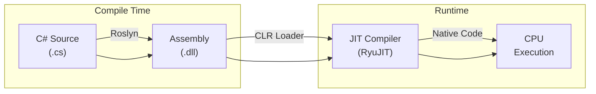
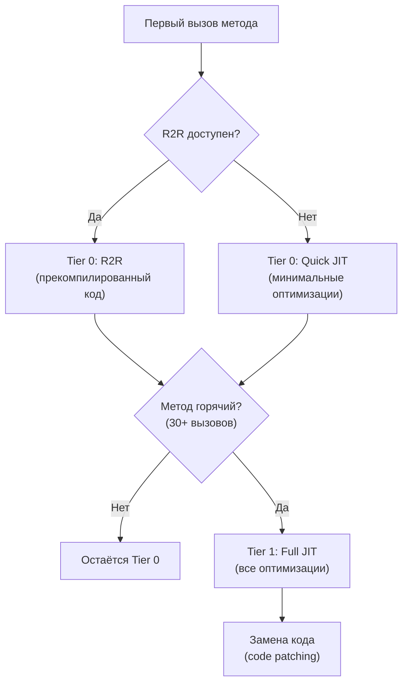

---
tags:
  - runtime
  - clr
  - jit
  - roslyn
  - deepdive
complexity: Senior
date: 2026-02-23
---

# .NET Runtime: от исходного кода до машинных инструкций

## Общая картина

Путь C#-кода до процессора — это конвейер из трёх стадий: **компиляция → загрузка → исполнение**. На каждом этапе код трансформируется в более низкоуровневое представление.



---

## 1. Roslyn: компиляция в IL

### Что происходит

Roslyn — компилятор C# (и VB.NET), реализованный как набор API. Он превращает исходный код в **MSIL** (Microsoft Intermediate Language, он же CIL / IL) и упаковывает в **assembly** (.dll / .exe).

### Под капотом

```
Source Code (.cs)
    │
    ├── 1. Lexical Analysis    → токены (keywords, identifiers, literals)
    ├── 2. Syntax Tree (AST)   → дерево синтаксиса
    ├── 3. Semantic Analysis   → типы, символы, binding
    ├── 4. Lowering            → упрощение конструкций языка
    └── 5. IL Emission         → байт-код + метаданные → .dll
```

### Что внутри Assembly

| Компонент | Содержимое |
|-----------|------------|
| **PE Header** | Формат Portable Executable, точка входа |
| **CLR Header** | Версия runtime, флаги (AnyCPU, x64) |
| **Metadata** | Типы, методы, поля, ссылки — полное описание модели |
| **IL Code** | Стековый байт-код — инструкции для виртуальной машины |
| **Resources** | Строки, файлы, embedded ресурсы |

```csharp
// Этот C# код:
public static int Add(int a, int b) => a + b;

// Превращается в IL:
// .method public static int32 Add(int32 a, int32 b) cil managed
// {
//     .maxstack 2
//     ldarg.0        // загрузить a на стек
//     ldarg.1        // загрузить b на стек
//     add            // сложить два верхних элемента стека
//     ret            // вернуть результат
// }
```

> [!info] IL — стековая машина
> IL не работает с регистрами процессора напрямую. Все операции идут через evaluation stack: загрузить значения → выполнить операцию → результат на вершине стека. JIT потом транслирует это в регистровый машинный код.

### Lowering — скрытые трансформации

Roslyn **до** генерации IL упрощает высокоуровневые конструкции:

| Конструкция C# | Во что lowering |
|-----------------|-----------------|
| `foreach` | `GetEnumerator()` + `while(MoveNext())` |
| `async/await` | State machine struct (`IAsyncStateMachine`) |
| `yield return` | State machine class (`IEnumerator<T>`) |
| `using` | `try { } finally { Dispose(); }` |
| `?.` (null-conditional) | `if (x != null) x.Method()` |
| `switch` expression | Серия `if/else` или jump table |
| `string interpolation` | `DefaultInterpolatedStringHandler` (C# 10+) |
| `record` | `Equals`, `GetHashCode`, `ToString`, `Deconstruct` |

> [!warning] Ключевой инсайт
> Многие «фичи языка» не существуют на уровне IL. `async/await` — это синтаксический сахар над state machine. `record` — это обычный класс с автогенерированными методами. Понимание lowering критично для диагностики производительности.

---

## 2. CLR: Execution Engine

### Что такое CLR

**Common Language Runtime** — среда исполнения .NET. Это не интерпретатор — это движок, который управляет:

```
CLR
├── Type System        → загрузка типов, метаданных, generics
├── JIT Compiler       → компиляция IL → native code
├── Garbage Collector  → управление памятью
├── Thread Pool        → управление потоками
├── Exception Engine   → SEH, managed exceptions
├── Security           → CAS, transparency (legacy), code access
└── Interop            → P/Invoke, COM Interop
```

### Загрузка типов

При первом обращении к типу CLR выполняет:

1. **Загрузка Assembly** — находит .dll, проверяет identity
2. **Загрузка Type** — парсит метаданные, создаёт `MethodTable`
3. **Валидация IL** — верификация type safety
4. **JIT-компиляция** — при первом вызове метода

```
Первый вызов MyClass.Process():
                                    MethodTable
┌──────────────┐     ┌───────────────────────────┐
│  MyClass     │     │ Process() → [JIT Stub]    │  ← указатель на stub
│  instance    │────►│ GetData() → [JIT Stub]    │
│              │     │ ToString() → [native ptr] │  ← уже скомпилирован
└──────────────┘     └───────────────────────────┘
                                    │
                          первый вызов Process()
                                    │
                                    ▼
                     ┌──────────────────────────┐
                     │   RyuJIT: IL → x64/ARM   │
                     │   Оптимизации, inlining   │
                     └──────────────────────────┘
                                    │
                                    ▼
                     MethodTable.Process() → [native code ptr]
```

> [!info] JIT Stub
> Изначально каждый метод в MethodTable указывает на **JIT stub** — маленький код, который вызывает JIT-компилятор. После компиляции stub заменяется на указатель на native code. Последующие вызовы идут напрямую в скомпилированный код.

---

## 3. JIT и Tiered Compilation

### RyuJIT

Текущий JIT-компилятор .NET (с .NET Core 1.0). Однопроходный, генерирует native code для x64, x86, ARM, ARM64.

### Tiered Compilation

С .NET Core 3.0 включена **многоуровневая компиляция** — компромисс между скоростью старта и качеством оптимизаций:



| Уровень | Когда | Оптимизации | Скорость компиляции |
|---------|-------|-------------|---------------------|
| **Tier 0 (Quick JIT)** | Первый вызов | Минимальные: без inlining, без loop optimization | Очень быстро |
| **Tier 0 (R2R)** | Первый вызов (если AOT) | Средние: прекомпилированы, но generic-независимые | Мгновенно (уже скомпилирован) |
| **Tier 1 (Full JIT)** | После ~30 вызовов | Полные: inlining, CSE, dead code elimination, loop unrolling | Медленнее |

> [!question]- **Интервью: Что такое IL? Как JIT компилирует?**
> IL (Intermediate Language) — платформо-независимый байткод, в который Roslyn компилирует C#. JIT (Just-In-Time) компилятор (RyuJIT) транслирует IL в нативный код при первом вызове метода. Tiered Compilation: Tier 0 — быстрая компиляция, минимальные оптимизации; Tier 1 — после ~30 вызовов, полные оптимизации (inlining, loop unrolling).

> [!question]- **Интервью: NativeAOT vs ReadyToRun?**
> **R2R** — прекомпиляция в нативный код + IL. JIT может перекомпилировать с полными оптимизациями. Быстрый старт, полная совместимость.
>
> **NativeAOT** — полная AOT компиляция, без JIT. Минимальный размер, мгновенный старт. Ограничения: нет dynamic, нет unreferenced reflection.

### Оптимизации Tier 1

```csharp
// Исходный код:
public int Sum(int[] arr)
{
    int sum = 0;
    for (int i = 0; i < arr.Length; i++)
        sum += arr[i];
    return sum;
}

// Tier 0: дословная трансляция IL → native
// Tier 1 применяет:
// 1. Bounds check elimination — arr[i] без проверки границ (i < arr.Length гарантирует)
// 2. Loop strength reduction — упрощение индексной арифметики
// 3. Register allocation — переменные в регистрах, не в памяти
// 4. Inlining — мелкие методы встраиваются в вызывающий код
```

> [!warning] On-Stack Replacement (OSR) — .NET 7+
> Если метод содержит долгий цикл и Tier 0 код слишком медленный, CLR может **заменить код прямо во время выполнения цикла** — перейти с Tier 0 на Tier 1 без ожидания завершения метода. Это OSR — критичная оптимизация для первого запуска.

### Profile-Guided Optimization (PGO)

**.NET 8+** — Dynamic PGO включён по умолчанию:

```csharp
// JIT собирает профиль: какие ветки чаще выполняются
public void Process(IShape shape)
{
    // Dynamic PGO видит, что 95% вызовов — Circle
    // Генерирует:
    if (shape is Circle c)       // fast path (devirtualization)
        c.Draw();                // прямой вызов, возможен inlining
    else
        shape.Draw();            // виртуальный вызов (fallback)
}
```

Dynamic PGO превращает виртуальные вызовы в прямые (Guarded Devirtualization) на основе реальной статистики.

---

## 4. ReadyToRun (R2R)

### Проблема

JIT при первом запуске тратит время на компиляцию. Для микросервисов с быстрым scale-out или serverless — это критично.

### Решение

R2R — **ahead-of-time** (AOT) компиляция в native code при публикации. Assembly содержит и IL, и прекомпилированный native code.

```bash
# Публикация с R2R
dotnet publish -c Release -r linux-x64 --self-contained \
    /p:PublishReadyToRun=true
```

### Как R2R работает с Tiered Compilation

```
Startup:
  R2R native code (Tier 0) → быстрый старт, код уже есть

Runtime (горячие методы):
  Tier 1 Full JIT → заменяет R2R на оптимизированный код
```

R2R не заменяет JIT — он даёт быстрый старт, а Tier 1 потом дооптимизирует горячие пути.

### NativeAOT (.NET 7+)

Полная AOT-компиляция — **без JIT, без IL**, один native binary:

```bash
dotnet publish -c Release -r linux-x64 \
    /p:PublishAot=true
```

| Характеристика | JIT | R2R | NativeAOT |
|----------------|-----|-----|-----------|
| Startup time | Медленный | Быстрый | Мгновенный |
| Peak performance | Максимум (Tier 1 + PGO) | Хороший | Хороший (нет dynamic PGO) |
| Binary size | Маленький (.dll) | Средний | Большой (всё в binary) |
| Reflection | Полная | Полная | Ограниченная (trimming) |
| Generics | Полные | Полные | Ограниченные (no shared generics) |

> [!warning] NativeAOT trade-offs
> NativeAOT не поддерживает: `Assembly.LoadFrom`, runtime code generation (`Reflection.Emit`), неограниченный reflection. Для CLI-утилит и microservices — отлично. Для plugin-систем — не подходит.

---

## 5. Практический кейс: диагностика startup

```bash
# Измерить время JIT при запуске
dotnet trace collect --process-id <PID> --providers Microsoft-Windows-DotNETRuntimePrivate

# Посмотреть, какие методы JIT-ятся
DOTNET_JitDisasm="MyNamespace.MyClass:HotMethod" dotnet run

# Включить событие JIT для анализа
DOTNET_EnableEventPipe=1 DOTNET_EventPipeOutputPath=trace.nettrace dotnet run

# Анализ R2R покрытия
crossgen2 --print-repro-instructions MyApp.dll
```

---

## Итог: полный pipeline

```
┌─────────────────────────────────────────────────────────────────┐
│                        COMPILE TIME                             │
│                                                                 │
│  .cs → Roslyn → [Syntax Tree → Semantic Model → Lowering → IL] │
│                           ↓                                     │
│                     Assembly (.dll)                              │
│              [PE Header + Metadata + IL + Resources]            │
│                                                                 │
│  Опционально: R2R / NativeAOT → native code в assembly         │
└─────────────────────────────────────────────────────────────────┘
                            ↓
┌─────────────────────────────────────────────────────────────────┐
│                         RUNTIME                                 │
│                                                                 │
│  CLR загружает Assembly → Type Loader → MethodTable             │
│       ↓                                                         │
│  Первый вызов метода → JIT Stub → RyuJIT (Tier 0)              │
│       ↓                                                         │
│  Горячий метод (30+ вызовов) → Tier 1 (Full Optimizations)     │
│       ↓                                                         │
│  Dynamic PGO → Guarded Devirtualization, Branch Prediction      │
│       ↓                                                         │
│  Native code → CPU Execution (registers, cache, pipelines)      │
└─────────────────────────────────────────────────────────────────┘
```

---

## См. также

- [GC, LOH и POH](gc-memory.md)
- [Span и Memory Layout](span-layout.md)
- [Concurrency и атомарность](concurrency-atomics.md)
- [Типы и память](../CSharp/types-and-memory.md)
