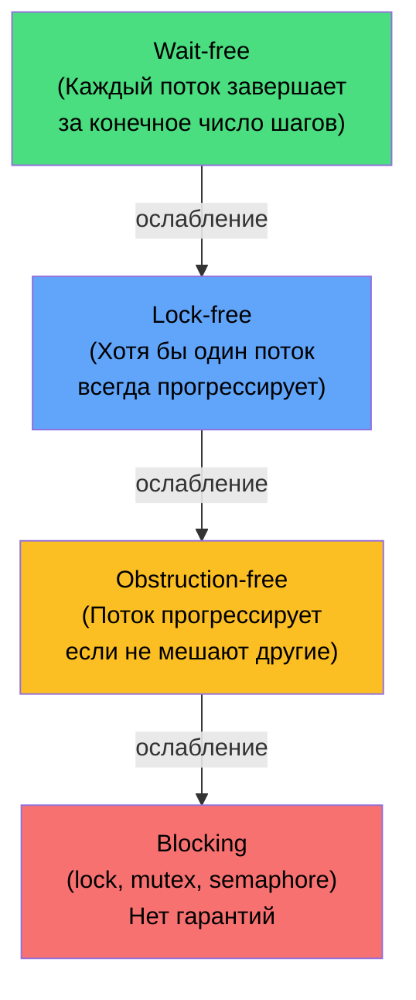

---
tags:
  - concurrency
  - lock-free
  - cas
  - volatile
  - delegates
  - deepdive
complexity: Senior
date: 2026-02-23
---

# Concurrency: гарантии прогресса и атомарность

## 1. Гарантии прогресса

Многопоточные алгоритмы классифицируются по тому, **насколько гарантированно** потоки продвигаются вперёд.



### Wait-free

**Каждый** поток завершает операцию за ограниченное число шагов, независимо от действий других потоков.

```csharp
// Wait-free: Interlocked.Increment
// Каждый вызов — ровно одна CAS-инструкция (или retry, но bounded)
Interlocked.Increment(ref counter);

// Wait-free read: Volatile.Read
var value = Volatile.Read(ref _sharedValue);
```

**Применение:** real-time системы, финансовые боты — нельзя ждать другие потоки.

### Lock-free

**Хотя бы один** поток всегда завершает операцию. Остальные могут retry, но **система в целом** прогрессирует. Нет дедлоков.

```csharp
// Lock-free: CAS loop
public bool TryUpdate(ref int location, Func<int, int> transform)
{
    while (true)
    {
        int current = Volatile.Read(ref location);
        int desired = transform(current);

        // Если значение не изменилось — успех
        // Если кто-то изменил — retry
        if (Interlocked.CompareExchange(ref location, desired, current) == current)
            return true;

        // Thread.SpinWait или yield для снижения contention
    }
}
```

### Obstruction-free

Поток прогрессирует, **если другие потоки не мешают**. Слабейшая нон-блокирующая гарантия. При contention — потоки могут мешать друг другу бесконечно (livelock).

### Blocking

`lock`, `Mutex`, `SemaphoreSlim` — поток может ждать бесконечно. Возможны дедлоки. Но **проще** и часто **достаточно**.

> [!info] Практическое правило
> 95% задач решаются через `lock` или `SemaphoreSlim`. Lock-free нужен для **hot path** в высоконагруженных системах (миллионы операций/сек). Wait-free — экзотика, почти никогда не требуется.

---

## 2. CAS (Compare-And-Swap)

### Атомарная инструкция процессора

CAS — **единственная** примитивная операция, на которой строятся все lock-free алгоритмы:

```
CAS(address, expected, desired):
    ATOMICALLY:
        if *address == expected:
            *address = desired
            return expected    // успех
        else:
            return *address    // неудача — кто-то изменил
```

### Interlocked — CAS в .NET

```csharp
// CompareExchange — основа CAS
int original = Interlocked.CompareExchange(
    ref location,   // где менять
    desired,        // новое значение
    expected);      // ожидаемое текущее

if (original == expected)
    Console.WriteLine("Успех — значение обновлено");
else
    Console.WriteLine($"Конфликт — текущее значение: {original}");

// Другие атомарные операции (построены на CAS)
Interlocked.Increment(ref counter);       // counter++ атомарно
Interlocked.Decrement(ref counter);       // counter-- атомарно
Interlocked.Add(ref counter, 10);         // counter += 10 атомарно
Interlocked.Exchange(ref value, newValue); // value = newValue, возвращает старое

// Атомарная замена ссылки
Interlocked.CompareExchange(ref _head, newNode, oldHead);
```

### ABA Problem

```
Thread 1: читает A, готовится записать B
Thread 2: меняет A → B → A (значение вернулось к A)
Thread 1: CAS видит A → "не изменилось" → записывает B
          НО состояние системы изменилось!

Решения:
1. Version counter (tagged pointer) — CAS по (value, version)
2. Immutable objects — каждое изменение создаёт новый объект
3. Hazard pointers — для lock-free структур данных
```

---

## 3. Lock-free Stack (пример)

```csharp
public class LockFreeStack<T>
{
    private volatile Node? _head;

    private class Node(T value, Node? next)
    {
        public readonly T Value = value;
        public Node? Next = next;
    }

    public void Push(T value)
    {
        var newNode = new Node(value, null);
        while (true)
        {
            newNode.Next = _head;
            // CAS: если _head не изменился — заменяем на newNode
            if (Interlocked.CompareExchange(ref _head, newNode, newNode.Next) == newNode.Next)
                return; // успех
            // Кто-то изменил _head — retry
        }
    }

    public bool TryPop(out T? value)
    {
        while (true)
        {
            var head = _head;
            if (head is null)
            {
                value = default;
                return false;
            }
            // CAS: если _head не изменился — заменяем на head.Next
            if (Interlocked.CompareExchange(ref _head, head.Next, head) == head)
            {
                value = head.Value;
                return true;
            }
            // Кто-то изменил _head — retry
        }
    }
}
```

> [!warning] В production используй ConcurrentStack&lt;T&gt;
> Пример выше — для понимания механики. `System.Collections.Concurrent.ConcurrentStack<T>` — оптимизированная, протестированная реализация.

---

## 4. Memory Barriers и volatile

### Memory Reordering

Процессор и компилятор могут **переупорядочивать** чтения и записи для оптимизации:

```csharp
// Код:
_data = 42;      // запись 1
_ready = true;   // запись 2

// CPU может выполнить:
_ready = true;   // запись 2 (раньше!)
_data = 42;      // запись 1

// Другой поток:
if (_ready)
    Console.WriteLine(_data); // может увидеть 0, а не 42!
```

### volatile

Ключевое слово `volatile` выставляет **memory barriers**:

```csharp
private volatile bool _ready;  // volatile field

// Запись volatile → Release barrier (все предыдущие записи видимы)
// Чтение volatile → Acquire barrier (все последующие чтения видят актуальное)
```

```
Без volatile:
Thread 1:  Write(_data) ──── Write(_ready)     // могут поменяться местами
Thread 2:  Read(_ready) ──── Read(_data)        // могут поменяться местами

С volatile на _ready:
Thread 1:  Write(_data) ─[Release]─ Write(_ready)  // _data гарантированно ДО _ready
Thread 2:  Read(_ready) ─[Acquire]─ Read(_data)     // _data гарантированно ПОСЛЕ _ready
```

### Volatile vs Interlocked vs lock

| Механизм | Атомарность | Visibility | Ordering | Для чего |
|----------|-------------|------------|----------|----------|
| `volatile` | Нет (только aligned reads/writes) | Да | Acquire/Release | Флаги, single-word signaling |
| `Interlocked` | Да (CAS) | Да | Full fence | Счётчики, CAS-операции |
| `lock` | Да (критическая секция) | Да | Full fence | Составные операции |

```csharp
// volatile — ТОЛЬКО для простых флагов
private volatile bool _cancelled;

// ✗ НЕПРАВИЛЬНО — i++ не атомарен даже с volatile
private volatile int _counter;
_counter++; // Read + Increment + Write — 3 операции, не атомарно!

// ✓ ПРАВИЛЬНО — Interlocked для инкремента
Interlocked.Increment(ref _counter);
```

> [!warning] volatile не делает операции атомарными
> `volatile` гарантирует только **видимость** (другие потоки увидят новое значение) и **порядок** (acquire/release). Для атомарных read-modify-write — только `Interlocked`.

---

## 5. Multicast Delegates — внутренняя механика

### Как устроены делегаты

```csharp
// Delegate — объект с двумя полями
public abstract class Delegate
{
    internal object? _target;          // this для instance method, null для static
    internal IntPtr _methodPtr;        // указатель на метод
}

// MulticastDelegate — цепочка делегатов
public abstract class MulticastDelegate : Delegate
{
    private object? _invocationList;   // Delegate[]? — массив делегатов
    private IntPtr _invocationCount;
}
```

### InvocationList — неизменяемый массив

```csharp
Action<string> handler = Console.WriteLine;
handler += msg => File.AppendAllText("log.txt", msg);
handler += msg => Debug.WriteLine(msg);

// handler._invocationList = Delegate[3]
// [0] = Console.WriteLine
// [1] = λ (File.AppendAllText)
// [2] = Debug.WriteLine
```

### Combine и Remove — создают новый массив

```csharp
// += создаёт НОВЫЙ делегат с НОВЫМ массивом
handler += newHandler;
// Старый массив [3] → новый массив [4]

// -= создаёт НОВЫЙ делегат БЕЗ удалённого
handler -= oldHandler;
// Старый массив [4] → новый массив [3]
```

> [!info] Thread safety делегатов
> `Delegate.Combine` и `Delegate.Remove` создают **новые** объекты. Старый делегат неизменяем. Поэтому паттерн `handler?.Invoke(args)` потокобезопасен — `handler` копируется на стек, и даже если другой поток изменит поле, вызов пойдёт по старой копии.

### Invoke — последовательный вызов

```csharp
// При вызове multicast delegate:
handler("message");

// CLR делает:
// for (int i = 0; i < _invocationList.Length; i++)
//     _invocationList[i].Invoke("message");
//
// Последний возвращённый результат — результат multicast (для Func<T>)
// Если подписчик бросает исключение — остальные НЕ вызываются!
```

### Ручной обход подписчиков

```csharp
// Если нужно вызвать всех, даже при исключениях
foreach (var d in handler.GetInvocationList())
{
    try
    {
        ((Action<string>)d)("message");
    }
    catch (Exception ex)
    {
        logger.LogError(ex, "Handler failed");
    }
}
```

---

## 6. SpinWait и SpinLock — когда lock слишком дорог

```csharp
// SpinWait — адаптивное ожидание (spin → yield → sleep)
var spinner = new SpinWait();
while (!_condition)
{
    spinner.SpinOnce(); // CPU spin → Thread.Yield → Thread.Sleep(1)
}

// SpinLock — lock без kernel transition
private SpinLock _lock = new(enableThreadOwnerTracking: false);

bool taken = false;
try
{
    _lock.Enter(ref taken);
    // критическая секция — должна быть ОЧЕНЬ короткой (наносекунды)
}
finally
{
    if (taken) _lock.Exit();
}
```

> [!warning] SpinLock только для nano-секундных операций
> Если критическая секция > 1 мкс — используй обычный `lock`. SpinLock тратит CPU на ожидание. На одноядерных машинах — бесполезен.

---

## Cheat Sheet: выбор примитива синхронизации

```
Нужна синхронизация?
  │
  ├── Простой флаг (bool/int) → volatile
  │
  ├── Счётчик (increment/add) → Interlocked
  │
  ├── CAS-обновление → Interlocked.CompareExchange + loop
  │
  ├── Короткая критическая секция → lock (или SpinLock для наносекунд)
  │
  ├── Async-совместимая блокировка → SemaphoreSlim(1,1)
  │
  ├── Producer-consumer → Channel<T>
  │
  └── Множественный доступ к коллекции → ConcurrentDictionary / ConcurrentQueue
```

---

## См. также

- [.NET Runtime: компиляция](compilation-jit.md)
- [Async и потоки](../CSharp/async-threading.md)
- [GC и память](gc-memory.md)
