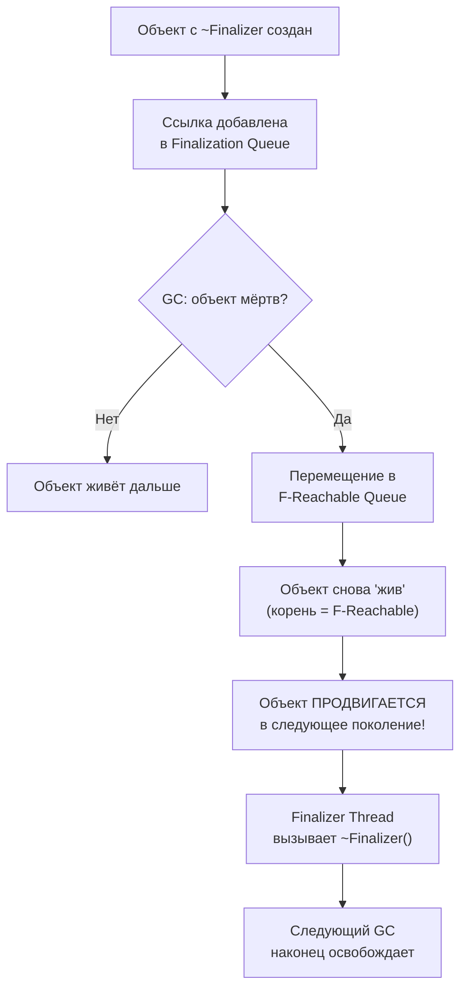

---
tags:
  - gc
  - memory
  - loh
  - poh
  - finalization
  - deepdive
complexity: Senior
date: 2026-02-23
---

# Управление памятью: GC, LOH и POH

## Generational GC — гипотеза поколений

Большинство объектов живут недолго (temporary DTO, строки, лямбды). GC использует это: **молодые объекты собираются чаще и дешевле**.

### Архитектура Managed Heap

```
Managed Heap
┌──────────────────────────────────────────────────────┐
│  Gen 0          │  Gen 1        │  Gen 2             │
│  (Nursery)      │  (Survivor)   │  (Long-lived)      │
│  Быстро, часто  │  Промежуточ.  │  Редко, дорого     │
│  ~256 KB        │  ~2 MB        │  Неограничен       │
├──────────────────────────────────────────────────────┤
│  LOH (Large Object Heap) — объекты > 85 000 bytes   │
├──────────────────────────────────────────────────────┤
│  POH (Pinned Object Heap) — pinned объекты (.NET 5+)│
└──────────────────────────────────────────────────────┘
```

### Сравнение поколений

| Характеристика | Gen 0 | Gen 1 | Gen 2 | LOH | POH |
|----------------|-------|-------|-------|-----|-----|
| **Размер** | ~256 KB | ~2 MB | Неограничен | Неограничен | Неограничен |
| **Порог объекта** | < 85 KB | < 85 KB | < 85 KB | ≥ 85 KB | Любой (pinned) |
| **Частота сборки** | Очень часто | Часто | Редко | С Gen 2 | С Gen 2 |
| **Compaction** | Да | Да | Да (дорого) | Нет* | Нет |
| **Стоимость сборки** | Микросекунды | Миллисекунды | Десятки мс | С Gen 2 | С Gen 2 |
| **Типичное содержимое** | Temp DTO, строки | Пережившие Gen 0 | Singletons, кэши | byte[], string | Буферы для I/O |

*LOH compaction возможен вручную: `GCSettings.LargeObjectHeapCompactionMode`

---

## Фазы сборки мусора

### Mark — Sweep — Compact


### 1. Mark (Маркировка)

GC начинает с **корней** (GC Roots) и обходит граф объектов:

```
GC Roots:
├── Stack variables (локальные переменные на стеке каждого потока)
├── Static fields (статические поля)
├── GC Handles (GCHandle.Alloc)
├── Finalization Queue (объекты с финализатором)
├── Thread-local storage
└── CPU Registers (регистры, содержащие ссылки)

Mark: root → obj1 → obj2 → obj3 (помечаются как "живые")
     Непомеченные → мёртвые → будут освобождены
```

### 2. Sweep (Очистка)

Мёртвые объекты освобождаются. Память помечается как свободная.

### 3. Compact (Уплотнение)

Живые объекты сдвигаются, заполняя пустоты. Все ссылки обновляются.

```
До Compact:
[obj1][    ][obj2][         ][obj3][    ]
       ↑ gap        ↑ gap           ↑ gap

После Compact:
[obj1][obj2][obj3][          свободно          ]
                   ↑ allocation pointer
```

> [!warning] Stop-The-World
> Во время GC все managed-потоки **приостанавливаются** (STW pause). Gen 0/1 — паузы микросекунды. Gen 2 — может быть десятки миллисекунд. Background GC (Concurrent GC) для Gen 2 минимизирует паузы, но не устраняет полностью.

---

> [!question]- **Интервью: Поколения GC — Gen0, Gen1, Gen2?**
> **Gen 0** — молодые объекты, частая быстрая сборка. **Gen 1** — буфер между Gen0 и Gen2. **Gen 2** — долгоживущие объекты, редкая дорогая сборка (full GC). Гипотеза поколений: большинство объектов живут недолго, поэтому частые сборки Gen0 эффективны.

## Workstation vs Server GC

```csharp
// csproj
<ServerGarbageCollection>true</ServerGarbageCollection>

// Или в runtimeconfig.json
{ "configProperties": { "System.GC.Server": true } }
```

| Режим | Потоков GC | Heaps | Пауза | Для чего |
|-------|-----------|-------|-------|----------|
| **Workstation** | 1 | 1 | Минимальная | UI, десктоп |
| **Server** | N (по ядру) | N (по ядру) | Больше, но реже | ASP.NET, серверы |

Server GC создаёт **отдельный heap на каждое ядро**. Потоки аллоцируют в свой heap без блокировок. Сборка — параллельно по всем heaps.

---

> [!question]- **Интервью: Workstation vs Server GC — когда что?**
> **Workstation** — минимальные паузы (UI, desktop). Один поток GC. **Server** — макс. пропускная способность (ASP.NET). Один поток GC на ядро, параллельная сборка. Настройка: `<ServerGarbageCollection>true</ServerGarbageCollection>`.

## LOH (Large Object Heap)

### Проблема

Объекты ≥ 85 000 bytes попадают в LOH. LOH **не уплотняется по умолчанию** → фрагментация.

```
LOH после работы:
[100KB][freed][200KB][freed][freed][50KB][freed][300KB]
         ↑              ↑      ↑            ↑
    фрагментация — свободные блоки разного размера

Запрос на 250KB → OutOfMemoryException!
(хотя суммарно свободно 500KB, нет непрерывного блока 250KB)
```

### Кто попадает в LOH

```csharp
// byte[] > 85000 → LOH
var buffer = new byte[85001];        // LOH!

// string > ~42500 chars → LOH (char = 2 bytes + overhead)
var bigString = new string('x', 50000); // LOH!

// Массив ссылочных типов > ~10625 элементов (8 bytes × 10625 = 85000)
var refs = new object[10626];        // LOH!
```

### Минимизация LOH-фрагментации

```csharp
// 1. ArrayPool — переиспользование буферов
var pool = ArrayPool<byte>.Shared;
byte[] buffer = pool.Rent(100_000);  // берём из пула (возможно из LOH)
try
{
    // ... работаем с buffer
}
finally
{
    pool.Return(buffer, clearArray: true); // возвращаем
}

// 2. Принудительный LOH Compact (крайний случай)
GCSettings.LargeObjectHeapCompactionMode = GCLargeObjectHeapCompactionMode.CompactOnce;
GC.Collect(); // compact произойдёт один раз

// 3. Держать буферы одного размера — меньше фрагментация
// ✗ Плохо: new byte[1000], new byte[5000], new byte[100000] — разные размеры
// ✓ Хорошо: ArrayPool с фиксированными bucket-ами
```

---

## POH (Pinned Object Heap) — .NET 5+

### Проблема, которую решает POH

**Pinning** — фиксация объекта в памяти (GC не может его перемещать). Нужно для interop с native code (P/Invoke, socket buffers).

```
Обычный heap с pinned объектами — "камни в реке":
[obj1][PINNED][obj2][obj3][PINNED][obj4]
        ↑ не двигается        ↑ не двигается

Compact не может сдвинуть pinned → фрагментация Gen 2
```

### POH — выделенная куча для pinned объектов

```csharp
// .NET 5+ — аллокация в POH
byte[] pinnedBuffer = GC.AllocateArray<byte>(4096, pinned: true);

// Буфер ГАРАНТИРОВАННО не будет двигаться — можно безопасно
// передавать указатель в native code без GCHandle
unsafe
{
    fixed (byte* ptr = pinnedBuffer)
    {
        // ptr стабилен на всё время жизни буфера
        NativeInterop.ReadSocket(ptr, pinnedBuffer.Length);
    }
}
```

```
С POH — pinned объекты отдельно:

Gen 0/1/2 (чистый, без "камней"):
[obj1][obj2][obj3][obj4][obj5]  ← легко compact

POH (pinned, без compaction):
[buffer1][buffer2][buffer3]     ← не мешают основному heap
```

### Когда использовать POH

| Сценарий | Используй POH |
|----------|---------------|
| Socket I/O буферы | Да — ядро ОС держит указатель |
| Native interop (P/Invoke) | Да — native код ожидает стабильный адрес |
| Временный fixed в цикле | Нет — обычный `fixed` достаточно |
| Обычные массивы | Нет — overhead не оправдан |

> [!info] Кейс: высоконагруженный HTTP-сервер
> Kestrel использует POH для буферов чтения/записи сокетов. Без POH тысячи pinned буферов фрагментировали бы Gen 2, вызывая длинные GC-паузы. С POH — Gen 2 остаётся чистым, паузы предсказуемы.

---

## Finalization Queue и F-Reachable Queue

### Как работает финализация

Объекты с деструктором (`~ClassName()`) или `Finalize()` проходят **двухэтапную** очистку:



### Проблемы финализации

```csharp
public class BadResource
{
    private IntPtr _handle;

    ~BadResource() // Finalizer
    {
        CloseHandle(_handle); // вызовется когда-нибудь...
    }
}

// Проблемы:
// 1. Объект переживает МИНИМУМ одну лишнюю сборку GC
// 2. Продвигается в Gen 1 или Gen 2 → дорогая сборка
// 3. Finalizer Thread — один на процесс, не параллелится
// 4. Порядок вызова финализаторов НЕ гарантирован
// 5. Если финализатор бросает исключение → процесс падает
```

### Правильный паттерн: IDisposable + Finalizer

```csharp
public class ManagedResource : IDisposable
{
    private IntPtr _handle;
    private bool _disposed;

    public void Dispose()
    {
        Dispose(disposing: true);
        GC.SuppressFinalize(this); // ← КРИТИЧНО: убираем из Finalization Queue
    }

    protected virtual void Dispose(bool disposing)
    {
        if (_disposed) return;

        if (disposing)
        {
            // Освобождаем managed ресурсы
        }

        // Освобождаем unmanaged ресурсы
        if (_handle != IntPtr.Zero)
        {
            CloseHandle(_handle);
            _handle = IntPtr.Zero;
        }

        _disposed = true;
    }

    ~ManagedResource() => Dispose(disposing: false);
}
```

> [!warning] GC.SuppressFinalize — must-have
> Без `SuppressFinalize` объект проходит через Finalization Queue **даже после Dispose**. Это значит: лишняя сборка GC, промоция в следующее поколение, задержка освобождения. Всегда вызывать в `Dispose()`.

---

## Off-heap: NativeMemory

Выделение памяти **вне managed heap** — GC не видит, не сканирует, не перемещает:

```csharp
using System.Runtime.InteropServices;

unsafe
{
    // Аллокация вне GC
    byte* buffer = (byte*)NativeMemory.Alloc(1024 * 1024); // 1 MB

    try
    {
        // Работа с буфером — GC не знает об этой памяти
        var span = new Span<byte>(buffer, 1024 * 1024);
        span.Fill(0xFF);
    }
    finally
    {
        NativeMemory.Free(buffer); // ОБЯЗАТЕЛЬНО! GC не освободит
    }
}

// Aligned allocation (для SIMD)
void* aligned = NativeMemory.AlignedAlloc(4096, alignment: 64);
NativeMemory.AlignedFree(aligned);
```

| Подход | Управление | GC pressure | Скорость аллокации | Риск |
|--------|-----------|-------------|--------------------|----- |
| `new byte[]` | GC | Да | Быстро (Gen 0) | Низкий |
| `ArrayPool.Rent` | Manual return | Нет (reuse) | Мгновенно | Забыть Return |
| `GC.AllocateArray(pinned)` | GC | Да (POH) | Быстро | Фрагментация |
| `NativeMemory.Alloc` | Manual free | Нет | Быстро | Утечка, segfault |
| `stackalloc` | Автоматически | Нет | Мгновенно | Stack overflow |

---

## Диагностика GC

```bash
# Live-метрики GC
dotnet-counters monitor --counters System.Runtime

# GC dump для анализа heap
dotnet-gcdump collect -p <PID>

# Детальная трассировка GC событий
dotnet-trace collect -p <PID> --providers Microsoft-Windows-DotNETRuntime:0x1:5
```

```csharp
// Программная диагностика
Console.WriteLine($"Gen 0: {GC.CollectionCount(0)}");
Console.WriteLine($"Gen 1: {GC.CollectionCount(1)}");
Console.WriteLine($"Gen 2: {GC.CollectionCount(2)}");
Console.WriteLine($"Total Memory: {GC.GetTotalMemory(false):N0} bytes");
Console.WriteLine($"GC Heap Size: {GC.GetGCMemoryInfo().HeapSizeBytes:N0} bytes");

// Принудительная сборка (только для диагностики!)
GC.Collect(2, GCCollectionMode.Aggressive, blocking: true, compacting: true);
```

---

## Best Practices

- **Избегать Gen 2** — short-lived объекты не должны доживать до Gen 2. Проверять через dotnet-counters.
- **ArrayPool** — для больших буферов. Не `new byte[N]` в цикле.
- **POH** — для I/O буферов, socket operations. Не для обычных массивов.
- **Dispose** — всегда `using` / `await using`. Финализатор — только как safety net для unmanaged.
- **SuppressFinalize** — всегда в `Dispose()`.
- **Не вызывать GC.Collect()** — кроме диагностики. GC лучше знает, когда собирать.

---

## См. также

- [.NET Runtime: компиляция](compilation-jit.md)
- [Span и Memory Layout](span-layout.md)
- [Performance и диагностика](../Performance/performance.md)
- [Типы и память](../CSharp/types-and-memory.md)
